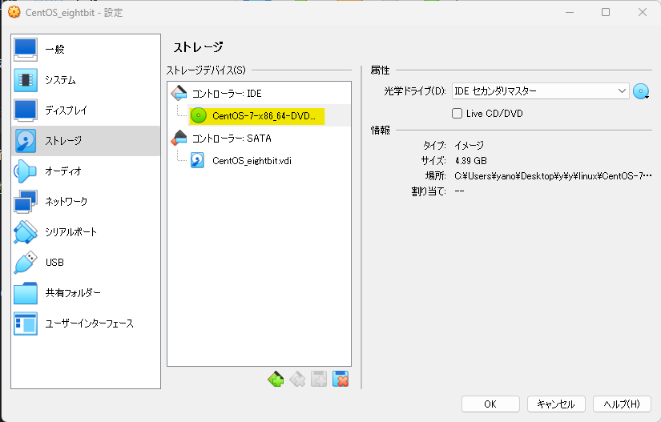

# Linux基礎研修

    
導入

    

## 環境確認

### 1. CentOSイメージファイル  

仮想マシンにインストールするイメージファイルです  
約 **4GB** のファイルですので、予めダウンロードしてデスクトップ等、わかりやすい場所に移動しておきましょう  

※実行する必要はありません

[CentOSイメージファイル](http://ftp.iij.ad.jp/pub/linux/centos/7.9.2009/isos/x86_64/CentOS-7-x86_64-DVD-2207-02.iso)

### 2. VirtualBox

**まずはお使いのPCにインストールされているかを確認して下さい**  
仮想環境を構築するためのアプリケーションです  
WindowsPCの中に仮想的にCentOS(LinuxPC)を構築します  
ダウンロード完了したら実行し、インストールまで済ませましょう  

[VirtualBoxインストーラ](https://download.virtualbox.org/virtualbox/7.0.14/VirtualBox-7.0.14-161095-Win.exe)

### 3. teraterm

VirtualBox上に構築した仮想マシンに対して、SSH接続して操作するためのアプリケーションです  

:::note
SSH（Secure Shell）とは、ネットワークを介して別のコンピューターやネットワーク機器などを操作するために使われるプロトコルです。
:::

ダウンロード完了したら実行し、インストールまで済ませましょう

[teratermインストーラ](https://github.com/TeraTermProject/osdn-download/releases/download/teraterm-5.0/teraterm-5.0.exe)

    

    
1. 仮想マシン作成手順

    

### 仮想マシン作成

**VirtualBoxマネージャ画面**  

VirtualBoxを起動し、以下の画面を表示したら**右上**の `新規` をクリック

**仮想マシン概要設定画面**  

黄色いハイライト部分を画面と同じ様に設定しましょう
- 名前 → 仮想マシンの名前(任意の名前で構いません)
- タイプ → **Linux**
- バージョン → **Red Hat 7.x (64bit)**

設定したら `次へ` をクリック

**ハードウェアリソース設定画面1**  

メモリ容量とCPU割当の設定画面です  
特に変更せずに `次へ` をクリック

**ハードウェアリソース設定画面2**  

ストレージ容量設定画面です  
黄色ハイライトの箇所を `16.00 GB` に設定して `次へ` をクリック

**仮想マシン設定概要画面**

作成する仮想マシンの概要を確認する画面です  
以下の画像と比較し、大きな差異がない事を確認し、`完了` をクリック

**VirtualBoxマネージャ画面**  

左側に赤い帽子の項目が表示されます(これが一つの仮想マシンです)  
該当項目を右クリックし、`設定` をクリック

**仮想マシン設定画面(ストレージ)**

`ストレージ` > `空` > 右上の`◎` を順にクリック

以下の選択項目からは `ディスクファイルを選択` をクリックし、  
[導入](#1-centosイメージファイル)でダウンロードしたCentOSのイメージファイルを選択します  

イメージファイルを選択後、元の画面に戻ります  
黄色ハイライト部分が `CentOS-7-x86_64...` のような表記になっている事を確認して下さい

同画面左の `ネットワーク` > `割り当て` のドロップダウンリストを開き、  
**ブリッジアダプター** を選択して `OK` をクリックして下さい

以上で仮想マシンの作成は完了です
    

    
2. CentOSインストール手順

    

### CentOSインストール

    

    
3. SSH接続手順

    

### SSH接続

    

    
課題

    

    

