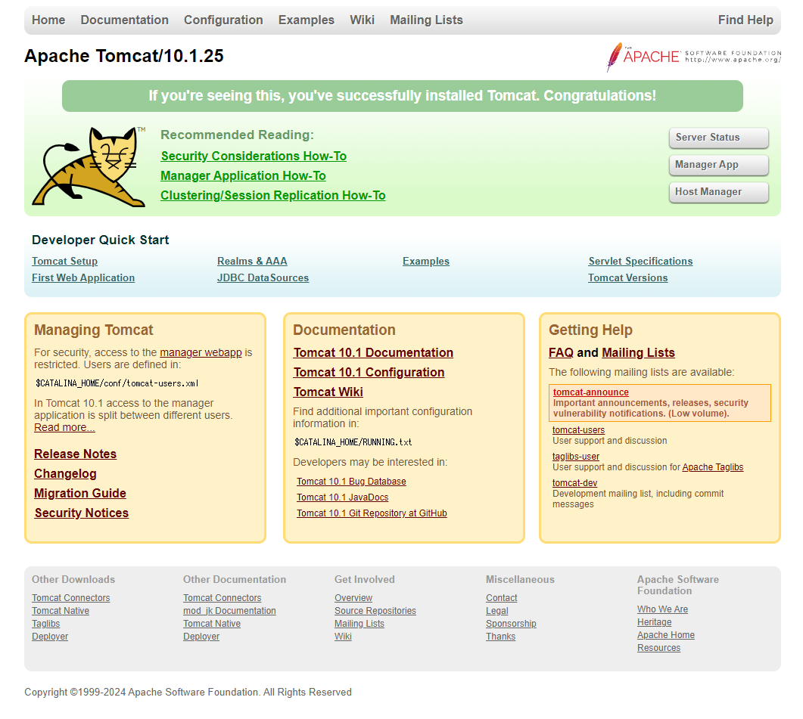
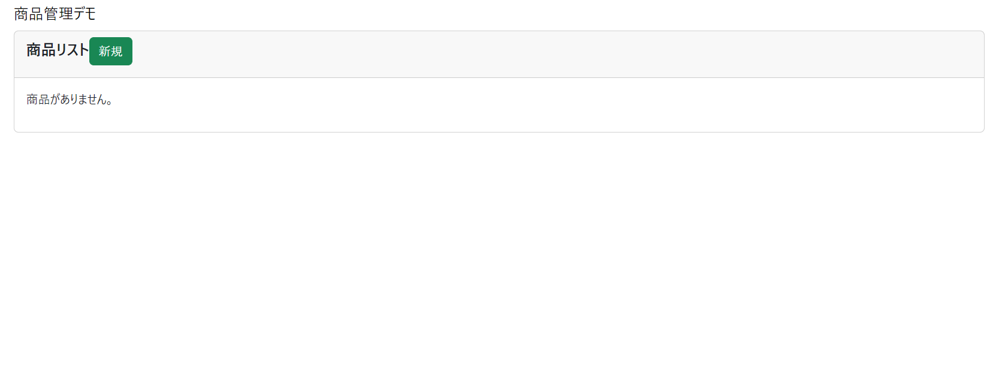

# Linux追加課題 CentOS9

Javaのアプリケーションを利用するためのアプリケーションサーバを構築して下さい  

#### バージョン指定

|ソフトウェア|バージョン指定|
|--|--|
|Amazon Corretto |17|
|tomcat|10|
|MySQL |8.4以上|

:::tip
## 進め方
1. Amazom Correttoをインストールする
2. ApacheとTomcatを**mod_jk**を使用して連携し、ブラウザからIPアドレスのみで[Tomcatの初期画面](#tomcatの初期画面)が表示される事を確認する
3. MySQLをインストールする
4. 必要なDBを作成し、アプリケーションをデプロイする (デプロイ手順は以下参考)
5. 名前解決のため、DNSのゾーンファイルに必要情報を追記する
6. [動作確認](#アプリケーションの初期画面)
:::

#### デプロイ手順
1. アプリケーションに必要なデータベースを作成する（rootユーザのパスワード：root）
3. .warファイルを適切なディレクトリに配置する
4. mysqlのrootユーザのパスワードを「root」に変更する。

#### 必要リソース
以下をダウンロードして使用して下さい
- [DB作成クエリ](./files/jpa.sql)
- [warファイル](./files/demo.war)

:::caution
DNSサーバは作成したものを使いまわして構いません
:::

## Tomcatの初期画面

接続URL  
http://**IPアドレス**

## アプリケーションの初期画面
接続URL  
http://**ドメイン**/demo

