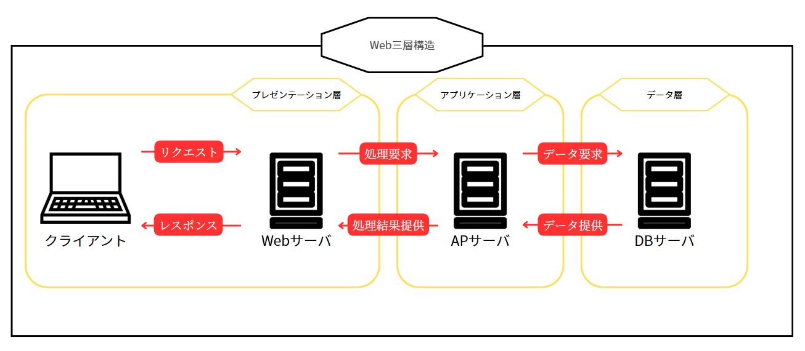
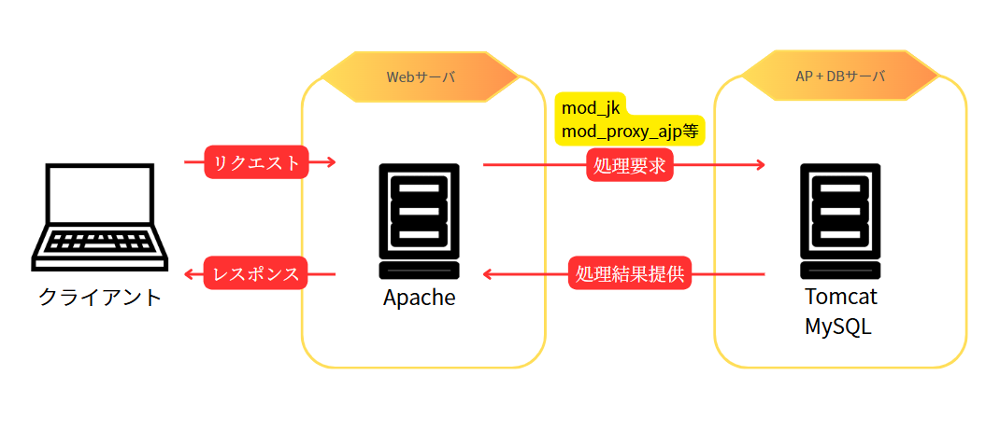

# Linux実践課題

## Web三層構造
---

Web三層構造は、Webアプリケーションを構築する上で最も一般的なアーキテクチャパターンの一つです。  
アプリケーションの機能を以下の3つの論理的な層に分割することで開発効率や保守性、拡張性を高めることを目的としています。
- **プレゼンテーション層**
- **アプリケーション層**（またはビジネスロジック層）」
- **データ層**  

図式化すると一般的に以下のような構成を指します。  

それぞれの層の概要は以下の通りです。

### プレゼンテーション層

|項目　|説明|
|----|----|
|役割|ユーザーインターフェース（UI）を担当し、ユーザーからの入力を受け付け、処理結果をユーザーに表示します。|
|例|Webブラウザで表示されるHTML、CSS、JavaScriptなど、ユーザーが直接目にする部分です。スマートフォンのアプリの画面などもここに該当します。|
|特徴|アプリケーションの見た目や操作性に関わる部分であり、ユーザー体験（UX）に直結します。|

### アプリケーション層 (ビジネスロジック層)

|項目　|説明|
|----|----|
|役割|プレゼンテーション層からの要求を受け取り、データ層と連携しながら、アプリケーションの中核となるビジネスロジック（業務処理）を実行します。|
|具体例|Webサーバー上で動作するプログラム（例: PythonのDjango/Flask、Ruby on Rails、PHP、JavaのSpringなど）や、API（Application Programming Interface）などがこれに該当します。データの検証、計算、他のサービスとの連携などを行います。|
|特徴|ユーザーインターフェースやデータの永続化方法に依存せず、独立してビジネスルールを実装します。|

### データ層

|項目　|説明|
|----|----|
|役割|データの保存、管理、取得を行います。アプリケーションが必要とするデータを永続的に保持する責任を持ちます。|
|具体例|データベース（RDB: MySQL, PostgreSQL, Oracle; NoSQL: MongoDB, Redisなど）、ファイルシステム、外部のストレージサービスなどがこれに該当します。|
|特徴|アプリケーション層からの要求に応じてデータの操作を行い、データの整合性やセキュリティを保つ役割も担います。|

## 三層構造のメリット
---

|項目　　　|説明|
|----|----|
|開発効率|各層が独立しているため、異なる開発チームが並行して作業を進めやすい。|
|保守性|特定の層に問題が発生した場合でも、他の層への影響を最小限に抑えられ、問題の特定と修正が容易になる。|
|拡張性|各層を独立してスケールさせることができる(負荷分散に対応しやすい)。また、技術の変更にも柔軟に対応できる。|
|再利用性|ビジネスロジックがプレゼンテーション層やデータ層から分離されているため、異なるUIやデータストレージを使用する別のアプリケーションでも再利用しやすい。|

## 三層構造のデメリット
---

Web三層構造は多くのメリットがありますが、以下のようにデメリットも存在します。

|項目　　　|説明|
|----|----|
|複雑性|各層が独立している分、システム全体の構造が複雑になるため、特に小規模なプロジェクトではシンプルな構成の方が開発効率が良い場合もある。|
|初期コスト|層ごとに設計や実装を行うため、開発の初期段階でかかる時間やコストが増える傾向がある。|
|パフォーマンス|各層間の通信が発生するため、直接的にデータにアクセスする場合と比べてわずかながら処理のオーバーヘッドが生じることがある。|
|学習コスト|各層の役割や技術を理解する必要があるため、特に初心者にとっては学習コストがかかる可能性がある。|

## 課題
---

追加課題で作成したサーバを、役割毎に分離して構成して下さい。  
仮想マシンを2台用意し、それぞれに指定された役割を与え、連携するように構築しましょう。

:::caution
Javaアプリケーションの都合上、今回は**APサーバとDBサーバは同一のマシン**に役割を持たせます。
:::

### Webサーバ
Apacheをインストールし、クライアントからのリクエストを受け付ける。  
受け取ったリクエストはAPサーバに連携する。

### AP + DBサーバ
tomcatにJavaアプリケーションをデプロイし、Webサーバから受け取ったリクエストを元に処理を実行する。  
MySQLをインストール  し、Javaアプリケーションから問い合わせがあれば必要とされるデータを提供する。  

