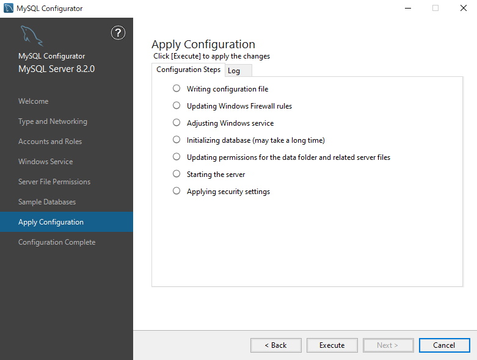

## インストーラのダウンロードと起動

以下のリンクからMySQL公式のダウンロードページにアクセスして下さい  

[公式ダウンロードページ](https://dev.mysql.com/downloads/mysql/)

ページ遷移したら ``Select Version``を 最新バージョン(**LTS**と付くものが好ましい)に変更し  
**Windows (x86, 64-bit), MSI Installer** をダウンロードして下さい

以下画面の最下部 ``No Thanks, just start my download.`` をクリックし、  
インストーラをダウンロードします

ダウンロードが完了したら msi ファイルを実行し、 **MySQL Setup Wizard** を立ち上げ、  
``Next`` をクリックして次の画面に進みます

## MySQL Server Setup Wizard

利用規約確認画面  

**I accept the terms in thee license Agreement**  
にチェックを入れて ``Next`` 

インストールパッケージの選択画面  

`Typical` をクリック

インストール確認画面  

`Install` をクリック

Setup完了画面  

**Run MySQL Configurator** にチェックが入っていることを確認し、 `Finish` をクリック

## MySQL Configurator

以下の手順でインストール前にMySQLの内部的な設定を行います  

MySQL Setup Wizard閉じると自動的に以下の画面が開くので `Next` をクリック

MySQLで使用するポート番号等の設定画面  

特に変更はせず `Next` をクリック

管理ユーザパスワード等の設定画面  

研修中に余計なトラブルを防ぐため以下の通りに設定して下さい  
**MySQL Root Password** に `root`   
**Repeat Password** にも `root` と入力し、`Next` をクリック

Windows上におけるサービス名や自動起動の設定画面  

特に変更はせず `Next` をクリック

データファイルに対する権限設定  

**Yes, grant full access to the user running the Windows Service ~ ...**  
を選択した状態で `Next` をクリック

サンプルデータベース作成設定画面  

チェックは入れずに `Next` をクリック

設定適用画面  

`Execute` をクリックし、インストールを開始します(多少時間が掛かります)

以下のように全てに緑色のチェックがついたらインストール完了です  
確認できたら `Next` をクリック

設定完了画面  

`Finish` をクリックし、**MySQL Configurator** の画面を閉じます

## 動作確認

コマンドプロンプトを立ち上げ、以下のコマンドで移動して下さい  
(x の箇所はご自身の環境に合わせて置換しましょう)  
`cd C:\Program Files\MySQL\MySQL Server 8.x\bin`  

移動後、`mysql --version` を実行し、  
インストールしたMySQLのバージョンが出てくることを確認して下さい

以上でMySQLのインストールは完了です！