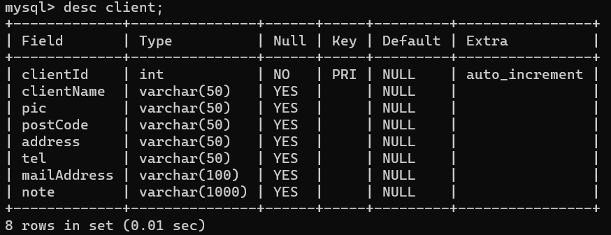
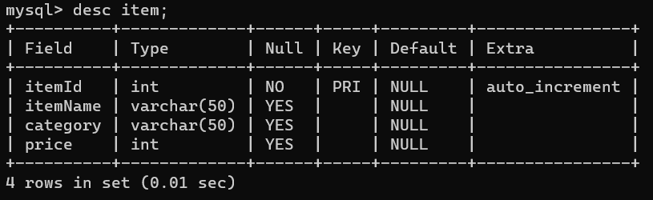
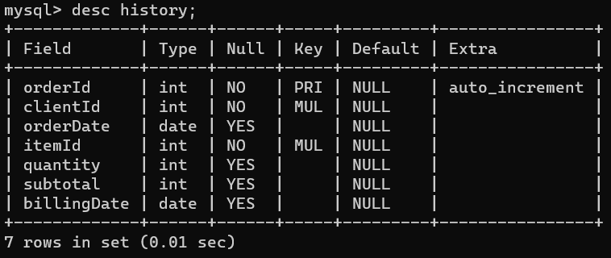
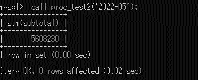
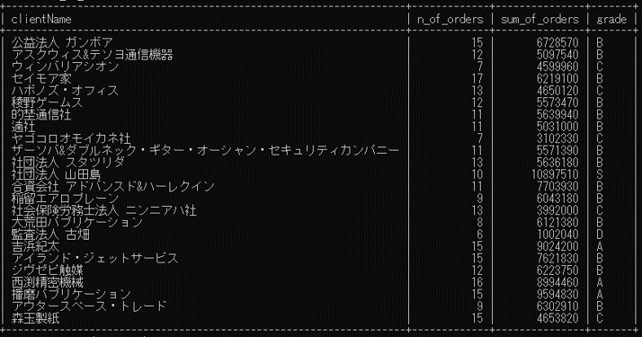
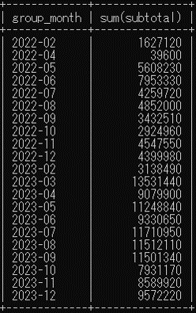
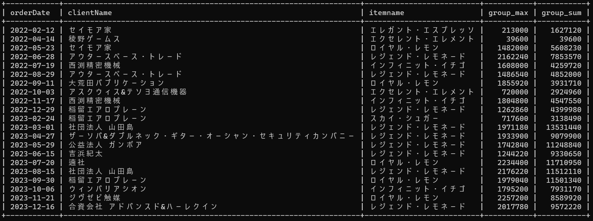

# MySQL追加課題

基礎研修の課題と動画視聴が全て完了した場合は以下の課題に着手して下さい

<details>
    <summary>1. データベース作成</summary>
    <div>
OMDBというデータベースを作成してください
    </div>
</details>


<details>
    <summary>2. テーブル作成</summary>
    <div>
以下の画像スキーマに合わせたテーブルをOMDB内に作成して下さい

#### clientテーブル


#### itemテーブル


#### historyテーブル

    </div>
</details>


<details>
    <summary>3. データ挿入</summary>
    <div>
```sql
INSERT client (clientName, pic, postCode, address, tel, mailAddress, note) VALUES ('公益法人 ガンボア', '飯西 京汰', '425-0024', '静岡県焼津市北浜通8-1-5 プチドミール北浜通 8階', '054-266-5666', 'onnak@bbtec.net', '');
INSERT client (clientName, pic, postCode, address, tel, mailAddress, note) VALUES ('アスクウィス&テソヨ通信機器', '麻野 月疎', '424-0403', '静岡県静岡市清水区和田島4-9-7', '054-643-7617', 'kuritarie@infoseek.jp', '');
INSERT client (clientName, pic, postCode, address, tel, mailAddress, note) VALUES ('ウィンバリアシオン', '林 瞳李', '177-0042', '東京都練馬区下石神井4-11-1', '03-3059-9177', 'ooba_yuuka@plala.or.jp', '');
INSERT client (clientName, pic, postCode, address, tel, mailAddress, note) VALUES ('セイモア家', 'ジョン・スミス', '069-0382', '北海道岩見沢市幌向北二条1-12-4 パレットハウス幌向北二条 3F', '0126-32-8478', 'ouki0614@sannet.ne.jp', '');
INSERT client (clientName, pic, postCode, address, tel, mailAddress, note) VALUES ('ハボノズ・オフィス', '西面 玲速', '799-1533', '愛媛県今治市国分5-13-1', '0898-63-7389', 'itio.nisi@dti.ad.jp', '');
INSERT client (clientName, pic, postCode, address, tel, mailAddress, note) VALUES ('稜野ゲームス', 'クマール・シン', '987-2264', '宮城県栗原市築館薬師台1-12-1 ニューコーポ築館薬師台 1013号室', '0228-66-2326', 'adnoh@tokyo24.com', '');
INSERT client (clientName, pic, postCode, address, tel, mailAddress, note) VALUES ('的埜通信社', '滑川?新', '926-0371', '石川県七尾市佐々波町4-14-6 ウインベル・佐々波町 7階', '0767-94-1257', 'akio@dti.ne.jp', '');
INSERT client (clientName, pic, postCode, address, tel, mailAddress, note) VALUES ('遖社', '岡木 隼生', '132-0024', '東京都江戸川区一之江1-4-3-210号室', '03-3729-6950', 'ogawacyouitirou@excite.com', '');
INSERT client (clientName, pic, postCode, address, tel, mailAddress, note) VALUES ('ヤゴコロオモイカネ社', '浜名 聡之', '305-0012', '茨城県つくば市中根1-13-1', '029-671-5711', 'dnzbru84@gmail.com', '');
INSERT client (clientName, pic, postCode, address, tel, mailAddress, note) VALUES ('ザーソバ&ダブルネック・ギター・オーシャン・セキュリティカンパニー', 'マリオ・ロッシ', '873-0644', '大分県国東市国東町浜崎7313', '0978-55-8781', 'kataoka1129@ybb.ne.jp', '');
INSERT client (clientName, pic, postCode, address, tel, mailAddress, note) VALUES ('社団法人 スタツリダ', '久留 明美', '197-0802', '東京都あきる野市草花6926', '042-870-7061', 'sinzirouwatanabe@mxi.asp.home.ne.jp', '');
INSERT client (clientName, pic, postCode, address, tel, mailAddress, note) VALUES ('社団法人 山田島', '水崎 由美子', '607-8481', '京都府京都市山科区北花山中道町1-7-2', '075-351-3695', 'sigetugu172@ath.cx', '');
INSERT client (clientName, pic, postCode, address, tel, mailAddress, note) VALUES ('毛籠', '二文字 凉勢', '161-0035', '東京都新宿区中井3-6-7', '03-3232-1684', 'tani@ocn.ne.jp', '');
INSERT client (clientName, pic, postCode, address, tel, mailAddress, note) VALUES ('合資会社 アドバンスド&ハーレクイン', '多田 博愛', '319-2401', '茨城県常陸大宮市上小瀬2304', '02955-9-9208', 'tb_tskt@hotmail.co.jp', '');
INSERT client (clientName, pic, postCode, address, tel, mailAddress, note) VALUES ('稲留エアロプレーン', '桶生 愛子', '356-0037', '埼玉県ふじみ野市福岡武蔵野2-10-5', '049-111-3064', 'nozaki2105@eaccess.net', '');
INSERT client (clientName, pic, postCode, address, tel, mailAddress, note) VALUES ('社会保険労務士法人 ニンニアハ社', '莊所 太夏', '196-0011', '東京都昭島市上川原町8-6-2', '042-927-0082', 'isotisoy@plala.or.jp', '');
INSERT client (clientName, pic, postCode, address, tel, mailAddress, note) VALUES ('大荒田パブリケーション', '桐 敬子', '114-0011', '東京都北区昭和町3-2-4-302号室', '03-3564-8465', 'kayoko.sasaki@dion.ne.jp', '');
INSERT client (clientName, pic, postCode, address, tel, mailAddress, note) VALUES ('監査法人 古畑', '高橋 鷲', '310-0067', '茨城県水戸市根本7790', '029-884-0181', 'ai3100067@nifty.jp', '');
INSERT client (clientName, pic, postCode, address, tel, mailAddress, note) VALUES ('吉浜紀太', '鵤 キヨ', '360-0815', '埼玉県熊谷市本石5-12-4', '048-015-9563', 'aymmyuttuymmya@ocn.ne.jp', '');
INSERT client (clientName, pic, postCode, address, tel, mailAddress, note) VALUES ('アイランド・ジェットサービス', '牧野 聡資', '808-0034', '福岡県北九州市若松区本町2-3-9', '093-030-6838', 'asada6838@anet.ne.jp', '');
INSERT client (clientName, pic, postCode, address, tel, mailAddress, note) VALUES ('ジヴゼピ触媒', '無雁 智琴', '120-0034', '東京都足立区千住1-10-3-11階', '03-3881-7206', 'miyakawa91@dti.ad.jp', '');
INSERT client (clientName, pic, postCode, address, tel, mailAddress, note) VALUES ('西渕精密機械', '位藤 なぎり', '874-0016', '大分県別府市野田7-12-5', '0977-36-8148', 'knt7125so@so-net.ne.jp', '');
INSERT client (clientName, pic, postCode, address, tel, mailAddress, note) VALUES ('播磨パブリケーション', '来川 伶兎', '503-0864', '岐阜県大垣市南頬町9-3-8 メゾネット南頬町 9F', '0584-51-8902', 'toyotugu-tasima@hotmail.com', '');
INSERT client (clientName, pic, postCode, address, tel, mailAddress, note) VALUES ('アウタースペース・トレード', '大野浦 伊旺', '006-0023', '北海道札幌市手稲区手稲本町三条9-3-5', '011-015-5925', 'eiro@infoseek.jp', '');
INSERT client (clientName, pic, postCode, address, tel, mailAddress, note) VALUES ('森玉製紙', '栄飛 太郎', '104-0031', '東京都中央区京橋3-11-2', '090-3864-1851', 'uhrtmk@geocities.com ', '');

INSERT item (itemName, category, price) VALUES ('ファンタジック・キャンディ', 'お菓子', 19);
INSERT item (itemName, category, price) VALUES ('トリック・トリフル', 'お菓子', 81);
INSERT item (itemName, category, price) VALUES ('スター・スプラッシュ', 'お菓子', 81);
INSERT item (itemName, category, price) VALUES ('ムーン・ミルク', 'お菓子', 198);
INSERT item (itemName, category, price) VALUES ('ダイヤモンド・ドロップ', 'お菓子', 152);
INSERT item (itemName, category, price) VALUES ('スノー・ソフト', 'お菓子', 152);
INSERT item (itemName, category, price) VALUES ('スカイ・シュガー', 'お菓子', 260);
INSERT item (itemName, category, price) VALUES ('クリスタル・クリーム', 'お菓子', 154);
INSERT item (itemName, category, price) VALUES ('ミラクル・マシュマロ', 'お菓子', 232);
INSERT item (itemName, category, price) VALUES ('フレイム・フルーツ', 'お菓子', 81);
INSERT item (itemName, category, price) VALUES ('ゴールデン・グミ', 'お菓子', 19);
INSERT item (itemName, category, price) VALUES ('シルバー・スノー', 'お菓子', 86);
INSERT item (itemName, category, price) VALUES ('ラプソディ・ロリポップ', 'お菓子', 152);
INSERT item (itemName, category, price) VALUES ('インフィニット・イチゴ', 'お菓子', 480);
INSERT item (itemName, category, price) VALUES ('エンジェル・アイス', 'お菓子', 123);
INSERT item (itemName, category, price) VALUES ('オリオン・オレンジ', 'お菓子', 223);
INSERT item (itemName, category, price) VALUES ('エレガント・エスプレッソ', 'お菓子', 355);
INSERT item (itemName, category, price) VALUES ('ヘブン・ハニー', 'お菓子', 56);
INSERT item (itemName, category, price) VALUES ('シック・シロップ', 'お菓子', 258);
INSERT item (itemName, category, price) VALUES ('ロイヤル・レモン', 'お菓子', 456);
INSERT item (itemName, category, price) VALUES ('マジック・ミント', 'お菓子', 159);
INSERT item (itemName, category, price) VALUES ('レジェンド・レモネード', 'お菓子', 466);
INSERT item (itemName, category, price) VALUES ('キャッスル・キャンディ', 'お菓子', 19);
INSERT item (itemName, category, price) VALUES ('エクセレント・エレメント', 'お菓子', 180);
INSERT item (itemName, category, price) VALUES ('ピュア・ピンク', 'お菓子', 28);

INSERT history (clientId, orderDate, itemId, quantity, subtotal, billingDate) VALUES (4, '2022-02-03', 6, 140, 21280, '2022-03-01');
INSERT history (clientId, orderDate, itemId, quantity, subtotal, billingDate) VALUES (13, '2022-02-03', 22, 200, 93200, '2022-03-01');
INSERT history (clientId, orderDate, itemId, quantity, subtotal, billingDate) VALUES (18, '2022-02-03', 7, 100, 26000, '2022-03-01');
INSERT history (clientId, orderDate, itemId, quantity, subtotal, billingDate) VALUES (3, '2022-02-03', 15, 150, 18450, '2022-03-01');
INSERT history (clientId, orderDate, itemId, quantity, subtotal, billingDate) VALUES (10, '2022-02-04', 21, 220, 34980, '2022-03-01');
INSERT history (clientId, orderDate, itemId, quantity, subtotal, billingDate) VALUES (13, '2022-02-05', 5, 50, 7600, '2022-03-01');
INSERT history (clientId, orderDate, itemId, quantity, subtotal, billingDate) VALUES (8, '2022-02-06', 13, 85, 12920, '2022-03-01');
INSERT history (clientId, orderDate, itemId, quantity, subtotal, billingDate) VALUES (2, '2022-02-06', 1, 190, 3610, '2022-03-01');
INSERT history (clientId, orderDate, itemId, quantity, subtotal, billingDate) VALUES (7, '2022-02-07', 23, 480, 9120, '2022-03-01');
INSERT history (clientId, orderDate, itemId, quantity, subtotal, billingDate) VALUES (21, '2022-02-08', 19, 120, 30960, '2022-03-01');
INSERT history (clientId, orderDate, itemId, quantity, subtotal, billingDate) VALUES (21, '2022-02-09', 2, 100, 8100, '2022-03-01');
INSERT history (clientId, orderDate, itemId, quantity, subtotal, billingDate) VALUES (11, '2022-02-10', 17, 180, 63900, '2022-03-01');
INSERT history (clientId, orderDate, itemId, quantity, subtotal, billingDate) VALUES (17, '2022-02-11', 20, 220, 100320, '2022-03-01');
INSERT history (clientId, orderDate, itemId, quantity, subtotal, billingDate) VALUES (19, '2022-02-12', 5, 570, 86640, '2022-03-01');
INSERT history (clientId, orderDate, itemId, quantity, subtotal, billingDate) VALUES (5, '2022-02-12', 12, 440, 37840, '2022-03-01');
INSERT history (clientId, orderDate, itemId, quantity, subtotal, billingDate) VALUES (8, '2022-02-12', 11, 100, 1900, '2022-03-01');
INSERT history (clientId, orderDate, itemId, quantity, subtotal, billingDate) VALUES (4, '2022-02-12', 17, 600, 213000, '2022-03-01');
INSERT history (clientId, orderDate, itemId, quantity, subtotal, billingDate) VALUES (9, '2022-02-12', 4, 200, 39600, '2022-03-01');
INSERT history (clientId, orderDate, itemId, quantity, subtotal, billingDate) VALUES (16, '2022-02-12', 18, 1200, 67200, '2022-03-01');
INSERT history (clientId, orderDate, itemId, quantity, subtotal, billingDate) VALUES (10, '2022-02-13', 9, 150, 34800, '2022-03-01');
INSERT history (clientId, orderDate, itemId, quantity, subtotal, billingDate) VALUES (12, '2022-02-14', 6, 1000, 152000, '2022-03-01');
INSERT history (clientId, orderDate, itemId, quantity, subtotal, billingDate) VALUES (1, '2022-02-15', 25, 480, 13440, '2022-03-01');
INSERT history (clientId, orderDate, itemId, quantity, subtotal, billingDate) VALUES (14, '2022-02-16', 22, 390, 181740, '2022-03-01');
INSERT history (clientId, orderDate, itemId, quantity, subtotal, billingDate) VALUES (5, '2022-02-20', 19, 570, 147060, '2022-03-01');
INSERT history (clientId, orderDate, itemId, quantity, subtotal, billingDate) VALUES (16, '2022-02-20', 10, 240, 19440, '2022-03-01');
INSERT history (clientId, orderDate, itemId, quantity, subtotal, billingDate) VALUES (18, '2022-02-21', 18, 120, 6720, '2022-03-01');
INSERT history (clientId, orderDate, itemId, quantity, subtotal, billingDate) VALUES (11, '2022-02-21', 12, 150, 12900, '2022-03-01');
INSERT history (clientId, orderDate, itemId, quantity, subtotal, billingDate) VALUES (20, '2022-02-24', 5, 1200, 182400, '2022-03-01');
INSERT history (clientId, orderDate, itemId, quantity, subtotal, billingDate) VALUES (18, '2022/09/17', 7, 1920, 499200, '2022/10/01');
INSERT history (clientId, orderDate, itemId, quantity, subtotal, billingDate) VALUES (22, '2022/06/20', 4, 2740, 542520, '2022/07/01');
INSERT history (clientId, orderDate, itemId, quantity, subtotal, billingDate) VALUES (25, '2022/08/28', 13, 3620, 550240, '2022/09/01');
INSERT history (clientId, orderDate, itemId, quantity, subtotal, billingDate) VALUES (7, '2022/11/27', 3, 3520, 285120, '2022/12/01');
INSERT history (clientId, orderDate, itemId, quantity, subtotal, billingDate) VALUES (10, '2022/12/30', 23, 1660, 31540, '2023/01/01');
INSERT history (clientId, orderDate, itemId, quantity, subtotal, billingDate) VALUES (6, '2022/04/14', 24, 220, 39600, '2022/05/01');
INSERT history (clientId, orderDate, itemId, quantity, subtotal, billingDate) VALUES (1, '2022/09/29', 23, 4220, 80180, '2022/10/01');
INSERT history (clientId, orderDate, itemId, quantity, subtotal, billingDate) VALUES (7, '2022/06/11', 22, 3790, 1766140, '2022/07/01');
INSERT history (clientId, orderDate, itemId, quantity, subtotal, billingDate) VALUES (20, '2022/08/21', 7, 2910, 756600, '2022/09/01');
INSERT history (clientId, orderDate, itemId, quantity, subtotal, billingDate) VALUES (10, '2022/12/05', 8, 4190, 645260, '2023/01/01');
INSERT history (clientId, orderDate, itemId, quantity, subtotal, billingDate) VALUES (22, '2022/05/25', 3, 1320, 106920, '2022/06/01');
INSERT history (clientId, orderDate, itemId, quantity, subtotal, billingDate) VALUES (6, '2022/10/24', 9, 2670, 619440, '2022/11/01');
INSERT history (clientId, orderDate, itemId, quantity, subtotal, billingDate) VALUES (21, '2022/05/30', 24, 4720, 849600, '2022/06/01');
INSERT history (clientId, orderDate, itemId, quantity, subtotal, billingDate) VALUES (12, '2022/07/08', 17, 1370, 486350, '2022/08/01');
INSERT history (clientId, orderDate, itemId, quantity, subtotal, billingDate) VALUES (15, '2022/12/29', 22, 2710, 1262860, '2023/01/01');
INSERT history (clientId, orderDate, itemId, quantity, subtotal, billingDate) VALUES (6, '2022/08/09', 16, 120, 26760, '2022/09/01');
INSERT history (clientId, orderDate, itemId, quantity, subtotal, billingDate) VALUES (1, '2022/07/31', 7, 2000, 520000, '2022/08/01');
INSERT history (clientId, orderDate, itemId, quantity, subtotal, billingDate) VALUES (6, '2022/05/01', 8, 2830, 435820, '2022/06/01');
INSERT history (clientId, orderDate, itemId, quantity, subtotal, billingDate) VALUES (10, '2022/10/06', 25, 1940, 54320, '2022/11/01');
INSERT history (clientId, orderDate, itemId, quantity, subtotal, billingDate) VALUES (7, '2022/06/05', 16, 3890, 867470, '2022/07/01');
INSERT history (clientId, orderDate, itemId, quantity, subtotal, billingDate) VALUES (15, '2022/11/11', 7, 1050, 273000, '2022/12/01');
INSERT history (clientId, orderDate, itemId, quantity, subtotal, billingDate) VALUES (16, '2022/09/25', 11, 4060, 77140, '2022/10/01');
INSERT history (clientId, orderDate, itemId, quantity, subtotal, billingDate) VALUES (24, '2022/05/09', 1, 2670, 50730, '2022/06/01');
INSERT history (clientId, orderDate, itemId, quantity, subtotal, billingDate) VALUES (22, '2022/08/27', 20, 1050, 478800, '2022/09/01');
INSERT history (clientId, orderDate, itemId, quantity, subtotal, billingDate) VALUES (2, '2022/11/06', 19, 2080, 536640, '2022/12/01');
INSERT history (clientId, orderDate, itemId, quantity, subtotal, billingDate) VALUES (20, '2022/10/18', 10, 4960, 401760, '2022/11/01');
INSERT history (clientId, orderDate, itemId, quantity, subtotal, billingDate) VALUES (18, '2022/12/21', 9, 1260, 292320, '2023/01/01');
INSERT history (clientId, orderDate, itemId, quantity, subtotal, billingDate) VALUES (23, '2022/07/02', 19, 2370, 611460, '2022/08/01');
INSERT history (clientId, orderDate, itemId, quantity, subtotal, billingDate) VALUES (3, '2022/06/25', 7, 3020, 785200, '2022/07/01');
INSERT history (clientId, orderDate, itemId, quantity, subtotal, billingDate) VALUES (23, '2022/08/24', 19, 1480, 381840, '2022/09/01');
INSERT history (clientId, orderDate, itemId, quantity, subtotal, billingDate) VALUES (9, '2022/11/20', 10, 3570, 289170, '2022/12/01');
INSERT history (clientId, orderDate, itemId, quantity, subtotal, billingDate) VALUES (23, '2022/05/14', 12, 3440, 295840, '2022/06/01');
INSERT history (clientId, orderDate, itemId, quantity, subtotal, billingDate) VALUES (10, '2022/10/14', 15, 2870, 353010, '2022/11/01');
INSERT history (clientId, orderDate, itemId, quantity, subtotal, billingDate) VALUES (11, '2022/06/02', 21, 3470, 551730, '2022/07/01');
INSERT history (clientId, orderDate, itemId, quantity, subtotal, billingDate) VALUES (1, '2022/12/28', 19, 3680, 949440, '2023/01/01');
INSERT history (clientId, orderDate, itemId, quantity, subtotal, billingDate) VALUES (4, '2022/07/12', 12, 2650, 227900, '2022/08/01');
INSERT history (clientId, orderDate, itemId, quantity, subtotal, billingDate) VALUES (4, '2022/05/23', 20, 3250, 1482000, '2022/06/01');
INSERT history (clientId, orderDate, itemId, quantity, subtotal, billingDate) VALUES (4, '2022/10/31', 18, 2560, 143360, '2022/11/01');
INSERT history (clientId, orderDate, itemId, quantity, subtotal, billingDate) VALUES (20, '2022/09/02', 16, 210, 46830, '2022/10/01');
INSERT history (clientId, orderDate, itemId, quantity, subtotal, billingDate) VALUES (7, '2022/06/12', 10, 3830, 310230, '2022/07/01');
INSERT history (clientId, orderDate, itemId, quantity, subtotal, billingDate) VALUES (19, '2022/12/15', 8, 440, 67760, '2023/01/01');
INSERT history (clientId, orderDate, itemId, quantity, subtotal, billingDate) VALUES (15, '2022/08/11', 11, 2700, 51300, '2022/09/01');
INSERT history (clientId, orderDate, itemId, quantity, subtotal, billingDate) VALUES (1, '2022/07/29', 11, 1150, 21850, '2022/08/01');
INSERT history (clientId, orderDate, itemId, quantity, subtotal, billingDate) VALUES (25, '2022/11/23', 21, 3100, 492900, '2022/12/01');
INSERT history (clientId, orderDate, itemId, quantity, subtotal, billingDate) VALUES (11, '2022/05/12', 2, 1300, 105300, '2022/06/01');
INSERT history (clientId, orderDate, itemId, quantity, subtotal, billingDate) VALUES (24, '2022/09/13', 18, 3580, 200480, '2022/10/01');
INSERT history (clientId, orderDate, itemId, quantity, subtotal, billingDate) VALUES (16, '2022/06/04', 12, 3480, 299280, '2022/07/01');
INSERT history (clientId, orderDate, itemId, quantity, subtotal, billingDate) VALUES (19, '2022/08/05', 25, 1490, 41720, '2022/09/01');
INSERT history (clientId, orderDate, itemId, quantity, subtotal, billingDate) VALUES (22, '2022/12/26', 22, 2190, 1020540, '2023/01/01');
INSERT history (clientId, orderDate, itemId, quantity, subtotal, billingDate) VALUES (2, '2022/10/03', 24, 4000, 720000, '2022/11/01');
INSERT history (clientId, orderDate, itemId, quantity, subtotal, billingDate) VALUES (21, '2022/05/28', 21, 3070, 488130, '2022/06/01');
INSERT history (clientId, orderDate, itemId, quantity, subtotal, billingDate) VALUES (14, '2022/07/06', 9, 3380, 784160, '2022/08/01');
INSERT history (clientId, orderDate, itemId, quantity, subtotal, billingDate) VALUES (5, '2022/11/26', 3, 2120, 171720, '2022/12/01');
INSERT history (clientId, orderDate, itemId, quantity, subtotal, billingDate) VALUES (2, '2022/09/24', 3, 2300, 186300, '2022/10/01');
INSERT history (clientId, orderDate, itemId, quantity, subtotal, billingDate) VALUES (11, '2022/05/02', 15, 3800, 467400, '2022/06/01');
INSERT history (clientId, orderDate, itemId, quantity, subtotal, billingDate) VALUES (5, '2022/10/27', 16, 2700, 602100, '2022/11/01');
INSERT history (clientId, orderDate, itemId, quantity, subtotal, billingDate) VALUES (5, '2022/06/18', 8, 2140, 329560, '2022/07/01');
INSERT history (clientId, orderDate, itemId, quantity, subtotal, billingDate) VALUES (5, '2022/08/07', 7, 3330, 865800, '2022/09/01');
INSERT history (clientId, orderDate, itemId, quantity, subtotal, billingDate) VALUES (14, '2022/12/14', 1, 2550, 48450, '2023/01/01');
INSERT history (clientId, orderDate, itemId, quantity, subtotal, billingDate) VALUES (17, '2022/09/11', 20, 4070, 1855920, '2022/10/01');
INSERT history (clientId, orderDate, itemId, quantity, subtotal, billingDate) VALUES (5, '2022/05/17', 15, 1230, 151290, '2022/06/01');
INSERT history (clientId, orderDate, itemId, quantity, subtotal, billingDate) VALUES (17, '2022/11/03', 7, 2670, 694200, '2022/12/01');
INSERT history (clientId, orderDate, itemId, quantity, subtotal, billingDate) VALUES (1, '2022/06/09', 18, 2490, 139440, '2022/07/01');
INSERT history (clientId, orderDate, itemId, quantity, subtotal, billingDate) VALUES (24, '2022/08/29', 22, 3190, 1486540, '2022/09/01');
INSERT history (clientId, orderDate, itemId, quantity, subtotal, billingDate) VALUES (25, '2022/12/06', 2, 1010, 81810, '2023/01/01');
INSERT history (clientId, orderDate, itemId, quantity, subtotal, billingDate) VALUES (22, '2022/07/19', 14, 3350, 1608000, '2022/08/01');
INSERT history (clientId, orderDate, itemId, quantity, subtotal, billingDate) VALUES (11, '2022/09/19', 16, 4420, 985660, '2022/10/01');
INSERT history (clientId, orderDate, itemId, quantity, subtotal, billingDate) VALUES (24, '2022/06/28', 22, 4640, 2162240, '2022/07/01');
INSERT history (clientId, orderDate, itemId, quantity, subtotal, billingDate) VALUES (16, '2022/10/09', 1, 1630, 30970, '2022/11/01');
INSERT history (clientId, orderDate, itemId, quantity, subtotal, billingDate) VALUES (19, '2022/05/06', 7, 4520, 1175200, '2022/06/01');
INSERT history (clientId, orderDate, itemId, quantity, subtotal, billingDate) VALUES (22, '2022/11/17', 14, 3760, 1804800, '2022/12/01');
INSERT history (clientId, orderDate, itemId, quantity, subtotal, billingDate) VALUES (2, '2022/08/04', 24, 1180, 212400, '2022/09/01');
INSERT history (clientId, orderDate, itemId, quantity, subtotal, billingDate) VALUES (21, '2022/06/21', 12, 1160, 99760, '2022/07/01');
INSERT history (clientId, orderDate, itemId, quantity, subtotal, billingDate) VALUES (1, '2023/06/28', 8, 540, 83160, '2023/07/01');
INSERT history (clientId, orderDate, itemId, quantity, subtotal, billingDate) VALUES (12, '2023/09/29', 7, 3590, 933400, '2023/10/01');
INSERT history (clientId, orderDate, itemId, quantity, subtotal, billingDate) VALUES (11, '2023/04/03', 10, 1390, 112590, '2023/05/01');
INSERT history (clientId, orderDate, itemId, quantity, subtotal, billingDate) VALUES (8, '2023/08/19', 24, 2920, 525600, '2023/09/01');
INSERT history (clientId, orderDate, itemId, quantity, subtotal, billingDate) VALUES (20, '2023/09/25', 20, 1700, 775200, '2023/10/01');
INSERT history (clientId, orderDate, itemId, quantity, subtotal, billingDate) VALUES (21, '2023/03/30', 7, 4370, 1136200, '2023/04/01');
INSERT history (clientId, orderDate, itemId, quantity, subtotal, billingDate) VALUES (1, '2023/06/25', 8, 4440, 683760, '2023/07/01');
INSERT history (clientId, orderDate, itemId, quantity, subtotal, billingDate) VALUES (6, '2023/03/22', 25, 2710, 75880, '2023/04/01');
INSERT history (clientId, orderDate, itemId, quantity, subtotal, billingDate) VALUES (21, '2023/03/17', 1, 3090, 58710, '2023/04/01');
INSERT history (clientId, orderDate, itemId, quantity, subtotal, billingDate) VALUES (18, '2023/12/25', 7, 1260, 327600, '2024/01/01');
INSERT history (clientId, orderDate, itemId, quantity, subtotal, billingDate) VALUES (16, '2023/07/25', 10, 3840, 311040, '2023/08/01');
INSERT history (clientId, orderDate, itemId, quantity, subtotal, billingDate) VALUES (8, '2023/06/27', 21, 4110, 653490, '2023/07/01');
INSERT history (clientId, orderDate, itemId, quantity, subtotal, billingDate) VALUES (25, '2023/11/23', 10, 1370, 110970, '2023/12/01');
INSERT history (clientId, orderDate, itemId, quantity, subtotal, billingDate) VALUES (12, '2023/03/31', 7, 1650, 429000, '2023/04/01');
INSERT history (clientId, orderDate, itemId, quantity, subtotal, billingDate) VALUES (13, '2023/09/21', 1, 1470, 27930, '2023/10/01');
INSERT history (clientId, orderDate, itemId, quantity, subtotal, billingDate) VALUES (19, '2023/07/10', 16, 4400, 981200, '2023/08/01');
INSERT history (clientId, orderDate, itemId, quantity, subtotal, billingDate) VALUES (4, '2023/06/29', 12, 3290, 282940, '2023/07/01');
INSERT history (clientId, orderDate, itemId, quantity, subtotal, billingDate) VALUES (25, '2023/12/07', 7, 1140, 296400, '2024/01/01');
INSERT history (clientId, orderDate, itemId, quantity, subtotal, billingDate) VALUES (1, '2023/12/11', 17, 3100, 1100500, '2024/01/01');
INSERT history (clientId, orderDate, itemId, quantity, subtotal, billingDate) VALUES (8, '2023/08/08', 3, 2540, 205740, '2023/09/01');
INSERT history (clientId, orderDate, itemId, quantity, subtotal, billingDate) VALUES (4, '2023/09/18', 25, 3710, 103880, '2023/10/01');
INSERT history (clientId, orderDate, itemId, quantity, subtotal, billingDate) VALUES (20, '2023/05/26', 7, 4650, 1209000, '2023/06/01');
INSERT history (clientId, orderDate, itemId, quantity, subtotal, billingDate) VALUES (3, '2023/08/18', 21, 1620, 257580, '2023/09/01');
INSERT history (clientId, orderDate, itemId, quantity, subtotal, billingDate) VALUES (16, '2023/04/12', 18, 1740, 97440, '2023/05/01');
INSERT history (clientId, orderDate, itemId, quantity, subtotal, billingDate) VALUES (19, '2023/03/28', 10, 1290, 104490, '2023/04/01');
INSERT history (clientId, orderDate, itemId, quantity, subtotal, billingDate) VALUES (12, '2023/03/01', 22, 4230, 1971180, '2023/04/01');
INSERT history (clientId, orderDate, itemId, quantity, subtotal, billingDate) VALUES (14, '2023/10/31', 1, 3220, 61180, '2023/11/01');
INSERT history (clientId, orderDate, itemId, quantity, subtotal, billingDate) VALUES (23, '2023/03/09', 11, 2120, 40280, '2023/04/01');
INSERT history (clientId, orderDate, itemId, quantity, subtotal, billingDate) VALUES (8, '2023/10/28', 1, 1810, 34390, '2023/11/01');
INSERT history (clientId, orderDate, itemId, quantity, subtotal, billingDate) VALUES (20, '2023/12/20', 7, 4640, 1206400, '2024/01/01');
INSERT history (clientId, orderDate, itemId, quantity, subtotal, billingDate) VALUES (14, '2023/11/11', 10, 2980, 241380, '2023/12/01');
INSERT history (clientId, orderDate, itemId, quantity, subtotal, billingDate) VALUES (24, '2023/03/21', 25, 3470, 97160, '2023/04/01');
INSERT history (clientId, orderDate, itemId, quantity, subtotal, billingDate) VALUES (22, '2023/02/07', 21, 1700, 270300, '2023/03/01');
INSERT history (clientId, orderDate, itemId, quantity, subtotal, billingDate) VALUES (15, '2023/02/24', 7, 2760, 717600, '2023/03/01');
INSERT history (clientId, orderDate, itemId, quantity, subtotal, billingDate) VALUES (24, '2023/02/14', 16, 2780, 619940, '2023/03/01');
INSERT history (clientId, orderDate, itemId, quantity, subtotal, billingDate) VALUES (20, '2023/09/08', 13, 1980, 300960, '2023/10/01');
INSERT history (clientId, orderDate, itemId, quantity, subtotal, billingDate) VALUES (11, '2023/05/13', 20, 1590, 725040, '2023/06/01');
INSERT history (clientId, orderDate, itemId, quantity, subtotal, billingDate) VALUES (14, '2023/11/18', 25, 2240, 62720, '2023/12/01');
INSERT history (clientId, orderDate, itemId, quantity, subtotal, billingDate) VALUES (12, '2023/05/10', 9, 2660, 617120, '2023/06/01');
INSERT history (clientId, orderDate, itemId, quantity, subtotal, billingDate) VALUES (23, '2023/12/14', 22, 3610, 1682260, '2024/01/01');
INSERT history (clientId, orderDate, itemId, quantity, subtotal, billingDate) VALUES (14, '2023/10/14', 25, 4650, 130200, '2023/11/01');
INSERT history (clientId, orderDate, itemId, quantity, subtotal, billingDate) VALUES (22, '2023/06/18', 3, 1110, 89910, '2023/07/01');
INSERT history (clientId, orderDate, itemId, quantity, subtotal, billingDate) VALUES (18, '2023/06/11', 1, 3860, 73340, '2023/07/01');
INSERT history (clientId, orderDate, itemId, quantity, subtotal, billingDate) VALUES (16, '2023/11/05', 17, 2940, 1043700, '2023/12/01');
INSERT history (clientId, orderDate, itemId, quantity, subtotal, billingDate) VALUES (8, '2023/08/21', 1, 3680, 69920, '2023/09/01');
INSERT history (clientId, orderDate, itemId, quantity, subtotal, billingDate) VALUES (24, '2023/08/05', 14, 2350, 1128000, '2023/09/01');
INSERT history (clientId, orderDate, itemId, quantity, subtotal, billingDate) VALUES (11, '2023/06/02', 25, 3940, 110320, '2023/07/01');
INSERT history (clientId, orderDate, itemId, quantity, subtotal, billingDate) VALUES (25, '2023/09/15', 25, 3810, 106680, '2023/10/01');
INSERT history (clientId, orderDate, itemId, quantity, subtotal, billingDate) VALUES (13, '2023/12/03', 18, 3850, 215600, '2024/01/01');
INSERT history (clientId, orderDate, itemId, quantity, subtotal, billingDate) VALUES (22, '2023/06/03', 2, 3130, 253530, '2023/07/01');
INSERT history (clientId, orderDate, itemId, quantity, subtotal, billingDate) VALUES (1, '2023/06/19', 11, 2680, 50920, '2023/07/01');
INSERT history (clientId, orderDate, itemId, quantity, subtotal, billingDate) VALUES (4, '2023/11/25', 25, 2610, 73080, '2023/12/01');
INSERT history (clientId, orderDate, itemId, quantity, subtotal, billingDate) VALUES (2, '2023/09/19', 16, 4280, 954440, '2023/10/01');
INSERT history (clientId, orderDate, itemId, quantity, subtotal, billingDate) VALUES (3, '2023/02/12', 2, 3210, 260010, '2023/03/01');
INSERT history (clientId, orderDate, itemId, quantity, subtotal, billingDate) VALUES (20, '2023/07/08', 9, 1510, 350320, '2023/08/01');
INSERT history (clientId, orderDate, itemId, quantity, subtotal, billingDate) VALUES (15, '2023/08/28', 1, 1930, 36670, '2023/09/01');
INSERT history (clientId, orderDate, itemId, quantity, subtotal, billingDate) VALUES (17, '2023/06/30', 23, 2490, 47310, '2023/07/01');
INSERT history (clientId, orderDate, itemId, quantity, subtotal, billingDate) VALUES (4, '2023/09/23', 7, 3860, 1003600, '2023/10/01');
INSERT history (clientId, orderDate, itemId, quantity, subtotal, billingDate) VALUES (21, '2023/05/22', 23, 1990, 37810, '2023/06/01');
INSERT history (clientId, orderDate, itemId, quantity, subtotal, billingDate) VALUES (23, '2023/03/10', 5, 4480, 680960, '2023/04/01');
INSERT history (clientId, orderDate, itemId, quantity, subtotal, billingDate) VALUES (2, '2023/05/01', 23, 2880, 54720, '2023/06/01');
INSERT history (clientId, orderDate, itemId, quantity, subtotal, billingDate) VALUES (25, '2023/05/21', 5, 1650, 250800, '2023/06/01');
INSERT history (clientId, orderDate, itemId, quantity, subtotal, billingDate) VALUES (3, '2023/06/22', 5, 2560, 389120, '2023/07/01');
INSERT history (clientId, orderDate, itemId, quantity, subtotal, billingDate) VALUES (19, '2023/11/26', 5, 3900, 592800, '2023/12/01');
INSERT history (clientId, orderDate, itemId, quantity, subtotal, billingDate) VALUES (25, '2023/02/10', 5, 1950, 296400, '2023/03/01');
INSERT history (clientId, orderDate, itemId, quantity, subtotal, billingDate) VALUES (23, '2023/02/27', 18, 4640, 259840, '2023/03/01');
INSERT history (clientId, orderDate, itemId, quantity, subtotal, billingDate) VALUES (19, '2023/02/23', 5, 4700, 714400, '2023/03/01');
INSERT history (clientId, orderDate, itemId, quantity, subtotal, billingDate) VALUES (15, '2023/04/17', 5, 3630, 551760, '2023/05/01');
INSERT history (clientId, orderDate, itemId, quantity, subtotal, billingDate) VALUES (16, '2023/08/03', 5, 2840, 431680, '2023/09/01');
INSERT history (clientId, orderDate, itemId, quantity, subtotal, billingDate) VALUES (23, '2023/05/11', 14, 1700, 816000, '2023/06/01');
INSERT history (clientId, orderDate, itemId, quantity, subtotal, billingDate) VALUES (14, '2023/03/12', 9, 2360, 547520, '2023/04/01');
INSERT history (clientId, orderDate, itemId, quantity, subtotal, billingDate) VALUES (25, '2023/06/13', 5, 1490, 226480, '2023/07/01');
INSERT history (clientId, orderDate, itemId, quantity, subtotal, billingDate) VALUES (19, '2023/03/05', 14, 3220, 1545600, '2023/04/01');
INSERT history (clientId, orderDate, itemId, quantity, subtotal, billingDate) VALUES (20, '2023/06/12', 5, 2750, 418000, '2023/07/01');
INSERT history (clientId, orderDate, itemId, quantity, subtotal, billingDate) VALUES (22, '2023/06/10', 12, 2310, 198660, '2023/07/01');
INSERT history (clientId, orderDate, itemId, quantity, subtotal, billingDate) VALUES (23, '2023/11/19', 16, 2860, 637780, '2023/12/01');
INSERT history (clientId, orderDate, itemId, quantity, subtotal, billingDate) VALUES (15, '2023/06/21', 17, 3050, 1082750, '2023/07/01');
INSERT history (clientId, orderDate, itemId, quantity, subtotal, billingDate) VALUES (7, '2023/11/28', 2, 1330, 107730, '2023/12/01');
INSERT history (clientId, orderDate, itemId, quantity, subtotal, billingDate) VALUES (13, '2023/09/10', 12, 4910, 422260, '2023/10/01');
INSERT history (clientId, orderDate, itemId, quantity, subtotal, billingDate) VALUES (14, '2023/05/20', 14, 3370, 1617600, '2023/06/01');
INSERT history (clientId, orderDate, itemId, quantity, subtotal, billingDate) VALUES (12, '2023/09/03', 20, 3000, 1368000, '2023/10/01');
INSERT history (clientId, orderDate, itemId, quantity, subtotal, billingDate) VALUES (1, '2023/05/29', 22, 3740, 1742840, '2023/06/01');
INSERT history (clientId, orderDate, itemId, quantity, subtotal, billingDate) VALUES (6, '2023/07/06', 17, 2720, 965600, '2023/08/01');
INSERT history (clientId, orderDate, itemId, quantity, subtotal, billingDate) VALUES (19, '2023/05/15', 19, 2980, 768840, '2023/06/01');
INSERT history (clientId, orderDate, itemId, quantity, subtotal, billingDate) VALUES (22, '2023/03/13', 22, 1950, 908700, '2023/04/01');
INSERT history (clientId, orderDate, itemId, quantity, subtotal, billingDate) VALUES (7, '2023/10/13', 9, 4550, 1055600, '2023/11/01');
INSERT history (clientId, orderDate, itemId, quantity, subtotal, billingDate) VALUES (19, '2023/08/01', 9, 1050, 243600, '2023/09/01');
INSERT history (clientId, orderDate, itemId, quantity, subtotal, billingDate) VALUES (8, '2023/07/20', 20, 4900, 2234400, '2023/08/01');
INSERT history (clientId, orderDate, itemId, quantity, subtotal, billingDate) VALUES (6, '2023/04/24', 19, 4130, 1065540, '2023/05/01');
INSERT history (clientId, orderDate, itemId, quantity, subtotal, billingDate) VALUES (7, '2023/10/11', 2, 4110, 332910, '2023/11/01');
INSERT history (clientId, orderDate, itemId, quantity, subtotal, billingDate) VALUES (25, '2023/08/22', 2, 1170, 94770, '2023/09/01');
INSERT history (clientId, orderDate, itemId, quantity, subtotal, billingDate) VALUES (21, '2023/06/05', 18, 3000, 168000, '2023/07/01');
INSERT history (clientId, orderDate, itemId, quantity, subtotal, billingDate) VALUES (6, '2023/11/02', 19, 3410, 879780, '2023/12/01');
INSERT history (clientId, orderDate, itemId, quantity, subtotal, billingDate) VALUES (2, '2023/08/20', 19, 4550, 1173900, '2023/09/01');
INSERT history (clientId, orderDate, itemId, quantity, subtotal, billingDate) VALUES (11, '2023/11/16', 4, 4690, 928620, '2023/12/01');
INSERT history (clientId, orderDate, itemId, quantity, subtotal, billingDate) VALUES (23, '2023/10/29', 4, 2280, 451440, '2023/11/01');
INSERT history (clientId, orderDate, itemId, quantity, subtotal, billingDate) VALUES (6, '2023/04/25', 24, 4000, 720000, '2023/05/01');
INSERT history (clientId, orderDate, itemId, quantity, subtotal, billingDate) VALUES (15, '2023/09/30', 20, 4340, 1979040, '2023/10/01');
INSERT history (clientId, orderDate, itemId, quantity, subtotal, billingDate) VALUES (6, '2023/05/25', 19, 1070, 276060, '2023/06/01');
INSERT history (clientId, orderDate, itemId, quantity, subtotal, billingDate) VALUES (25, '2023/03/03', 22, 1480, 689680, '2023/04/01');
INSERT history (clientId, orderDate, itemId, quantity, subtotal, billingDate) VALUES (6, '2023/04/06', 10, 2160, 174960, '2023/05/01');
INSERT history (clientId, orderDate, itemId, quantity, subtotal, billingDate) VALUES (9, '2023/03/14', 25, 3240, 90720, '2023/04/01');
INSERT history (clientId, orderDate, itemId, quantity, subtotal, billingDate) VALUES (17, '2023/08/30', 20, 3600, 1641600, '2023/09/01');
INSERT history (clientId, orderDate, itemId, quantity, subtotal, billingDate) VALUES (1, '2023/07/18', 3, 2090, 169290, '2023/08/01');
INSERT history (clientId, orderDate, itemId, quantity, subtotal, billingDate) VALUES (20, '2023/04/18', 18, 3270, 183120, '2023/05/01');
INSERT history (clientId, orderDate, itemId, quantity, subtotal, billingDate) VALUES (14, '2023/07/16', 14, 4190, 2011200, '2023/08/01');
INSERT history (clientId, orderDate, itemId, quantity, subtotal, billingDate) VALUES (6, '2023/09/13', 3, 3630, 294030, '2023/10/01');
INSERT history (clientId, orderDate, itemId, quantity, subtotal, billingDate) VALUES (1, '2023/06/16', 10, 3580, 289980, '2023/07/01');
INSERT history (clientId, orderDate, itemId, quantity, subtotal, billingDate) VALUES (4, '2023/04/26', 11, 1670, 31730, '2023/05/01');
INSERT history (clientId, orderDate, itemId, quantity, subtotal, billingDate) VALUES (23, '2023/03/06', 17, 2220, 788100, '2023/04/01');
INSERT history (clientId, orderDate, itemId, quantity, subtotal, billingDate) VALUES (4, '2023/10/22', 23, 1050, 19950, '2023/11/01');
INSERT history (clientId, orderDate, itemId, quantity, subtotal, billingDate) VALUES (4, '2023/04/20', 24, 4130, 743400, '2023/05/01');
INSERT history (clientId, orderDate, itemId, quantity, subtotal, billingDate) VALUES (2, '2023/03/20', 12, 1680, 144480, '2023/04/01');
INSERT history (clientId, orderDate, itemId, quantity, subtotal, billingDate) VALUES (23, '2023/07/27', 17, 4540, 1611700, '2023/08/01');
INSERT history (clientId, orderDate, itemId, quantity, subtotal, billingDate) VALUES (22, '2023/10/18', 10, 3710, 300510, '2023/11/01');
INSERT history (clientId, orderDate, itemId, quantity, subtotal, billingDate) VALUES (23, '2023/03/19', 20, 2220, 1012320, '2023/04/01');
INSERT history (clientId, orderDate, itemId, quantity, subtotal, billingDate) VALUES (11, '2023/09/22', 9, 1970, 457040, '2023/10/01');
INSERT history (clientId, orderDate, itemId, quantity, subtotal, billingDate) VALUES (1, '2023/04/19', 21, 3220, 511980, '2023/05/01');
INSERT history (clientId, orderDate, itemId, quantity, subtotal, billingDate) VALUES (25, '2023/12/24', 16, 2670, 595410, '2024/01/01');
INSERT history (clientId, orderDate, itemId, quantity, subtotal, billingDate) VALUES (23, '2023/06/09', 10, 3290, 266490, '2023/07/01');
INSERT history (clientId, orderDate, itemId, quantity, subtotal, billingDate) VALUES (4, '2023/11/07', 23, 4630, 87970, '2023/12/01');
INSERT history (clientId, orderDate, itemId, quantity, subtotal, billingDate) VALUES (5, '2023/11/14', 1, 1310, 24890, '2023/12/01');
INSERT history (clientId, orderDate, itemId, quantity, subtotal, billingDate) VALUES (16, '2023/08/24', 23, 4200, 79800, '2023/09/01');
INSERT history (clientId, orderDate, itemId, quantity, subtotal, billingDate) VALUES (20, '2023/08/06', 5, 4990, 758480, '2023/09/01');
INSERT history (clientId, orderDate, itemId, quantity, subtotal, billingDate) VALUES (4, '2023/11/22', 5, 310, 47120, '2023/12/01');
INSERT history (clientId, orderDate, itemId, quantity, subtotal, billingDate) VALUES (4, '2023/05/28', 5, 4870, 740240, '2023/06/01');
INSERT history (clientId, orderDate, itemId, quantity, subtotal, billingDate) VALUES (12, '2023/09/02', 5, 4070, 618640, '2023/10/01');
INSERT history (clientId, orderDate, itemId, quantity, subtotal, billingDate) VALUES (4, '2023/10/27', 5, 4320, 656640, '2023/11/01');
INSERT history (clientId, orderDate, itemId, quantity, subtotal, billingDate) VALUES (22, '2023/07/01', 5, 3600, 547200, '2023/08/01');
INSERT history (clientId, orderDate, itemId, quantity, subtotal, billingDate) VALUES (2, '2023/09/28', 5, 4260, 647520, '2023/10/01');
INSERT history (clientId, orderDate, itemId, quantity, subtotal, billingDate) VALUES (12, '2023/08/15', 22, 4670, 2176220, '2023/09/01');
INSERT history (clientId, orderDate, itemId, quantity, subtotal, billingDate) VALUES (3, '2023/10/09', 14, 2280, 1094400, '2023/11/01');
INSERT history (clientId, orderDate, itemId, quantity, subtotal, billingDate) VALUES (5, '2023/03/26', 9, 4930, 1143760, '2023/04/01');
INSERT history (clientId, orderDate, itemId, quantity, subtotal, billingDate) VALUES (5, '2023/10/03', 10, 4270, 345870, '2023/11/01');
INSERT history (clientId, orderDate, itemId, quantity, subtotal, billingDate) VALUES (5, '2023/08/13', 19, 2560, 660480, '2023/09/01');
INSERT history (clientId, orderDate, itemId, quantity, subtotal, billingDate) VALUES (5, '2023/12/27', 11, 3010, 57190, '2024/01/01');
INSERT history (clientId, orderDate, itemId, quantity, subtotal, billingDate) VALUES (20, '2023/09/11', 20, 1570, 715920, '2023/10/01');
INSERT history (clientId, orderDate, itemId, quantity, subtotal, billingDate) VALUES (11, '2023/06/17', 22, 1060, 493960, '2023/07/01');
INSERT history (clientId, orderDate, itemId, quantity, subtotal, billingDate) VALUES (12, '2023/07/29', 14, 4470, 2145600, '2023/08/01');
INSERT history (clientId, orderDate, itemId, quantity, subtotal, billingDate) VALUES (5, '2023/09/20', 25, 4020, 112560, '2023/10/01');
INSERT history (clientId, orderDate, itemId, quantity, subtotal, billingDate) VALUES (2, '2023/12/29', 2, 1180, 95580, '2024/01/01');
INSERT history (clientId, orderDate, itemId, quantity, subtotal, billingDate) VALUES (2, '2023/10/16', 16, 1650, 367950, '2023/11/01');
INSERT history (clientId, orderDate, itemId, quantity, subtotal, billingDate) VALUES (10, '2023/04/11', 17, 3720, 1320600, '2023/05/01');
INSERT history (clientId, orderDate, itemId, quantity, subtotal, billingDate) VALUES (16, '2023/06/23', 16, 3110, 693530, '2023/07/01');
INSERT history (clientId, orderDate, itemId, quantity, subtotal, billingDate) VALUES (10, '2023/04/27', 22, 4150, 1933900, '2023/05/01');
INSERT history (clientId, orderDate, itemId, quantity, subtotal, billingDate) VALUES (24, '2023/03/07', 1, 4140, 78660, '2023/04/01');
INSERT history (clientId, orderDate, itemId, quantity, subtotal, billingDate) VALUES (20, '2023/04/14', 25, 3820, 106960, '2023/05/01');
INSERT history (clientId, orderDate, itemId, quantity, subtotal, billingDate) VALUES (22, '2023/08/11', 18, 1070, 59920, '2023/09/01');
INSERT history (clientId, orderDate, itemId, quantity, subtotal, billingDate) VALUES (9, '2023/12/30', 9, 4080, 946560, '2024/01/01');
INSERT history (clientId, orderDate, itemId, quantity, subtotal, billingDate) VALUES (9, '2023/04/29', 1, 1260, 23940, '2023/05/01');
INSERT history (clientId, orderDate, itemId, quantity, subtotal, billingDate) VALUES (15, '2023/05/19', 25, 3150, 88200, '2023/06/01');
INSERT history (clientId, orderDate, itemId, quantity, subtotal, billingDate) VALUES (8, '2023/05/23', 2, 3640, 294840, '2023/06/01');
INSERT history (clientId, orderDate, itemId, quantity, subtotal, billingDate) VALUES (10, '2023/05/14', 24, 1390, 250200, '2023/06/01');
INSERT history (clientId, orderDate, itemId, quantity, subtotal, billingDate) VALUES (21, '2023/11/21', 20, 4950, 2257200, '2023/12/01');
INSERT history (clientId, orderDate, itemId, quantity, subtotal, billingDate) VALUES (22, '2023/10/17', 10, 4990, 404190, '2023/11/01');
INSERT history (clientId, orderDate, itemId, quantity, subtotal, billingDate) VALUES (24, '2023/03/02', 4, 2420, 479160, '2023/04/01');
INSERT history (clientId, orderDate, itemId, quantity, subtotal, billingDate) VALUES (19, '2023/06/15', 22, 2670, 1244220, '2023/07/01');
INSERT history (clientId, orderDate, itemId, quantity, subtotal, billingDate) VALUES (20, '2023/05/06', 21, 1320, 209880, '2023/06/01');
INSERT history (clientId, orderDate, itemId, quantity, subtotal, billingDate) VALUES (11, '2023/09/26', 4, 3140, 621720, '2023/10/01');
INSERT history (clientId, orderDate, itemId, quantity, subtotal, billingDate) VALUES (8, '2023/11/10', 3, 2490, 201690, '2023/12/01');
INSERT history (clientId, orderDate, itemId, quantity, subtotal, billingDate) VALUES (17, '2023/08/26', 21, 2030, 322770, '2023/09/01');
INSERT history (clientId, orderDate, itemId, quantity, subtotal, billingDate) VALUES (10, '2023/06/20', 4, 2160, 427680, '2023/07/01');
INSERT history (clientId, orderDate, itemId, quantity, subtotal, billingDate) VALUES (17, '2023/04/15', 4, 2660, 526680, '2023/05/01');
INSERT history (clientId, orderDate, itemId, quantity, subtotal, billingDate) VALUES (19, '2023/11/04', 4, 2340, 463320, '2023/12/01');
INSERT history (clientId, orderDate, itemId, quantity, subtotal, billingDate) VALUES (17, '2023/05/12', 4, 4710, 932580, '2023/06/01');
INSERT history (clientId, orderDate, itemId, quantity, subtotal, billingDate) VALUES (9, '2023/08/14', 4, 4200, 831600, '2023/09/01');
INSERT history (clientId, orderDate, itemId, quantity, subtotal, billingDate) VALUES (16, '2023/11/30', 4, 2310, 457380, '2023/12/01');
INSERT history (clientId, orderDate, itemId, quantity, subtotal, billingDate) VALUES (8, '2023/06/14', 16, 3570, 796110, '2023/07/01');
INSERT history (clientId, orderDate, itemId, quantity, subtotal, billingDate) VALUES (19, '2023/06/24', 2, 2230, 180630, '2023/07/01');
INSERT history (clientId, orderDate, itemId, quantity, subtotal, billingDate) VALUES (22, '2023/03/15', 4, 2020, 399960, '2023/04/01');
INSERT history (clientId, orderDate, itemId, quantity, subtotal, billingDate) VALUES (10, '2023/04/10', 4, 2450, 485100, '2023/05/01');
INSERT history (clientId, orderDate, itemId, quantity, subtotal, billingDate) VALUES (19, '2023/08/09', 4, 4110, 813780, '2023/09/01');
INSERT history (clientId, orderDate, itemId, quantity, subtotal, billingDate) VALUES (7, '2023/03/25', 23, 1950, 37050, '2023/04/01');
INSERT history (clientId, orderDate, itemId, quantity, subtotal, billingDate) VALUES (3, '2023/10/06', 14, 3740, 1795200, '2023/11/01');
INSERT history (clientId, orderDate, itemId, quantity, subtotal, billingDate) VALUES (25, '2023/03/11', 18, 4370, 244720, '2023/04/01');
INSERT history (clientId, orderDate, itemId, quantity, subtotal, billingDate) VALUES (21, '2023/12/15', 20, 2170, 989520, '2024/01/01');
INSERT history (clientId, orderDate, itemId, quantity, subtotal, billingDate) VALUES (7, '2023/03/04', 17, 2330, 827150, '2023/04/01');
INSERT history (clientId, orderDate, itemId, quantity, subtotal, billingDate) VALUES (9, '2023/10/20', 22, 1890, 880740, '2023/11/01');
INSERT history (clientId, orderDate, itemId, quantity, subtotal, billingDate) VALUES (1, '2023/11/01', 10, 4590, 371790, '2023/12/01');
INSERT history (clientId, orderDate, itemId, quantity, subtotal, billingDate) VALUES (16, '2023/07/23', 24, 2130, 383400, '2023/08/01');
INSERT history (clientId, orderDate, itemId, quantity, subtotal, billingDate) VALUES (7, '2023/12/01', 11, 2180, 41420, '2024/01/01');
INSERT history (clientId, orderDate, itemId, quantity, subtotal, billingDate) VALUES (18, '2023/05/09', 19, 1070, 276060, '2023/06/01');
INSERT history (clientId, orderDate, itemId, quantity, subtotal, billingDate) VALUES (23, '2023/09/07', 23, 3080, 58520, '2023/10/01');
INSERT history (clientId, orderDate, itemId, quantity, subtotal, billingDate) VALUES (25, '2023/04/23', 19, 1900, 490200, '2023/05/01');
INSERT history (clientId, orderDate, itemId, quantity, subtotal, billingDate) VALUES (14, '2023/12/16', 22, 4330, 2017780, '2024/01/01');
INSERT history (clientId, orderDate, itemId, quantity, subtotal, billingDate) VALUES (4, '2023/05/18', 10, 4210, 341010, '2023/06/01');
INSERT history (clientId, orderDate, itemId, quantity, subtotal, billingDate) VALUES (25, '2023/06/07', 2, 1560, 126360, '2023/07/01');

```
    </div>
</details>


<details>
    <summary>4. ストアドプロシージャ</summary>
    <div>
#### 以下の結果を返すストアドプロシージャを作成して下さい


:::note
引数で受け取った月の売上合計金額を出力するストアドプロシージャを作成しましょう  
※プロシージャ名の指定はありません
:::
    </div>
</details>


<details>
    <summary>5. CASEステートメント</summary>
    <div>
#### 以下の結果を返すクエリを作成して下さい


:::note
顧客ごとの全期間の注文回数を「n_of_orders」、売上合計金額を「sum_of_orders」と定義する  
grade列には以下を出力してください  
売上合計金額が3,000,000以下の場合は「D」、3,000,001 ~ 5,000,000の場合は「C」  
5,000,001 ~ 8,000,000の場合は「B」、8,000,001 ~ 10,000,000の場合は「A」  
それ以上の場合は「S」 この時、売上合計金額が1,000,000以下の顧客は集計対象には含めない  
:::
    </div>
</details>


<details>
    <summary>6. グループ化</summary>
    <div>
#### 以下の結果を返すクエリを作成して下さい


:::note
historyテーブルにおいて**YYYY-MM**までが一致する行をグループ化する  
グループごとの売上合計金額を表示する  
:::
    </div>
</details>


<details>
    <summary>7. Window関数</summary>
    <div>
#### 以下の結果を返すクエリを作成して下さい


:::note
月別最高売上金額を「group_max」、月別売上合計金額を「group_sum」と定義する  
上記に加えて月別最高売上金額で注文された商品名、該当注文日、それを注文した顧客名も表示する  
:::
    </div>
</details>

