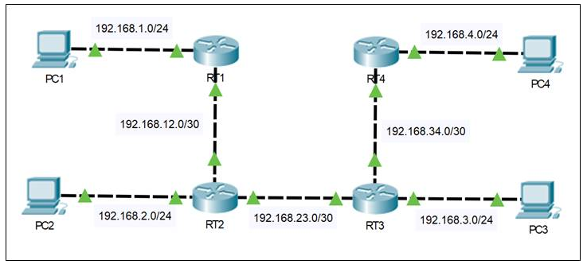
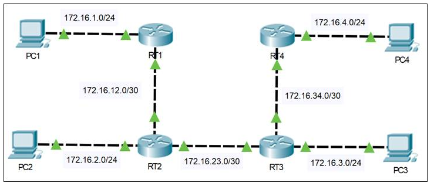

# Network追加課題

基礎研修の課題が全て完了した場合は以下の課題に着手して下さい

    
追加課題1-1

    

ネットワーク図に従って、PCとルータに適切なIPアドレスを設定してください  
インターフェース番号は各自で調査してください

:::caution
PC以外のGUI設定は禁止とします
:::

#### 構成図

    

    
追加課題1-2

    

*追加課題1-1*を引き続き使用します  
4台のルータにRIPv1を設定し、4台のPCがお互いにICMPでの疎通確認に成功するようにしてください  

:::caution
PC以外のGUI設定は禁止とします
:::
    

    
追加課題2

    

ネットワーク構成図に従いIPアドレスとRIPの設定を行ったはずなのですが、いずれのPC同士の通信もうまくいきません  
問題点を修正しお互いの通信が通るようにしてください  

以下のリンクからファイルをpktファイルをダウンロードして下さい  

[課題ファイルダウンロード](https://drive.google.com/open?id=13A5FMEEgHBMs232KbpWmaJxe1aIQf1no&authuser=m.isobe.reg%40gmail.com&usp=drive_fs)

:::caution
PC以外のGUI設定は禁止とします  
RIPによるルーティングを必須とし、スタティックルートやそれ以外のルーティングプロトコルは禁止します
:::

#### 構成図
|
    

    
追加課題3

    

以下要件を満たすネットワークを構築してください

- 各ルータに**シングルエリアOSPF**の設定を行う
- 各ルータに**プロセスID**及び**ルータID**は以下の様に設定する

||プロセスID|ルーターID|
|---|:---:|:---:|
|router1|1|1.1.1.1|
|router2|2|2.2.2.2|
|router3|3|3.3.3.3|
|router4|4|4.4.4.4|

- プライオリティをrouter1が**DR**、router2が**BDR**になるように調整する
  ※プライオリティ値は任意で設定する
- PC向けの**Helloパケット**が発生しないように設定する
- Hello間隔を5秒に変更する
- PC間での**icmp**を可能にする

#### 構成図

    

