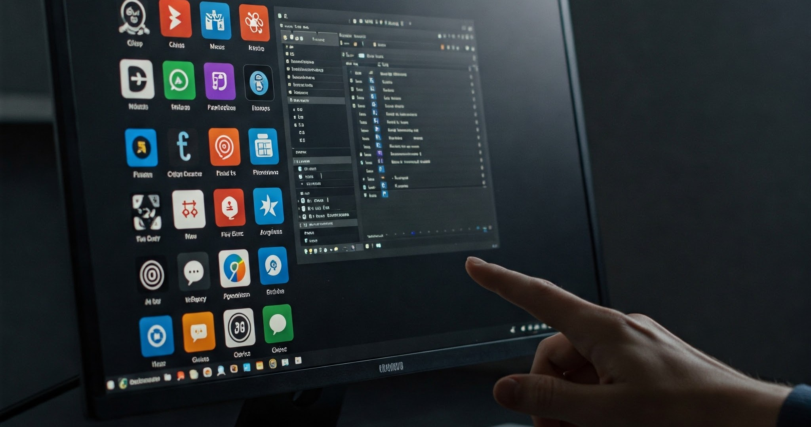
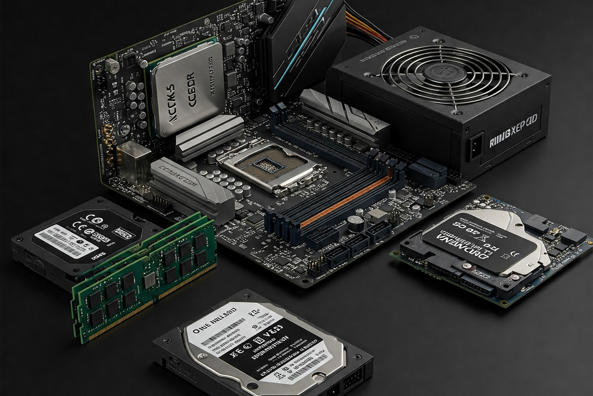
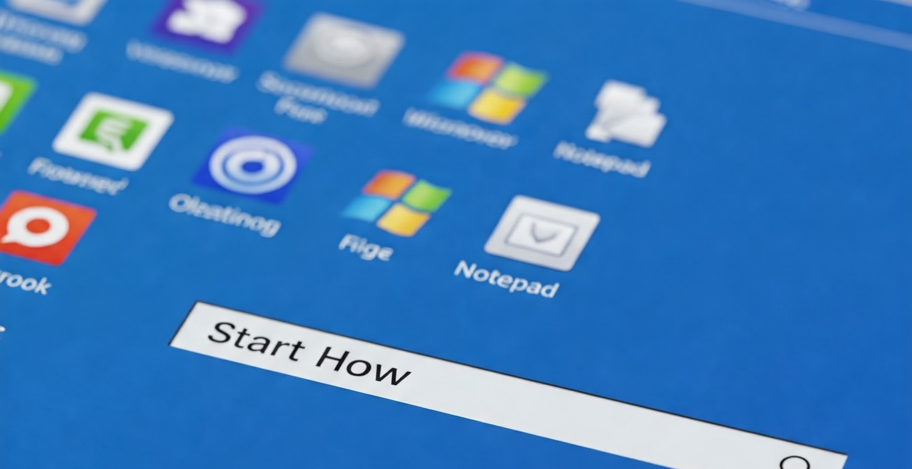
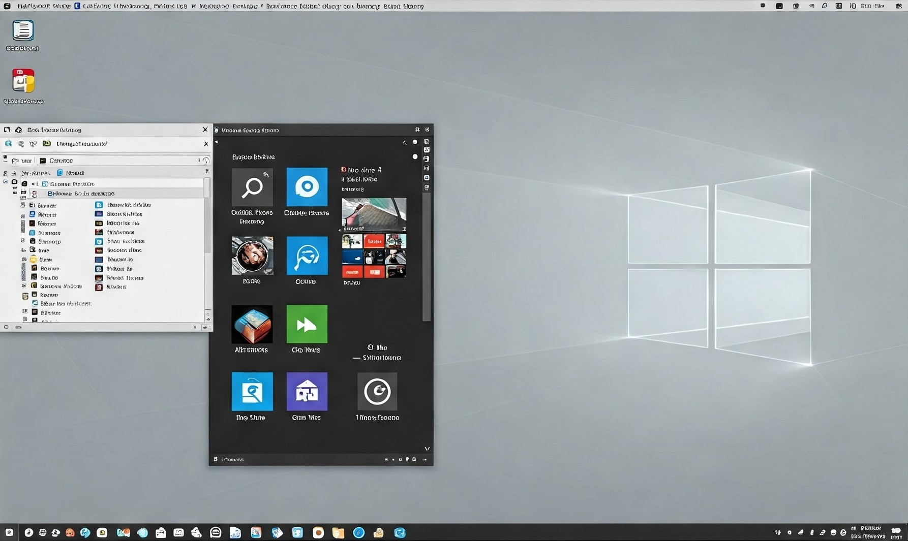
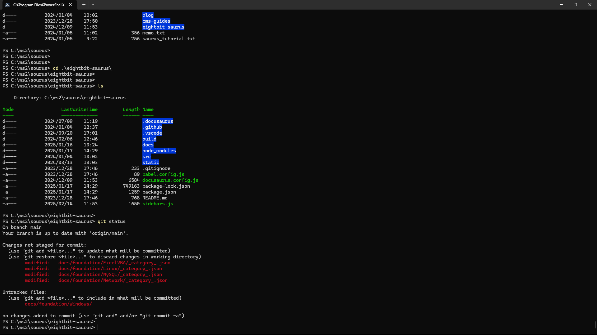
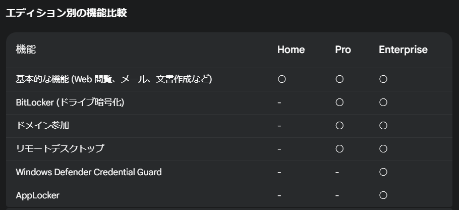

# OSとは

突然ですが、みなさんはPCをお持ちでしょうか。  
持っていない人、macOSのPCを使っている人、様々だと思いますが、多くの人はWindowsOSのPCを使っているのではないでしょうか。  

エンジニアとしてキャリアを築く上で、このWindowsは必ずと言っていいほど使用することになるでしょう。  
このページではそもそもOSとは？  
というお話から、Windowsについての理解を深める内容になっています。

## OS

OSとは、**O**peration **S**ystem の頭文字を取った略語で、この業界では一般的な用語です。  
OSには様々な種類があり、WindowsもOSの一種と言えます。  
代表的なもので言うと、MacやLinuxなどもOSの類です。  

スマホにおいては、iPhoneのiOSやAndroid端末のAndroidが主流です。  
これらは聞いたことがある人も多いのではないでしょうか。

## PCを構成する要素
OSを理解するために、まずは事前知識として、PCを構成するハードウェアについての理解を深めましょう。  
ハードウェアとは、PCを動かすために必要な、物理的な部品のことです。  
PCは、以下のハードウェアで構成されています。
- CPU (**C**entral **P**rocessing **U**nit)
- メモリ (RAM: **R**andom **A**ccess **M**emory)
- ストレージ
- マザーボード
- 電源ユニット

それぞれの役割について、以下の表にまとめています。  

||役割|
|---|---|
|CPU|PCの「脳みそ」にあたる部分で、プログラムの実行やデータの処理を行います。  性能が高いほど、高速な処理が可能です。|
|メモリ|プログラムやデータを一時的に保存する場所です。PCにおける作業デスクと比喩されることが多いです。 容量が大きいほど、多くのプログラムを同時に実行できます。|
|ストレージ|プログラムやデータを長期的に保存する場所です。 HDD (Hard Disk Drive) や SSD (Solid State Drive) などがあります。|
|マザーボード|PCの基盤となる部分で、CPU、メモリ、ストレージなどの部品が接続されます。 各部品間のデータのやり取りを制御します。|

:::tip
補足ですが、これらに加え、マウスやキーボードもハードウェアと言えます。  
特にサーバのハードウェアに関する詳しい情報は[**こちら**](/eightbit-saurus/docs/hw/page1)からご確認下さい。
:::

OSは、これらハードウェアとソフトウェア（アプリケーション）の間を取り持ち、円滑な動作を支える基盤となるソフトウェアです。  
もし、あなたのPCにOSが搭載されていなければ、マウスすら使うことができないでしょう。  
自分の意思を反映しようと思っても、1と0を組み合わせて操作することになります。  
以上のことから、人間が直感的にPCを使用できるように、OSは開発されたと言えます。  

## OSの具体的な役割
では具体的に、OSがどのような役割を担っているのか、以下の表で確認しましょう。  

|役割|説明|
|---|---|
|ハードウェア管理|CPUの処理時間配分、メモリの割り当て、ストレージのデータ管理など、ハードウェア資源全体を効率的に管理します。|
|実行環境の提供|アプリケーションが動作するために必要な共通の機能（例えば、ファイル操作、画面表示、ネットワーク通信など）を提供し、アプリケーション開発を容易にします。|
|UIの提供|マウスやキーボードからの入力を受け付け、画面に情報を表示するなど、ユーザーがコンピューターを操作するための手段を提供します。|
|セキュリティ管理|ユーザー認証、アクセス制限、データ暗号化など、コンピューターシステム全体の安全性を維持するための機能を提供します。 OSは、コンピューターの電源を入れた際に最初に起動し、すべてのソフトウェアの動作を管理します。OSがなければ、アプリケーションは動作せず、ユーザーはコンピューターを操作することができません。|

## Windowsとは

以上を踏まえた上で、WindowsOSがどういう物なのか、解説します。  
Windows OS は、マイクロソフト社が開発・販売している、世界で最も広く使われているオペレーティングシステム (OS) です。  
パソコン (PC) をはじめ、タブレットやスマートフォンなど、様々なデバイスで利用されており、圧倒的なシェアから、多くの業務領域で使用されています。

### WindowsOSの特徴
#### 使いやすいインターフェース
`GUI (Graphical User Interface)` と呼ばれる、マウスやキーボードを使って視覚的に操作できるインターフェースを採用しており、初心者でも扱いやすいのが特徴です。  
一部のOSでは、`CUI(Charactor User Interface)`と呼ばれる、コマンドを使用して操作するインターフェースが用意されており、こちらは主にサーバー等で使用されます。  
実はこのCUI、Windows OSにも搭載されていますが、紹介は後ほど。

|GUI|CUI|
|---|---|
|||

#### 豊富なソフトウェア
世界中で多くの開発者が Windows OS に対応したソフトウェアを開発しており、ビジネス用途からゲームまで、様々なジャンルのソフトウェアが利用できます。

#### 高い互換性
多くのハードウェアメーカーが Windows OS に対応した製品を開発しており、周辺機器やパーツの選択肢が豊富です。

#### 継続的なアップデート
マイクロソフト社は定期的に Windows OS のアップデートを行い、セキュリティの向上や新機能の追加を行っています。 
これを`Windows Update`と呼びます。詳しくは後述します。

### Windows OS の種類

Windows OS には、様々なエディション (種類) があります。主なエディションとしては、以下のものがあります。
|エディション|説明|
|---|---|
|Windows 11 Home|一般家庭向けの基本的なエディションです。|
|Windows 11 Pro|ビジネス用途向けの機能が追加されたエディションです。|
|Windows 11 Enterprise|大企業向けの高度な機能が搭載されたエディションです。|

エディションの違いにより、使用可能な機能に違いがあります。  
業務用途では、Proエディション、又はEnterpriseエディションが使用されると考えて下さい。

### Windows OS の歴史
Windows OS は、1985 年に Windows 1.0 として初めてリリースされました。  
その後、Windows 95、Windows XP、Windows 7、Windows 10 など、様々なバージョンがリリースされ、2025年現在では Windows 11 が最新バージョンとなっています。

