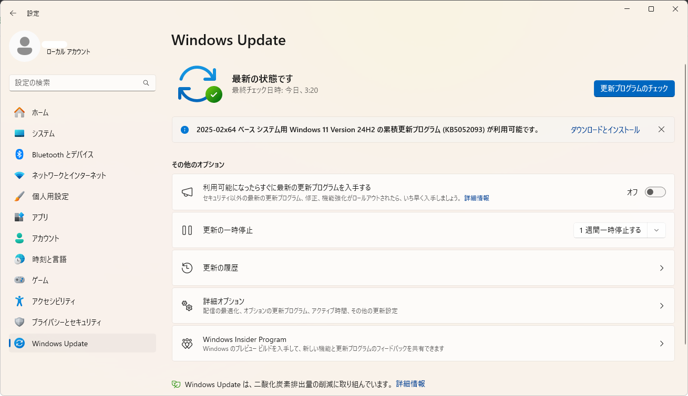

# Windows Update

Windows Update は、Microsoft が提供するWindows オペレーティングシステム (OS) やその他の Microsoft ソフトウェアの更新プログラムをダウンロードし、インストールするためのサービスです。

## Windows Update の役割
Windows Update は、以下の目的のために重要な役割を果たしています。

|役割|説明|
|---|---|
|セキュリティの向上|セキュリティ上の脆弱性を修正する更新プログラムを提供し、マルウェアやハッカーからの攻撃からコンピューターを保護します。|
|機能の追加と改善|新しい機能を追加したり、既存の機能を改善したりする更新プログラムを提供し、Windows の使いやすさやパフォーマンスを向上させます。|
|互換性の維持|ハードウェアやソフトウェアの互換性を維持するための更新プログラムを提供し、Windows が正常に動作するようにします。|
|不具合の修正|Windows やその他の Microsoft ソフトウェアに存在する不具合を修正する更新プログラムを提供し、安定性を向上させます。|

## Windows Update の種類
Windows Update には、主に以下の種類の更新プログラムがあります。  
アップデート頻度が重要なシーンも考えられますので、是非覚えておきましょう。

|更新プログラムの種類|頻度|説明|
|---|---|---|
|品質更新プログラム|毎月第2水曜日または第3水曜日|セキュリティ修正、バグ修正、ドライバー更新|
|機能更新プログラム|年1回|新機能の追加、既存機能の改善(大型アップデートと呼ばれます)|

## Windows Update の設定
Windows Update の設定は、以下の手順で変更できます。  
スタートメニューから「設定」を選択します。  
Windows Update を選択: 設定アプリのホーム画面で「Windows Update」を選択します。

### 更新プログラムの設定
更新プログラムのダウンロードとインストールに関する設定 (例: 自動更新の有効/無効、更新プログラムのインストール時刻) を変更できます。  
業務利用の場合、以下の理由により基本的に自動更新は**無効**に設定します。
- 作業の中断や業務遅延の原因となる可能性がある
- 既存のソフトウェアやハードウェアとの互換性が失われる場合
- 更新プログラムに脆弱性が含まれている可能性がある
- 業務システムが特定のバージョンのWindowsやドライバに依存している場合

自動更新を無効にする場合は、定期的な手動更新を怠らないようにしてください。  
セキュリティリスクが高まる可能性があります。

業務利用においては、**システムの安定性**、**業務時間への影響**、**互換性**、**セキュリティリスク**などを考慮し、自動更新の有効/無効を適切に判断することが重要です。

:::caution
### Windows Update の注意点

#### 更新プログラムの適用
個人利用において、セキュリティと安定性を維持するためにできるだけ早く適用することをおすすめします。  
業務利用では、更新プログラムによって予期せぬ事態が発生することを忌避するため、**事前検証によって正常性確認が担保されてから適用**するのが一般的です。

#### 自動更新
自動更新を有効にしておくと、Windows Update が自動的に更新プログラムをダウンロードし、インストールしてくれます。  
前述の通り、予期せぬ事態の発生を予防するため、業務利用では基本的にこの機能はOFFにしておきましょう。**(プロジェクトや企業により運用は異なります)**

#### 再起動
更新プログラムによっては、インストール後にコンピューターの再起動が必要になる場合があります。
:::

