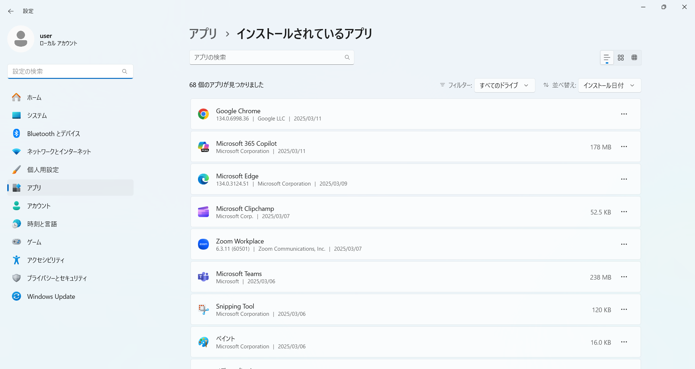
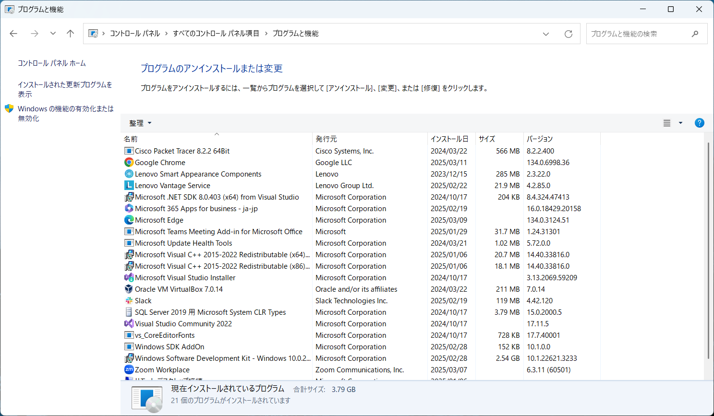
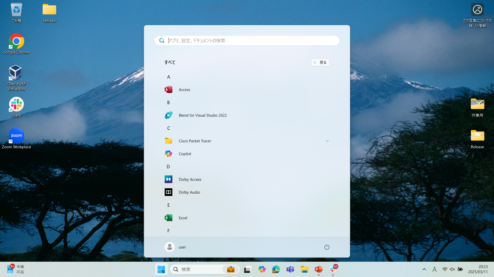
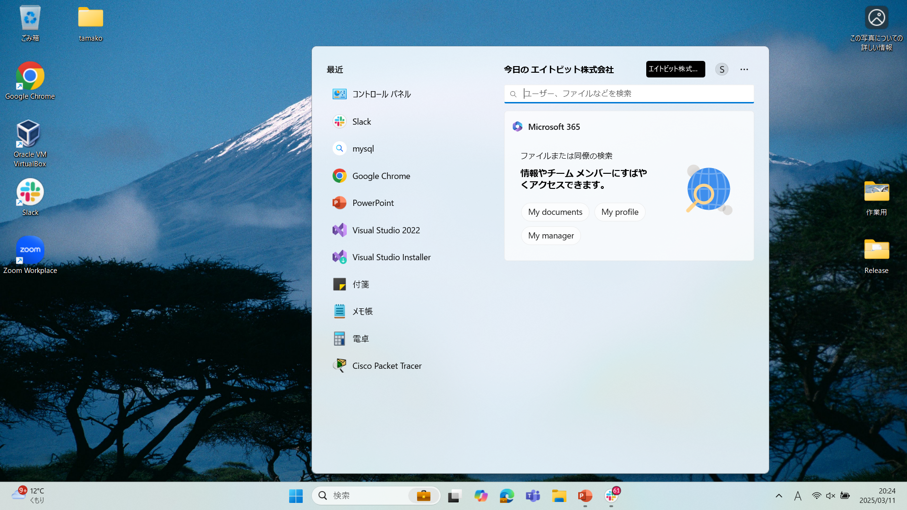
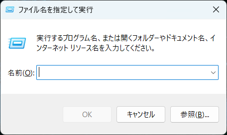
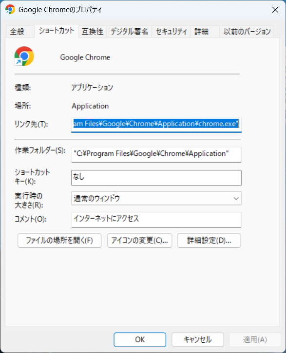
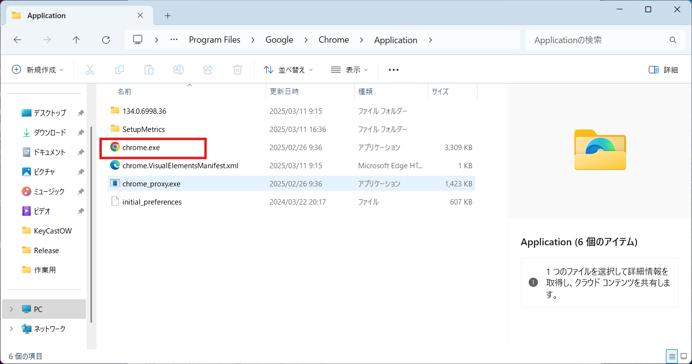

# アプリケーション

Windows 11 におけるアプリの起動方法について解説します。  
様々な起動方法を覚え、効率的にアプリを使いこなしましょう。

## Windows におけるアプリとは
アプリケーションとは、特定の目的を達成するために設計されたソフトウェアのことです。  
大きく**デスクトップアプリ**と**Webアプリ**の2つに分類されます。

|役割|説明|
|---|---|
|デスクトップアプリ|PCにインストールして使用するタイプの アプリケーション のことで、WordやExcel、テキストエディタ等が例として挙げられます。|
|Webアプリ|Webブラウザ上で動作するタイプのアプリ です。 Gmail、Google ドキュメント等のブラウザで提供されるサービス全般を指します。|

この記事では、デスクトップアプリケーションにフォーカスして進行します。

## インストールされているアプリ一覧
インストールされているアプリを確認する方法は以下の通りです。

`Win + X` を入力し、「**インストールされているアプリ**」にカーソルが当たっている状態でエンターキーを押します。  
設定画面でインストールされているアプリの一覧を確認することができます。

また、これはコントロールパネルでも確認可能です。  
カテゴリ表示の場合は「**プログラムのアンインストール**」  
大きいアイコン、または小さいアイコン表示の場合は  
「**プログラムと機能**」からアプリ一覧画面を確認することができます。

## アプリの起動
特定のアプリケーションを起動する場合、デスクトップのショートカットをダブルクリックして実行することが一般的かもしれません。  
しかし、業務上無数のアプリケーションを使用することもあります。  
デスクトップにいちいちショートカットを置くと、非常に醜いデスクトップになりかねません。  
そこで、ショートカットアイコンに頼らない起動方法をいくつか紹介します。

### スタートメニューから探す

スタートボタンをクリック、又は`Win`キーを押下します。  
「**すべてのアプリ**」をクリックします。  
アプリの一覧から、起動したいアプリを探してクリックします。

### 検索 (Win + Q)

タスクバーやWindowsメニューの検索ボックスに、アプリ名を入力します。  
検索結果に表示されたアプリをクリックします。  
アプリ名の一部を入力するだけでも、候補が表示されます。  
一般的にはこの方法をよく使用します。

### ファイル名を指定して実行

Windows の「ファイル名を指定して実行」は、キーボードから直接コマンドやファイルパスを入力して、プログラムやファイル、フォルダなどを素早く起動するための便利な機能です。  
`Win` + `R` を同時に押すことで上記のダイアログボックスが表示されます。  
表示されたダイアログボックスに、実行したいプログラムのコマンド名やファイルパスを入力することで目的のプログラム(アプリケーション)を実行することができます。  

:::tip
### パスの概念
「パス」とは、簡単に言うとファイルやフォルダがコンピューター内のどこに存在するかを示す「**住所**」のようなものです。  
コンピューターは、無数のファイルやフォルダを整理するために、それぞれに固有の「住所」を持っています。  
この「住所」が「パス」であり、ファイルやフォルダの場所を特定するために使用されます。
#### フォルダの階層構造
Windowsではフォルダが**階層状**に整理されており、パスはこの階層構造をたどって目的のファイルやフォルダにたどり着くための道筋を示します。
#### パスの表記
Windowsでは、パスは「**C:\フォルダ名\ファイル名**」のように、ドライブ名から始まり、フォルダ名を「\」で区切って表記します。  
例： 「*C:\Users\ユーザー名\Documents\ファイル名.txt*」

### パスの種類
パスには大きく分けて「**絶対パス**」と「**相対パス**」の2種類があります。  
非常に重要な概念なので覚えておきましょう。

#### 絶対パス
ドライブ名から始まる、ファイルやフォルダの**完全な住所を示すパス**です。  
常に同じ場所を指し示すため、ファイルの場所が変わってもパスは変わりません。  
例： 「*C:\Users\ユーザー名\Documents\ファイル名.txt*」
#### 相対パス
現在の場所（作業中のフォルダなど）を基準とした、ファイルやフォルダの場所を示すパスです。  
現在の場所からの**相対的な位置関係**を示すため、現在の場所が変わるとパスの意味も変わります。  
例： 「*Documents\ファイル名.txt*」（現在の場所が「C:\Users\ユーザー名」の場合）  

※「現在の場所」とは、カレントディレクトリとも呼ばれます。(詳しくは[コマンドプロンプト](./page7.md)で)

:::

### ファイルの実行 (exe 直接起動)
exeとは、実行ファイル、や、実行可能プログラムとも呼ばれ、アプリケーションを実行するためのファイル形式です。  
平たく言えばアプリケーション本体のことです。

通常、exe ファイルは「Program Files」または「Program Files (x86)」フォルダにあります。  
エクスプローラーを開き、起動したアプリのインストールフォルダに移動し、実行ファイル (.exe) をダブルクリックします。  
また、exe ファイルを右クリックし、「管理者として実行」を選択すると、管理者権限でアプリを起動することができます。  
ショートカットファイルは、このexeファイルを別の場所から実行するためのリンクファイルでしかありません。  
ショートカットを削除しても問題はありませんが、exeファイルを削除してしまうと、アプリケーション自体を削除することになるので、十分気をつけましょう。  
例えば、Google Chromeのショートカットのプロパティを見てみましょう。  

「リンク先」の欄にexeファイルのフルパスが記載されています。  
この階層をエクスプローラで開くと、アプリケーション本体ファイルを確認することができます。

## 演習
<iframe class="youtube-16-9" src="https://www.youtube.com/embed/3FN4mhQTZYA?si=PY9D1Oz7n9sxXUfe" title="YouTube video player" frameborder="0" allow="accelerometer; autoplay; clipboard-write; encrypted-media; gyroscope; picture-in-picture; web-share" referrerpolicy="strict-origin-when-cross-origin" allowfullscreen="true"></iframe>

## まとめ
アプリの起動方法は様々です。状況に合わせて最適な方法を選び、効率的にアプリを使いこなしましょう。

