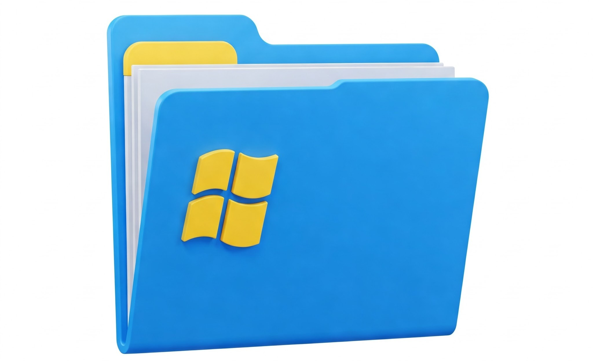
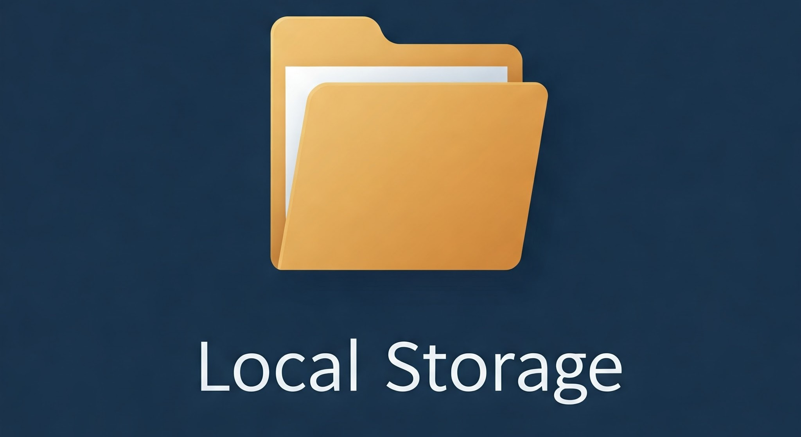

# ファイル操作

Windows エクスプローラーにおける基本的なファイル操作について解説します。  
日常的にはマウスを使用して操作しますが、可能な限りキーボードで操作してみましょう。  
これらの操作は、日々のパソコン作業において非常に役立ちますので、同じ様に手を動かして、ぜひ身につけましょう。

## フォルダ作成  

新しいフォルダを作成する方法は以下の通りです。  

今回はデスクトップに作成します。  
右クリックメニューからも「**新規作成**」→「**フォルダー**」を選択することでフォルダを作成できますが、`Ctrl`と`Shift`と`N`でもフォルダを作成することができます。  
よく使用するのでこちらを推奨します。  
新しいフォルダの名前を入力し、`Enter` キーを押します。  
このショートカットを使用して、動画内と同様にフォルダを作成してみましょう。  
フォルダ名やファイル名は、右クリックから「**名前の変更**」をクリックすることで変更できますが、`F2`キーでも同様の事が可能です。  

## テキストファイル作成
:::caution
前提として、**拡張子の表示が有効**になっていることを確認して下さい。  
[こちらの「拡張子」](#エクスプローラー補足)を参照して設定を確認しましょう。
:::
テキストファイルを作成する方法は以下の通りです。

フォルダ作成と同様に、ファイルを作成したい場所をエクスプローラーで開きます。  
右クリックメニューから「**新規作成**」→「**テキスト ドキュメント**」を選択します。  
新しいテキストファイルの名前を入力し、`Enter` キーを押します。  
動画内と同様に操作してみましょう。

## ファイルコピー&ペースト  
ファイルをコピーする方法は以下の通りです。  

コピーしたい対象ファイルを選択します。  
右クリックから「**コピー**」ボタンをクリックすることでコピーできますが、`Ctrl + C`で同じことができます。  
貼り付けは`Ctrl + V`です。  
コピー先のフォルダに貼り付けするまで、動画内と同様に操作してみて下さい。  
これらのショートカットの利用頻度はかなり高いので、覚えておきましょう。  

一度コピーしたファイルは、`Ctrl`を押しながら `V`を連打することで、この様に連続で複製することができます。  

## 上の階層に戻る
フォルダ階層を移動する方法は以下の通りです。  

エクスプローラーのアドレスバーにある「**←**」ボタンをクリックします。  
または、**アドレスバーにあるフォルダ名**をクリックすることで、直接そのフォルダに移動できますが`Alt + ←` のショートカットキーも利用できます。  
これは階層に関係なく、直前に開いていたフォルダを参照して戻る動作をします。  

同じ様なショートカットとして、`Alt + ↑` がありますが、こちらは現在のフォルダから見て相対的に一つ上の階層に移動することができます。  
言葉で説明されてもピンとこない方は、是非実践で身につけましょう。  

## 切り取り  
ファイルを切り取る (移動する) 方法は以下の通りです。

切り取りたいファイルを選択します。  
切り取りは、対象ファイルを選択した状態で`Ctrl + X`。  
移動先のフォルダに移動し、`Ctrl + V`で貼り付けしましょう。

## 圧縮
#### 圧縮とは
圧縮とは、ファイルやフォルダーのサイズを小さくすることを指します。  
複数のファイルをまとめて圧縮したり、大きなファイルを分割して圧縮したりすることができます。  
主にネットワーク越しのデータのやり取りが発生する場合に使用されます。

ファイルを圧縮する方法は以下の通りです。

圧縮したいファイルまたはフォルダを選択します。  
今回は特定のフォルダを圧縮してみましょう。  
右クリックメニューから「**送る**」→「**圧縮 (zip 形式)**」を選択します。  
圧縮された ZIP ファイルが作成されます。

## 展開  
#### 展開とは
展開とは、圧縮されたファイルを元の状態に戻すことを指します。  
展開のことを解凍と表現したりもするので、覚えておきましょう。

圧縮された ZIP ファイルを展開する方法は以下の通りです。  

先ほど圧縮したzipファイルを展開します。  
展開したい ZIP ファイルを右クリックします。  
「**すべて展開**」を選択します。  
展開先のフォルダを指定し、「**展開**」ボタンをクリックします。  

## 削除 (完全削除)  
ファイルを削除する方法は以下の通りです。

削除したいファイルまたはフォルダを選択します。  
先ほど圧縮したフォルダ削除してみましょう。  
`Delete` キーを押します。  
ゴミ箱に移動したファイルは、右クリックメニューから「**完全に削除**」を選択することで、完全に削除できます。  
`Delete`キーで削除するとゴミ箱に移動しますが、`Shift` を押しながら `Delete` キーを押すと、ゴミ箱をスキップして完全に削除することができます。  

:::danger
完全に削除してしまった場合は復元することができないので、使う場合は注意して使いましょう。  
:::

## エクスプローラー補足

    
エクスプローラーの役割

    

Windows エクスプローラーは、ファイルやフォルダーを管理するための基本的なツールです。  
毎日、必ずと言っていいほど使用することになります。

業務上、「**ローカル**」という言葉を耳にすることがあるかもしれません。  
例えば、「**ローカルにダウンロード**」や、「**ローカルのファイル**」、など。  
ローカルというのは、この様なシーンでは使用している**端末のストレージ**のことを指します。  
作成したファイルを保存したり、ネットからファイルをダウンロードするとローカルストレージに保存され、それらのファイルを閲覧、管理するためにはエクスプローラーを使用する必要があります。

また、何かをダウンロードする際は、基本的にはダウンロードフォルダに保存されますが、保存先フォルダを選択する場合もあります。  
その場合、場所を覚えておく必要があるので注意しましょう。  
忘れてしまうとエクスプローラーの広大な領域を彷徨う事になってしまいます。

Windowsではファイルなどを格納する入れ物を**フォルダ**と呼びますが、他OSでは**ディレクトリ**と呼んだりします。  
これらはほぼ同一の概念であることも、あわせて覚えておきましょう。
   

    
拡張子

    

### 拡張子とは
拡張子とは、ファイル名の末尾に付く文字列で、ファイルの種類を識別するために用いられます。  
例えば、**".txt"** はテキストファイル、**".docx"** は Word ファイル、**".jpg"** は画像ファイルであることを示します。

Windowsにおいては、拡張子とアプリケーションの紐づけが設定されています。  
例えば.jpg拡張子のファイルをダブルクリックで実行した場合、フォトアプリが起動します。  
これはjpg拡張子のファイルはデフォルトでフォトアプリで開く、という設定がされているからです。  
設定によってはこのデフォルトで使用するアプリを変更することもできます。  
**拡張子一つでファイルの振る舞いが大きく変わる**ので、非常に重要な概念と言えます。

### 拡張子の表示方法
Windows では、デフォルトで拡張子が**非表示**になっています。  
表示するには、以下の手順で設定を変更します。

エクスプローラーを開き、「表示」タブをクリックします。  
「表示/非表示」グループにある「ファイル名拡張子」にチェックを入れます。  
新たなPCを操作する際は、まず拡張子を表示するように設定しましょう。

   

    
隠しファイル、フォルダー

    

### 隠しファイル、フォルダーとは
隠しファイル、フォルダーとは、通常のエクスプローラーの表示では見えないように設定されたファイルやフォルダーのことです。  
システムファイルなど、誤って変更されると問題が発生する可能性のあるファイルが隠しファイルとして扱われることがあります。  
重要な設定のファイルだったりするので、必要な場合以外は触らないことをおすすめします。

### 隠しファイル、フォルダーの表示方法
隠しファイル、フォルダーを表示するには、拡張子と同様の手順で設定を変更することができます。

   

    
ファイルのソート

    

エクスプローラーでは、ファイルやフォルダーを様々な条件でソートすることができます。
|ソート基準|説明|
|---|---|
|名前|ファイル名やフォルダー名でソートします。|
|更新日時|ファイルやフォルダーが最後に更新された日時でソートします。|
|種類|ファイルの種類 (拡張子) でソートします。|
|サイズ|ファイルサイズでソートします。|

ソート方法を変更するには、エクスプローラーの表示形式を変更するか、各項目名をクリックします。

目的に合わせて、ソートを活用しましょう。
   

    
パスとドライブ

    

## パスとは
パスとは、ファイルやフォルダーの場所を示す文字列のことです。  
例えば、「*C:\Users\username\Documents\myfile.txt*」というパスは、「C ドライブ」の中の「Users」フォルダーの中の「username」フォルダーの中の「Documents」フォルダーの中にある「myfile.txt」というファイルを示します。

日本版Windowsではフォルダの区切り文字には円マークが使用されますが、オリジナル版ではバックスラッシュが使用されます。  
文字コードの関係上、環境によってはバックスラッシュが使用されることもあるので注意しましょう。

## ドライブとは
ドライブとは、ストレージ (HDD や SSD など) を区切って認識するための単位です。  
通常、アルファベット (C、D、E など) で識別されます。  
パスの説明で出てきた、「*C:\Users\username\Documents\myfile.txt*」というパスの先頭と見ると、「C:\」という記載があります。  
これはCドライブを表しており、ファイルシステムにおける最上位層に当たります。  
一般的にはCドライブにシステムファイル(OSを構成するファイル群)が格納されており。  
物理ストレージが複数存在する場合はDドライブとして個人的なファイル等を格納します。
   

## 演習
<iframe class="youtube-16-9" src="https://www.youtube.com/embed/rOBwRThxTUs?si=2bZDhwGCHMbb_S7A" title="YouTube video player" frameborder="0" allow="accelerometer; autoplay; clipboard-write; encrypted-media; gyroscope; picture-in-picture; web-share" referrerpolicy="strict-origin-when-cross-origin" allowfullscreen="true"></iframe>

## まとめ  
この動画では、Windows エクスプローラーを使った基本的なファイル操作について解説しました。  
これらの操作をマスターすることで、ファイル管理がよりスムーズになります。ぜひ、実際に試してみてください。