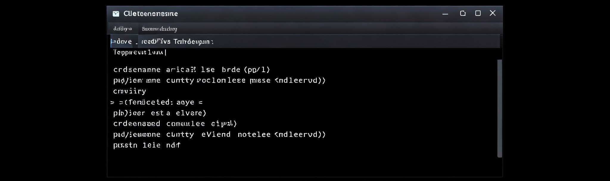

# コマンドプロンプト

## はじめに
この資料は、Windows のコマンドプロンプトについて、初心者の方でも理解できるように説明します。  
コマンドプロンプトは、Windows をより深く理解し、効率的に操作するための強力なツールです。

## コマンドプロンプトとは？
コマンドプロンプトは、Windows に標準搭載されている、キーボードから文字を入力してコンピュータに命令を与えるためのツールです。  
GUIでは難しい操作や、システム管理など高度な作業を行う際に役立ちます。

### GUIとCUI
**GUI**は**G**raphical **U**ser **I**nterface、**CUI**は**C**haracter **U**ser **I**nterfaceの頭字語です。  
普段私たちが使っている Windows の画面は、マウスやアイコンを使って操作する GUI 、
コマンドプロンプトは、文字入力によって操作する CUI です。

#### できること
- ファイルやフォルダの操作
- システム設定の変更
- ネットワークの設定
- プログラムの実行 など

#### コマンドプロンプトの起動方法
- `Win + R`
- 入力欄に「*cmd*」と入力し`Enter`

#### 基本操作
以下の操作は、コマンドプロンプトを使用する業務では当たり前のように使用します。  
WindowsOS以外のCUIでも操作はほとんど共通なため、是非身につけておきましょう。

|操作|説明|
|---|---|
|コマンドの実行|コマンドを入力し、Enterキーを押します。|
|コマンドのキャンセル|Ctrl + Cキーを押します。|
|コマンド履歴の表示|↑キー、↓キーで過去に入力したコマンドを呼び出せます。|
|コマンドの補完|コマンドやファイル名を途中まで入力し、Tabキーを押すと、候補が自動的に表示されます。|

## 基本的なコマンド
コマンドをクリックすると、そのコマンドに関する詳細情報を見ることができます。  
使用例やオプション等を確認してみましょう。

|コマンド|説明|
|---|---|
|[dir](https://learn.microsoft.com/ja-jp/windows-server/administration/windows-commands/dir)|現在のフォルダにあるファイルやフォルダの一覧を表示|
|[cd](https://learn.microsoft.com/ja-jp/windows-server/administration/windows-commands/cd)|フォルダを移動|
|[mkdir](https://learn.microsoft.com/ja-jp/windows-server/administration/windows-commands/mkdir)|新しいフォルダを作成|
|[del](https://learn.microsoft.com/ja-jp/windows-server/administration/windows-commands/del)|ファイルを削除|
|[copy](https://learn.microsoft.com/ja-jp/windows-server/administration/windows-commands/copy)|ファイルをコピー|
|[move](https://learn.microsoft.com/ja-jp/windows-server/administration/windows-commands/move)|ファイルを移動|
|[ipconfig](https://learn.microsoft.com/ja-jp/windows-server/administration/windows-commands/ipconfig)|ネットワークの設定情報を表示|
|[ping](https://learn.microsoft.com/ja-jp/windows-server/administration/windows-commands/ping)|ネットワークの接続を確認|

### 管理者として実行
コマンドプロンプトを右クリックし、「管理者として実行」を選択すると、より高度な操作が可能です。

### コマンドプロンプトの活用例
- ファイルの操作:  
大量のファイルを一度に処理したい場合
- 特定の条件に合致するファイルを探したい場合  
システム管理:
- ネットワークの設定を変更したい場合  
システムの情報を確認したい場合
- プログラミング:  
プログラムの実行やデバッグ

## 演習
上記で解説した内容を、実際に手を動かして体験しましょう。  
動画内と同じ様に操作してみて下さい。
<iframe class="youtube-16-9" src="https://www.youtube.com/embed/ijHfHGJw294?si=GerJE92YIYJJdSUJ" title="YouTube video player" frameborder="0" allow="accelerometer; autoplay; clipboard-write; encrypted-media; gyroscope; picture-in-picture; web-share" referrerpolicy="strict-origin-when-cross-origin" allowfullscreen="true"></iframe>

## まとめ
コマンドプロンプトは、最初は難しく感じるかもしれませんが、慣れてくると非常に便利なツールです。  
ぜひ、色々なコマンドを試して、コマンドプロンプトを使いこなせるようになってください。
