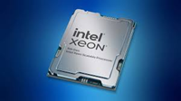
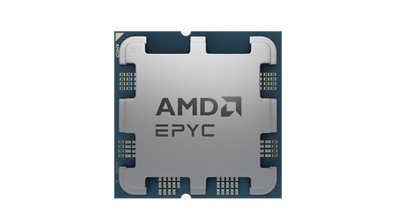
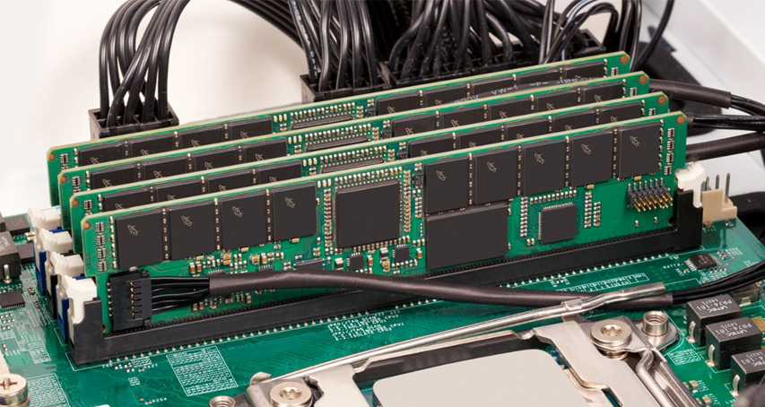
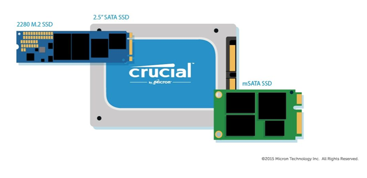
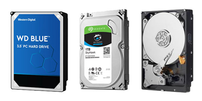
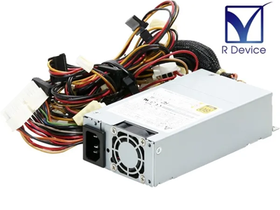
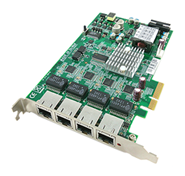
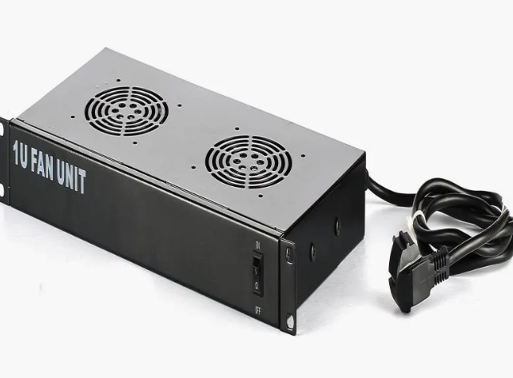

# サーバーのハードウェア基礎

サーバーは、企業やデータセンターで重要な役割を果たす専用のコンピュータであり、高い信頼性と耐久性が求められます。  
ここでは、サーバーの主要なハードウェア構成について解説します。

---

## 1. CPU（プロセッサ）
CPU（中央処理装置）は、サーバーの「頭脳」となる部分であり、あらゆる計算や処理を担当します。  
サーバーのCPUは、通常のパソコンよりも高度な処理を効率よく行うために設計されています。  

     

### ☑ わかりやすいイメージ
- 人間に例えると「脳」にあたる部分で、すべての指示を処理する役割を担う。
- 高性能なCPUほど、複数の作業を同時に素早くこなせる。

### ☑ 主な特徴
- **サーバー向けCPU**（Intel Xeon、AMD EPYC）
  - 高性能で長時間の稼働に耐えられるよう設計
  - 一般的なパソコン向けCPUよりも大きな処理能力を持つ
- **高コア数・高スレッド数**による並列処理性能
  - 1つのCPUの中に「コア」という小さな処理装置が複数入っている
  - コアが多いほど、同時に多くの処理が可能
- **大容量キャッシュメモリ**による高速データ処理
  - よく使うデータをすぐに呼び出せるため、動作がスムーズになる

:::note info
**キャッシュメモリとは？**  
キャッシュメモリは、「よく使うデータをすぐに取り出せる場所」のことで、例えば、学校の授業で使うノートを考えてみるとわかりやすい。  
📚 **メインメモリ（RAM） → 机の引き出しにしまってあるノート**  
💾 **キャッシュメモリ → 机の上に開いてあるノート**  
毎回、机の引き出しからノートを取り出していたら時間がかかるが、よく使うノートを机の上に置いておけば、すぐに書き込めるし読み返せる。  
コンピュータも同じで、よく使うデータをキャッシュメモリに置いておくことで、すぐに取り出せて動作が速くなる。  
:::

- **ECCメモリ対応**でデータの信頼性向上
  - エラー訂正機能があり、データの破損を防ぐ
- **省電力設計**で高効率な運用が可能
  - 消費電力を抑えながらも、安定したパフォーマンスを提供

---

## 2. メモリ（RAM）
メモリは、サーバーの「作業机」として機能し、一時的なデータを保存して高速処理を可能にします。  

 

### ☑ わかりやすいイメージ
- 大きな作業机があるほど、一度にたくさんの作業を効率よくこなせる。
- メモリが少ないと、処理が遅くなり、データを頻繁にストレージに書き込む必要がある。

### ☑ 主な特徴
- **ECCメモリの採用**（データエラーの自動訂正機能で信頼性向上）
- **大容量化**（仮想化環境やデータベース運用に最適）
- **デュアルチャネル・クアッドチャネル対応**（データ転送速度向上）

---

## 3. ストレージ（HDD/SSD）
ストレージは、サーバーの「記憶装置」として機能し、大量のデータを保管します。  

   
  

### ☑ わかりやすいイメージ
- HDDは大容量の本棚、SSDは高速な電子書籍リーダーのようなもの。
- SSDはHDDよりも高速で、データの読み書きが素早く行える。

### ☑ 主な種類
- **HDD（SAS / SATA）**：高耐久で長時間稼働向け
- **SSD（NVMe）**：超高速なデータアクセスが可能
- **エンタープライズSSD**：書き込み耐性が強く、耐久性が高い

### ☑ RAID構成
- **RAID 1**（ミラーリング）：冗長性を確保
- **RAID 5**（パリティ分散）：耐障害性と速度のバランス
- **RAID 10**（ストライピング+ミラーリング）：高速＆高冗長性
- **ホットスワップ対応**：ホットスワップ対応とは、パソコンやサーバーの電源を入れたままでも、SSDやHDDなどの機器を抜き差しできる機能のことです。
:::note info
RAIDは、複数のSSDを組み合わせて使用することで、速度を向上させたりデータを保護したりする技術です。  
RAID 0は、データを分割して複数のSSDに書き込むことで読み書きの速度を向上させますが、1台でも故障するとすべてのデータが失われてしまいます。RAID 1は、同じデータを2台のSSDに保存するため、1台が故障してもデータを保持できますが、使用できる容量は半分になります。  
RAID 5は、3台以上のSSDを使用し、データとエラー復旧用の情報（パリティ）を分散して保存することで、1台が故障してもデータの復元が可能です。  

ただし、2台同時に故障するとデータは失われてしまいます。  
速度を重視する場合はRAID 0、安全性を優先する場合はRAID 1、速度と安全性のバランスを取りたい場合はRAID 5が適しています。
:::
---

## 4. 電源（冗長化）
サーバーの電源は、安定した動作を維持するために重要な要素です。  

### ☑ わかりやすいイメージ
- 予備のバッテリーを持っていると、電池が切れてもすぐに交換できる。
- 冗長化された電源があれば、一つが故障してもサーバーが止まらない。

### ☑ 主な特徴
- **デュアル電源ユニット（冗長化）**：一方が故障しても継続稼働
- **UPS（無停電電源装置）対応**：停電時のデータ損失を防止
- **負荷分散電源装置（PDU）**：複数の電源供給経路を確保

---

## 5. ネットワークカード（NIC）
サーバーがインターネットや他のサーバーと通信するための重要な部品です。  

### ☑ わかりやすいイメージ
- NICはサーバーの「通信アンテナ」。
- 高性能なNICを使うと、高速で安定した通信が可能になる。

### ☑ 主な特徴
- **高性能NIC（1GbE / 10GbE / 40GbE）**：高速通信を実現
- **オフロード機能**搭載でサーバーの負荷を軽減
- **SR-IOV対応**（ネットワーク仮想化技術）で効率向上

### ☑ 冗長化構成
- **NICチーミング**：負荷分散と高速化
- **フェイルオーバー**：ネットワーク障害時の自動切り替え

---

## 6. 冷却と管理機能
サーバーは長時間稼働し続けるため、適切な冷却と管理が不可欠です。  

### ☑ 冷却
- **エアフロー設計**（前面吸気・背面排気）で冷却効率向上
- **温度管理センサー**：異常時に自動対策を実施

### ☑ リモート管理
- **iDRAC / iLO**：遠隔地からの電源管理・ハードウェア監視
- **BIOS / ファームウェアの遠隔アップデート**が可能
:::note info
例えば、  
DELLのサーバーでは「iDRAC」(Integrated Dell Remote Access Controller)、  
HP（Hewlett-Packard）のサーバーでは「iLO」(HP Integrated Lights-Out)、  
富士通のサーバーでは「iRMC」(Remote Management Controller)と呼ばれる機能を搭載しています。
:::
---

## 7. まとめ

サーバーのハードウェアは、高い信頼性と耐久性を備えた設計がされています。  
特に **冗長化構成や監視システム** を導入することで、長期間にわたる安定した運用が可能になります。

**これらの知識を活用し、効率的なサーバー運用を目指しましょう！**