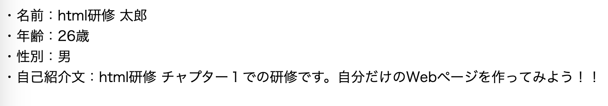

# 1. htmlの書き方とタグについて

## 目次

- 研修概要
- このチャプターでのゴール
- htmlとは？
  - タグとは？
  - 要素とは？
  - 属性とは？
- htmlの書き方
  - DOCTYPE宣言
  - htmlタグ
  - headタグ
  - bodyタグ
- 研修課題１

## 研修概要

このチャプターではhtmlの書き方やタグについて理解します。

## このチャプターでのゴール

htmlの書き方およびタグの意味を理解し、自己紹介ページを作成すること。

## htmlとは？

まずはhtmlとは何かを理解しましょう。

htmlとは、HyperText Markup Languageの略でマークアップ言語の１つです。  
マークアップとは、文書の構成や役割を示すことを意味します。  

皆さんがPCやスマートフォンで閲覧するWebページはこのhtmlを使って作られています。  
また、htmlを記述することにより、検索エンジンがWebサイトの構成を把握しやすくなり、その構成要素は主に３つ「タグ」「要素」「属性」があります。  

### タグとは？

タグとは、テキストに意味を与える目印です。

### 要素とは？

要素とは、見出しや段落などマークアップしたい対象の文字列を、タグで囲んだ情報の単位です。

### 属性とは？

属性とは、HTMLの要素に追加する情報のことです。

以上、これらの構成要素でWebページが制御されています。

## htmlの書き方

htmlの簡単な概要を理解した上で、実際にhtmlはどのようなものであるかを見てみましょう。  

まずは以下のリンクからファイルをダウンロードして任意のパスに展開して下さい  
[**ダウンロードリンク**](./files/研修コード.zip)

研修コードフォルダのChapter1.htmlの内容を記載しています。  

```html
<!DOCTYPE html>
<html lang="ja">
    <head>
        <meta charset="UTF-8">
        <title>Chapter1</title>
    </head>
    <body>
        Chapter1
    </body>
</html>
```

これがhtmlの基本形となっています。  
この`<>`がタグです。  
それでは、一つ一つ見ていきましょう。  

### DOCTYPE宣言

DOCTYPE宣言は、文書の冒頭でhtml文章であることを宣言するものです。  
この宣言は、html文書であれば必ず宣言するものですので、「お約束」として覚えておいてください。

```html
<!DOCTYPE html>
```

### htmlタグ

これもhtmlを記載する上でのお約束の一つとなります。  
文書全体をhtmlタグで囲みます。

また、lang="ja"と記載しているところに注目してください。  
これは、このWebページが扱う言語が日本語であることを宣言しています。  
例えば、これが日本語ではなく、英語を扱うページとして宣言をしたい場合は、lang="en"となります。その為、Webページの目的に応じてどの言語を扱うのかは事前に決めておきましょう!!

```html
<html lang="ja">

</html>
```

### headタグ

このheadタグにはメタデータを宣言します。  
メタデータとは文書全体の情報を意味し、その情報をこのheadタグの中で宣言しましょう。  
例えば、今headタグの中には２つのタグが定義されています。

1. metaタグ（この例では、文字コードがUTF-8であることを定義しています。）
2. titleタグ（このWebページタイトルがChapter1であることを定義しています。）

この2つのタグはWebページの情報を検索エンジンに伝える為のものなので、Webページの表示上は定義していたとしても特に変化はありません。

```html
<head>
    <meta charset="UTF-8">
    <title>Chapter1</title>
</head>
```

### bodyタグ

このbodyタグは画面に表示される領域を定義するセクションとなります。  
このbodyタグの中に、表示したい文字や画像を定義すると、ブラウザで表示されます。

ここでは「Chapter1」という文字列を定義しています。

※htmlでは、pタグやaタグ、h1タグなどを使い文字を表示したりしますが、タグをつかわずつかわず文字のみを表示することもできます。

```html
<body>
    Chapter1
</body>
```

## 研修課題１

簡単な自己紹介ページを作成してみましょう！  
自己紹介として記載する項目は以下項目とし、完成型は添付イメージを参考に作成してください。

:::tip
各自己紹介項目を改行して表示するには文末に `<br>` タグを入れると改行できます。
:::

- 名前
- 年齢
- 性別
- 自己紹介文


