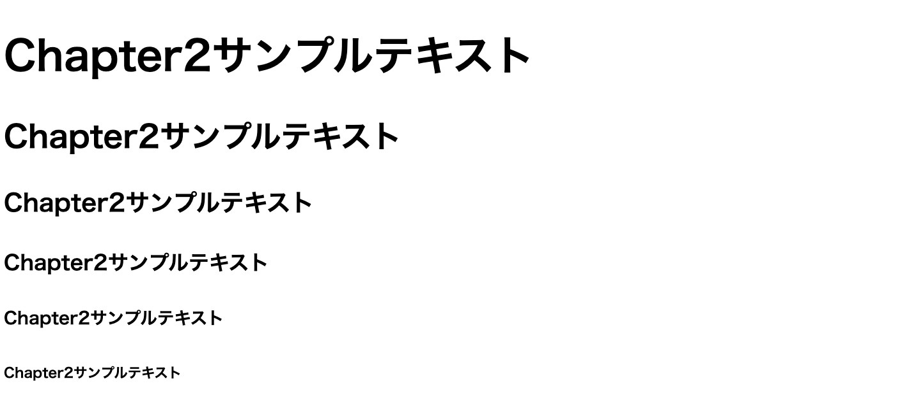
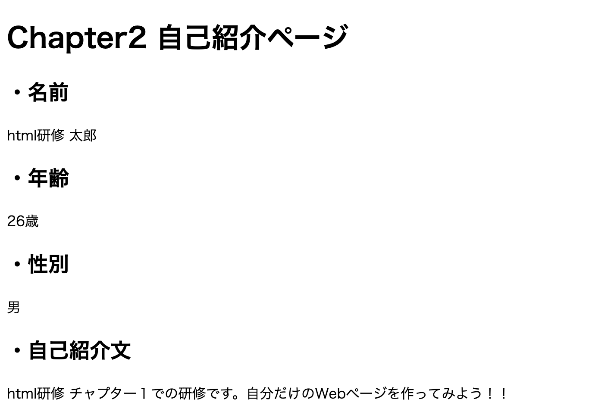

# 2. hタグについて

## 目次

- 研修概要
- このチャプターでのゴール
- hタグとは？
  - hタグの属性設定について
- 研修課題２

## 研修概要

このチャプターではhタグの使い方や種類、属性設定について理解します。

## このチャプターでのゴール

Chapter1で作成した自己紹介Webページにhタグを設定し、見出しをつけること。

## hタグとは？

「H」とは「Heading」の略で、見出しを意味するタグです。  
文章の章題や設題を記述し、その見出しの大きさに合わせて `<h1>` タグから `<h6>` タグまで設定できます。  
`<h1>` タグが一番大きな見出し（大見出し）になり、以下数字が小さくなるにつれ、下位の見出し（小見出し）という意味になります。  
同じ数値のものが複数ある場合は、同じランクとして扱われます。

見出しの数字が小さくなるにつれて文字が細く小さくなりますが、ブラウザによりその割合は異なります。

```html
<!DOCTYPE html>
<html lang="ja">
    <head>
        <meta charset="UTF-8">
        <title>Chapter2</title>
    </head>
    <body>
        <h1>Chapter2サンプルテキスト</h1>
        <h2>Chapter2サンプルテキスト</h2>
        <h3>Chapter2サンプルテキスト</h3>
        <h4>Chapter2サンプルテキスト</h4>
        <h5>Chapter2サンプルテキスト</h5>
        <h6>Chapter2サンプルテキスト</h6>
    </body>
</html>

```



以上、添付イメージのようにh1タグから下位のタグになるにつれ文字の大きさが小さくなっていっていることがわかります。

### hタグの属性設定について

hタグを使うことで大見出しや小見出しを設定することができ、Webページが見やすくなることを紹介しました。  
しかし、単にhタグを設定しただけでは文字列全体が画面左側に寄ってしまっているのでWebページとしては少し歪な見た目となってしまいます。  
そこで、hタグに”aligh=center"属性を付加します。  

```html
<h1 align="center">Chapter2サンプルテキスト</h1>
```

こうすることで、「Chapter2サンプルテキスト」という大見出しは画面上中央に配置されます。

## 研修課題２

Chapter1で作成した自己紹介ページに大見出しと小見出しをつけてみましょう。  
また、各自己紹介セクションは `<h2>` タグで構成し、内容は通常の文章で記載してください。  
※もし早めに課題が終了した場合は、「hタグの属性設定について」で触れたように大見出しや小見出しを画面中央配置するよう属性設定してみましょう。

:::tip
Webページを作るときには、そのセクションで何を伝え、どのように見せたいのかをしっかりと考えて作ると `<h>` タグの数値は自然と定まってきます。
:::

- 自己紹介ページ大見出し
- 名前
- 年齢
- 性別
- 自己紹介文


