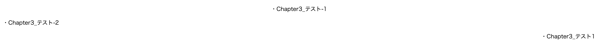
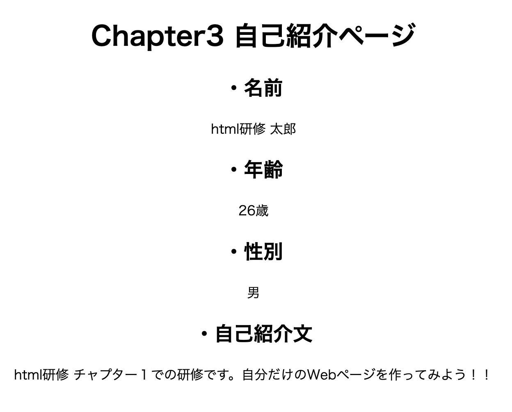

# 3. pタグについて

## 目次

- 研修概要
- このチャプターでのゴール
- pタグとは?
  - pタグの属性設定について
- 研修課題３

## 研修概要

このチャプターではpタグの使い方、属性設定について理解します。

## このチャプターでのゴール

Chapter1で作成した自己紹介Webページにpタグを設定し、段落をページに持たせること。

## pタグとは？

「P」とは、段落を指定するためのタグで、「Paragraph」の略です。`<p>` 〜 `</p>` で囲まれたテキストは１つの段落であることを示します。  
htmlの段落は、通常の文章と同じくひとかたまりを表します。

例えば...

```html
<!DOCTYPE html>
<html lang="ja">
    <head>
        <meta charset="UTF-8">
        <title>Chapter3</title>
    </head>
    <body>
        <p>・テスト</p>
        <p>・おはようございます。こんにちは。こんばんは。</p>
    </body>
</html>
```

のように、Chapter1では段落ごとの改行に `<br>` タグを利用し改行をしていましtが、 `<p>` タグを使うと、一つの段落となります。

### pタグの属性設定について

Chapter2では、hタグの中央よせについて解説をしましたが、pタグでも同様に段落の中央寄せや左右寄せの段落を同じ属性設定で行うことができます。

- 画面中央寄せ

```html
<!DOCTYPE html>
<html lang="ja">
    <head>
        <meta charset="UTF-8">
        <title>Chapter3</title>
    </head>
    <body>
        <p align="center">・Chapter3_テスト-1</p>
    </body>
</html>
```

- 画面左寄せ

```html
<!DOCTYPE html>
<html lang="ja">
    <head>
        <meta charset="UTF-8">
        <title>Chapter3</title>
    </head>
    <body>
        <p align="left">・Chapter3_テスト-2</p>
    </body>
</html>
```

- 画面右寄せ

```html
<!DOCTYPE html>
<html lang="ja">
    <head>
        <meta charset="UTF-8">
        <title>Chapter3</title>
    </head>
    <body>
        <p align="right">・Chapter3_テスト-3</p>
    </body>
</html>
```

少し、横長で小さくなっていますが、それぞれの属性設定の通り、中央寄せ、左寄せ、右寄せとなっていることがわかります。



## 研修課題３

自己紹介ページのhtmlコードに段落をつけてみましょう。
また、pタグだけではなく、全てのタグを画面中央寄せで作ってみましょう。

:::tip
段落を付けるために使うタグは `<p>` タグで、要素の画面の中央寄せはどのように記載するかをもう一度確認しましょう。
:::



上記添付イメージのように全ての要素が中央寄せとなり、pタグによる段落設定ができていればこのチャプターは完了です。
