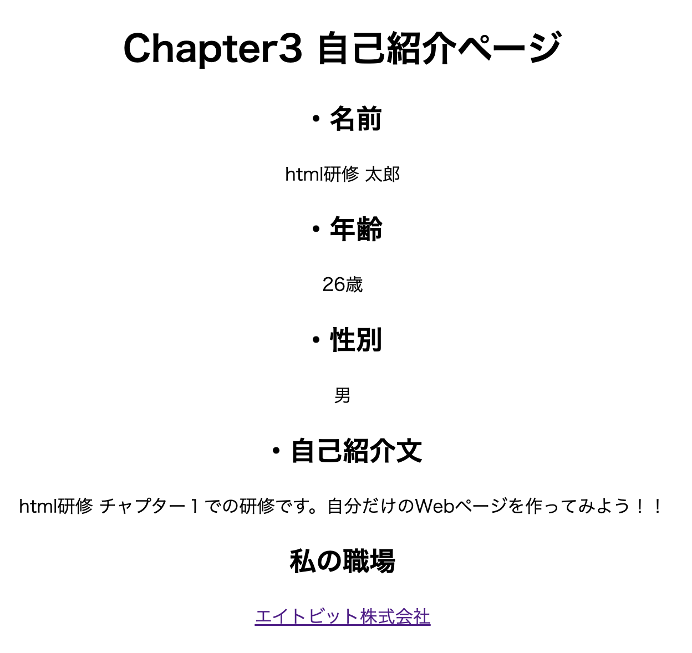

# 4. aタグについて

## 目次

- 研修課題
- このチャプターでのゴール
- aタグとは？
  - aタグの属性設定について
- 研修課題４
  - 研修課題４（応用編）

## 研修概要

このチャプターではaタグの使い方や種類、属性設定について理解します。

## このチャプターでのゴール

aタグを使い、エイトビット株式会社のホームページリンクを自己紹介ページに埋め込み表示させるリンクを作ること。

## aタグとは？

「A」とは、「Anchor」の略で、リンクの出発点や到達点を指定するタグです。  
リンクの出発点を示す場合は、href属性でリンク先を指定し、到達点を示す場合はname属性やid属性を使用し、その場合の名前（識別子）を指定します。  
以下に属性の種類を提示するので、覚えておきましょう！！

### aタグの属性設定について

| 属性名 | 属性概要 | 内容 |
| --- | --- | --- |
| href | 概要 | 領域をクリックした際のリンク先を指定します。 |
| | 属性の値 | URL |
| name | 概要 | リンクの到達点ににするための名前を指定します。 |
| | 属性の値 | 文字列 |
| charset | 概要 | リンク先の文字コードセットを指定します。 |
| | 属性の値 | 文字コード |
| hreflang | 概要 | リンク先の基本言語基本言語を指定します。 |
| | 属性の値 | 言語コード |
| type | 概要 | リンク先のMIMEタイプを指定します。 |
| | 属性の値 | MIMEタイプ |
| rel | 概要 | この文書から見たリンク先文書との関係を記述します。 |
| | 属性の値 | リンクタイプ |
| rev | 概要 | リンク先文書から見たこの文書の関係を記述します。 |
| | 属性の値 | リンクタイプ |
| shape | 概要 | リンク領域の形状（イメージマップ用）を指定します。 |
| | 属性の値 | rect, circle, poly, default |
| coords | 概要 | リンク領域の各座標（イメージマップ用）を指定します。 |
| | 属性の値 | 座標（X, Y） |
| target | 概要 | リンク先の文書を表示させる方法を指定します。 |
| | 属性の値 | _blank、_self、_parent、_top、フレーム名、ウィンドウ名 |
| download（HTML5） | 概要 | リンクがファイルのダウンロード用であることを示します |
| | 属性の値 | ダウンロード時のファイル名 |

## 研修課題４

エイトビット株式会社の会社ホームページのリンクをaタグを使い自身の自己紹介ページに埋め込んでみましょう。  
エイトビット株式会社のホームページリンクは、  
https://eightbit.co.jp/  
なので、このリンクを埋め込んでください。

### 研修課題４（応用編）

aタグも画面中央寄せに統一してください。

:::tip
💡ヒント：divタグを使いaタグを中央寄せにしてみましょう。（Chapter5でdivタグは扱っています。）
:::

