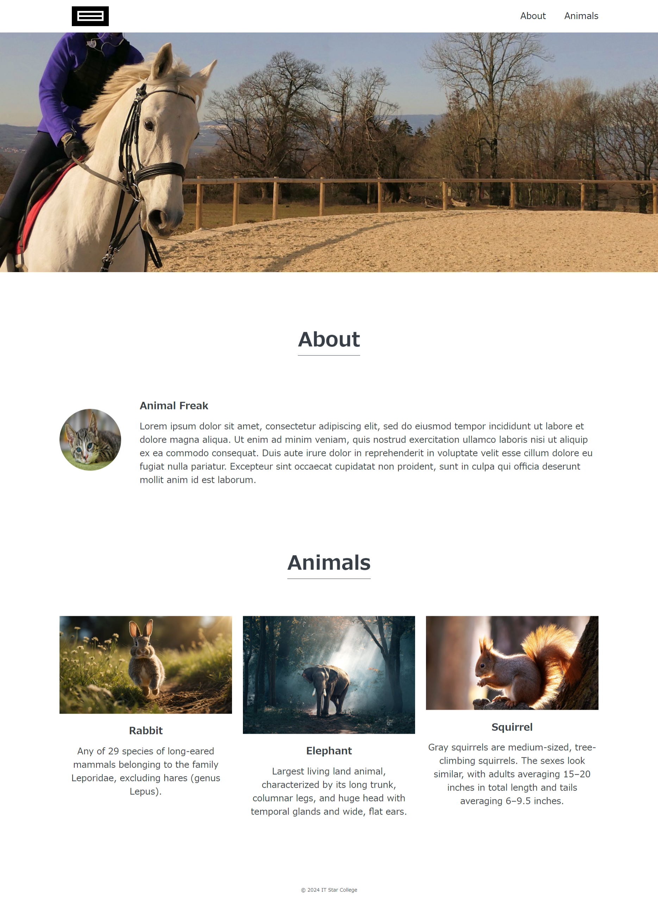
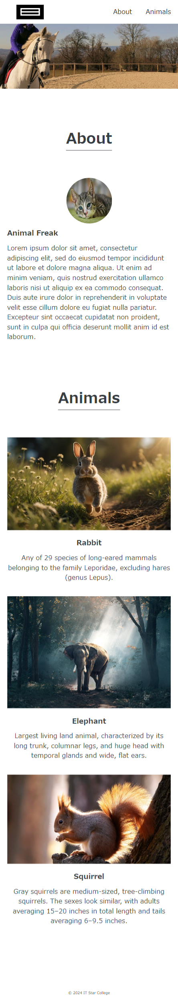

# 8. HTML CSS総合課題

### 以下の画像のWebページを作成しましょう
必要な資材は [**こちらのリンク**](./files/practice.zip) からダウンロードして下さい  
`margin` や `padding` 等のプロパティの明確な値の指定はありませんので、大体の数値を設定しましょう

### 以下を参考に、スマホページにも対応できるようにしましょう

