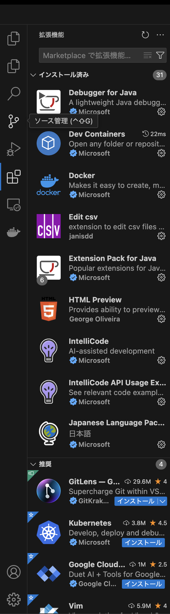
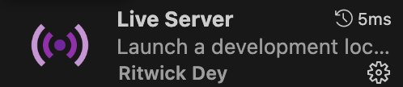

# 0. はじめに

## 概要

htmlの研修を開始する前にまずは環境の準備をしましょう。

準備事項としては、

1. Visual Studio Codeの拡張機能であるLive Serverをインストールする
2. インストールしたLive Serverの使い方を知る

だけです。

それでは、次のセクションより拡張機能のLive Serverのインストール手順となります。

### 注意事項

筆者の環境はMacOSですが、WindowsOSでも同様の手順で準備ができますのでご安心ください。

## Visual Studio CodeにLive Serverをインストールする

まず、Visual Studio Codeを開いてください。  
※以下のアイコンをしているアプリケーションになります。


次に、Visual Studio Codeの画面左にあるサイドバーより以下のマークをクリックしてください。


クリックすると、拡張機能をインストールできるマーケットプレイスがサイドバーに展開されるので、一番上の検索バーに「Live Server」と入力し検索をしてください。



検索後、一番上の検索結果に以下イメージが出てくるので、インストールをしてください。

※掲載イメージには、「インストール」と出ていませんが、初めてインストールする場合は下に緑色のボタンで「インストール」と出てきますのでそちらを押下してインストールしてください。



数秒待つとインストールが完了しますのでこれでLive ServerのVisual Studio Codeへのインストールは完了となります。

### 補足

正常にインストールされたかどうかを確認したい場合は、Visual Studio Code右下の以下マークが出ていれば正常にインストールされています。


## Live Serverの使い方を知る

それでは、実際にインストールされたLive Serverを使ってブラウザーにhtmlを表示してみましょう。

まず、Testフォルダ内にある「Test.html」をVisual Studio Codeで開いてください。

以下htmlが記載されていると思います。

```html
<!DOCTYPE html>
<html lang="ja">
    <head>
        <meta charset="UTF-8">
        <title>html研修前準備動作確認テスト</title>
    </head>
    <body>
        <h1>テスト</h1>
    </body>
</html>

```

htmlを表示できたら、補足に記載した「Go Live」を押下してください。  
自動的にブラウザが立ち上がり、上記htmlの内容がブラウザに表示されます。

これが、Live Serverの使い方となります。

### ヒント

Live Serverは5500番ポートを使います。  
その為、既に何かしらのシステムやアプリ等で5500番ポートを占有している場合は、動きませんのでご注意ください。

以上でhtml研修に入る前の環境準備は終了となります。  
お疲れ様でした。
