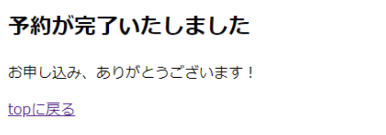
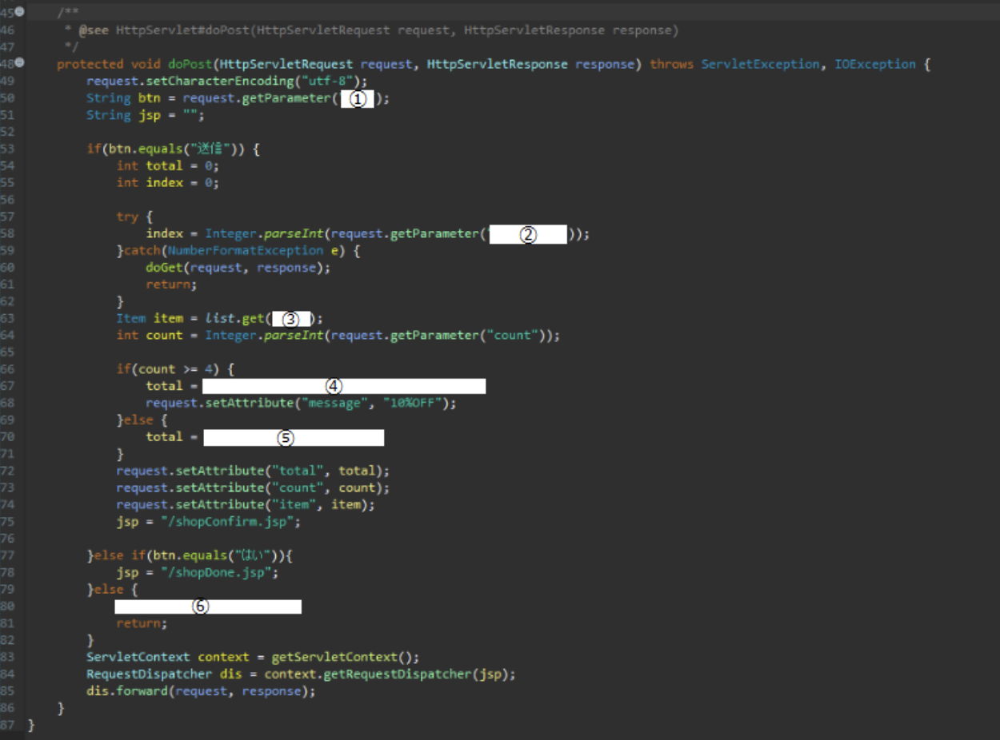

# javaWeb課題①

## プロジェクト概要

| 項目名 | 値 |
| --- | --- |
| 動的webプロジェクト名 | **webExam1** |
| パッケージ名 | servlet |
| サーブレット名 | shopServlet.java |
| URLマッピング | /shopServlet |
| メソッド・スタブ | ・継承された抽象メソッド |
| | ・doGet() |
| | ・oPost() |
| パッケージ名 | item |
| javaファイル名 | Item.java |
| JSPファイル名 | shopForm.jsp |
| | shopConfirm.jsp |
| | shopDone.jsp |
| 画像ファイル | hokkaidou.jpg |
| | nagoya.jpg |
| | okinawa.jpg |
| | osaka.jpg |
| | tokyo.jpg |
| jarファイル | jstl-api-1.2.jar |
| | jstl-impl-1.2.jar |

:::info
画像ファイル、jarファイルは **[こちら](./files/exercise1.zip)** からダウンロードして使用してください
:::

上の階層図のようになるようにプロジェクトの作成、各ファイルの作成及び配備を行いましょう  
【WebContent】に「**img**」フォルダを作成し、その中に画像ファイルを配置して下さい

## 実行時の画面

下記のようなページ遷移を行うwebシステムを構築します  

1 トップページ(起動時はShopServlet.java)…shopForm.jspに遷移

2 -1.適当なツアーを選択して人数は4人未満を選択した状態で『送信ボタンを押す』…shopConfirm.jsp

3 -2. 適当なツアーを選択して人数は4人以上を選択した状態で『送信ボタンを押す』…shopConfirm.jsp

4 はい』ボタンを押した場合…shopDone.jsp

5 いいえ』ボタンを押した場合→トップページに戻る

以上のように正常に動作するよう、下記の画像をもとにシステムを完成させましょう

## ファイル編集

#### Item.java

以下のクラスを作成してください(コメントは無視しても構いません)

#### shopForm.jsp

   1. listの要素を一つずつ参照する変数名を指定します
   2. 参照するオブジェクトから『name』フィールドを取得します
   3. 参照するオブジェクトから『price』フィールドを取得します

#### shopServlet.java

a.doGetメソッド

   1. リクエストスコープに全ツアー情報を要素に持つArrayListオブジェクトを『list』という名前で格納します。

b.doPostメソッド

   1. どのボタンが押されたかを文字列で取得します
   2. どのツアーを選択されたかを番号で取得します
   3. 全ツアー情報が格納されたArrayListからインデックスを指定して該当するオブジェクトを取得します
   4. 4名以上を選択した場合、合計から10%引きした金額を算出します
   5. 合計金額を算出します
   6. doGetメソッドを呼び出します

#### shopConfirm.jsp

   1. リクエストスコープから合計金額を取得します
   2. 本来の合計金額から10%引きした際の差額を算出します
   3. サーブレットのアノテーションを指定します

#### shopDone.jsp

1. 『topへ戻る』のリンクを作成します
