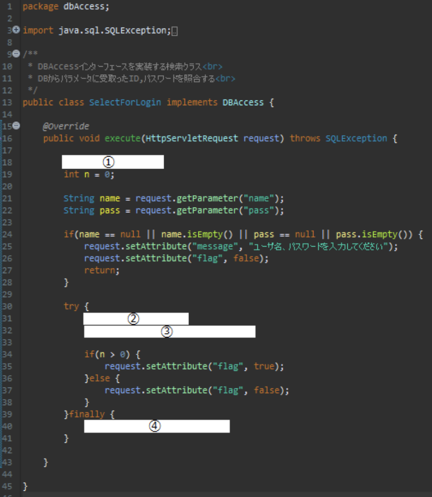
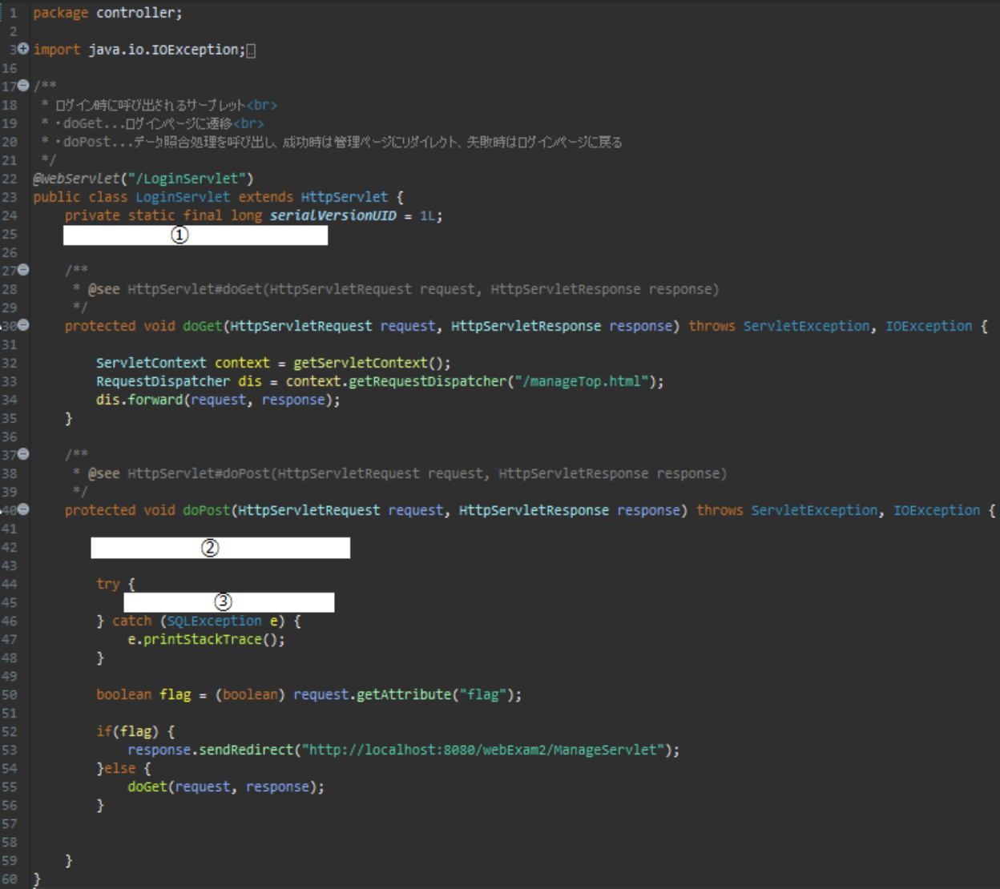

# 1 ログイン機能実装

### 追記対象ファイル

- ItemDao.java
- SelectForLogin.java
- LoginServlet.java

### 詳細  
商品管理画面にログインするための機能を実装する

1. 実装にあたり、まずDBとの接続機能を定義する(ItemDao.java)
2. DBから照合に必要な情報を取得するための機能を定義する(ItemDao.java)
3. DB操作インターフェースを実装するクラスに上記で定義した機能を追記する(SelectForLogin.java)
4. サーブレットに振り分け処理を追記する(LoginServlet.java)
5. 動作確認

## ItemDao.java
ItemDao.javaに以下のコンストラクタ、メソッドを追加します

    
ItemDaoコンストラクタ

    

| 項目 | 内容 |
| --- | --- |
| アクセス修飾子 | public |
| コンストラクタ(書式) | ItemDao() |
| throws | SQLException |
| 仕様 | DBに接続する |

#### 以下の手順で機能を実装してください

- String型の変数『url』を宣言し、文字列"jdbc:mysql://localhost:3306/javaexam?serverTimezone=UTC"を代入
- String型の変数『user』を宣言し、文字列”root”を代入
- String型の変数『pass』を宣言し、文字列”root”を代入
- 『DriverManager』クラスのstaticメソッド『getConnection』の引数に上記の『url』『user』『pass』を順番に渡し、クラス直下で宣言している変数『con』にその戻り値を代入する

　　　
    

    
getLoginInfoメソッド

    

| 項目 | 内容 |
| --- | --- |
| アクセス修飾子 | public |
| 戻り値 | int |
| メソッド(引数) | getLoginInfo(String name, String pass) |
| 仕様 | 引数に受取る『name』,『pass』をもとに『user』テーブルに問い合わせ、データを取得できた場合(照合成功した場合)は取得件数である『1』を,できなかった場合は『0』を戻り値として返す |

#### 以下の手順で機能を実装してください

- クラス直下で宣言している変数『sql』に文字列” select * from user where name = ? and password = ?”を代入
- クラス直下で宣言している変数『con』のメソッド『prepareStatement』の引数に上記の変数『sql』を渡し、その戻り値をクラス直下で宣言した変数『ps』に代入
- 変数『ps』のメソッド『setString』の第一引数に『1』、代二引数に引数『name』を渡して実行
- 変数『ps』のメソッド『setString』の第一引数に『2』、代二引数に引数『pass』を渡して実行
- try句とfinally句を用意する

tryブロック内に以下を記述

- 変数『ps』のメソッド『exceteQuery』(引数なし)の戻り値をクラス直下で宣言した変数『rs』に代入
- 『rs.next()』を記述(カーソルを次の行に移動)
- 戻り値として『rs.getRow()』の実行結果を返す (照合に成功した場合に『1』が、失敗した場合に『0』が返る)

以上でtryブロックは閉じます  
finallyブロック内に以下を記述

- 『ps.close();』を記述(リソースの開放)  

以上でfinallyブロックは閉じます
　
　　　
    

## SelectForLogin.java
SelectForLogin.javaに以下を追記します

    
executeメソッド

    

#### 以下の画像とヒントを参考に機能を実装してください

1. ItemDaoクラスの変数『dao』を宣言し、『null』を代入
2. 宣言した変数『dao』にItemDaoクラスをインスタンス化し、代入
3. 変数『dao』のメソッド『getLoginInfo』の第一引数に変数『name』、代二引数に変数『pass』を渡し、その戻り値を変数『n』に代入
4. if文で『daoがnullではない時』という条件で『dao.close()』を実行するように記述

　　　
    

## LoginServlet.java

LoginServlet.javaに以下を追記します

    
LoginServletクラス

    

#### 以下の画像とヒントを参考に機能を実装してください

1. 修飾子『public static』をつけ、DBAccessインターフェースの変数『dbAccess』を宣言
2. SelectForLoginクラスをインスタンス化し、変数『dbAccess』に代入
3. 変数『dbAccess』のメソッド『execute』の引数に引数『request』を渡して実行

　
    

以上でログイン機能は実装完了です

## 動作確認

[**こちら**](/eightbit-saurus/docs/java/Exercise/JavaWeb/Practice/課題２/課題2仕様書#実行時の画面)
を参考に、正常に動作するかを確認してみましょう！
