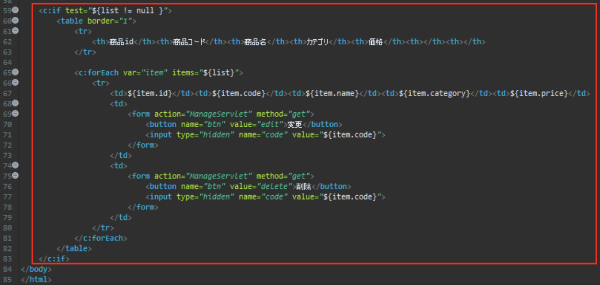

# 2 全件検索機能実装

### 追記、作成対象ファイル

- ItemDao.java
- SelectAll.java
- SearchServlet.java
- manage.jsp

### 詳細  
商品管理画面にてDBに登録された全商品情報を取得する機能を実装する

1. 汎用的な検索機能を定義する(ItemDao.java)
2. DBから全商品情報を取得するための機能を定義する(ItemDao.java)
3. DB操作インターフェースを実装する全件検索クラスを作成する (SelectAll.java)
4. サーブレットに振り分け処理を追記する(SelectServlet.java)
5. 検索結果を表示するための処理を追記する(manage.jsp)
6. 動作確認

## ItemDao.java
ItemDao.javaに以下のメソッドを追加します

    
searchメソッド

    

| 項目 | 内容 |
| --- | --- |
| アクセス修飾子 | private |
| 戻り値 | ArrayList＜ItemDto＞ |
| メソッド(引数) | search(PreparedStatement ps) |
| throws | SQLException |
| 仕様 | 引数に受け取ったPreparedStatementに定義されているSQL文を実行する。実行した結果を一行ずつオブジェクト化してArrayListに格納し、戻り値として返す |

#### 以下の手順で機能を実装してください

- try句とfinally句を用意する

tryブロック内に以下を記述

- 引数の『ps』のメソッド『exceteQuery』(引数なし)の戻り地をクラス直下で宣言した変数『rs』に代入
- クラス直下で宣言した変数『list』にArrayListクラスをインスタンス化して代入(ジェネリクスで型を指定してください)
- ItemDtoクラスの変数『dto』を宣言する(何も代入しない)
- while文を記述し、条件には『rs.next()』を指定する(実行結果を一行ずつループする)

whileブロック内に以下を記述

- 変数『dto』にItemDtoクラスをインスタンス化して代入
- 変数『dto』のメソッド『setId』の引数に『rs.getInt(“id”) 』を渡す
- 変数『dto』のメソッド『setCode』の引数に『rs.getInt(“code”) 』を渡す
- 変数『dto』のメソッド『setName』の引数に『rs.getString(“name”) 』を渡す
- 変数『dto』のメソッド『setCategory』の引数に『parseCategory(rs.getString(“category”))』を渡す
- 変数『dto』のメソッド『setPrice』の引数に『rs.getInt(“price”) 』を渡す
- 変数『list』のメソッド『add』の引数に変数『dto』を渡す

以上でwhile文は閉じます

以上でtryブロックは閉じます  
finallyブロック内に以下を記述  

- finallyブロック内には『ps.close()』を記述(リソース解放)

以上でfinallyブロックは閉じます

- 最後に変数『list』を戻り値として返します

　
    

    
getItemsAllメソッド

    

| 項目 | 内容 |
| --- | --- |
| アクセス修飾子 | public |
| 戻り値 | ArrayList＜ItemDto＞ |
| メソッド(引数) | getItemsAll() |
| throws | SQLException |
| 仕様 | 商品テーブルから全てのレコードを取得し、取得結果をArrayListとして返す |

#### 以下の手順で機能を実装してください

- クラス直下で宣言した変数『sql』に文字列”select * from item”を代入
- クラス直下で宣言した変数『con』のメソッド『prepareStatement』の引数に上記の変数『sql』を渡し、その戻り値をクラス直下で宣言した変数『ps』に代入
- 上記で作成したメソッド『search』の引数に変数『ps』を渡し、その実行結果を戻り値として返す

　
    

## SelectAll.java
作成したSelectAll.javaに以下のメソッドを定義(オーバーライド)します

    
executeメソッド

    

| 項目 | 内容 |
| --- | --- |
| アクセス修飾子 | public |
| 戻り値 | void |
| メソッド(引数) | execute(HttpServletRequest request) |
| throws | SQLException |
| 仕様 | daoオブジェクトを用い、全件検索処理を行ってその結果によってjspでの表示を振り分ける |

#### 以下の手順で機能を実装してください

- ItemDaoクラスの変数『dao』を宣言し、『null』を代入
- try句とfinally句を用意する

tryブロック内に以下を記述

- 変数『dao』にItemDaoクラスをインスダンス化して代入
- ArrayList＜ItemDto＞クラスの変数『list』を宣言し、変数『dao』のメソッド『getItemsAll』の実行結果を代入
- if文にて『list.size() > 0』という条件を記述し、trueなら『request.setAttribute(“list”, list);』を記述する。falseなら『request.setAttribute(“message”, “まだデータがありません”);』を記述する。

以上でtryブロックは閉じます

- finallyブロック内にはif文で『daoがnullではない時』という条件で『dao.close()』を実行するように記述

以上でfinallyブロックは閉じます

    

## SearchServlet.java
SearchServlet.javaの『doGet』内に以下を追記します

    
doGetメソッド

    

#### 以下を参考に機能を実装してください

既存のswitch文に条件を追加します

- 変数『selectWay』が『”all”』であった場合、変数『dbAccess』にSelectAllクラスをインスタンス化して代入
- breakを記述してswitch文を抜ける

　
    

## manage.jsp
manage.jspに追記します

    
manage.jsp

    

#### 以下の画像のようにファイルを編集してください(59行目から83行目まで)

    

以上で全件検索機能は実装完了です(他の検索機能も使用可能になります)

## 動作確認

[**こちら**](/eightbit-saurus/docs/java/Exercise/JavaWeb/Practice/課題２/課題2仕様書#実行時の画面)
を参考に、正常に動作するかを確認してみましょう！
