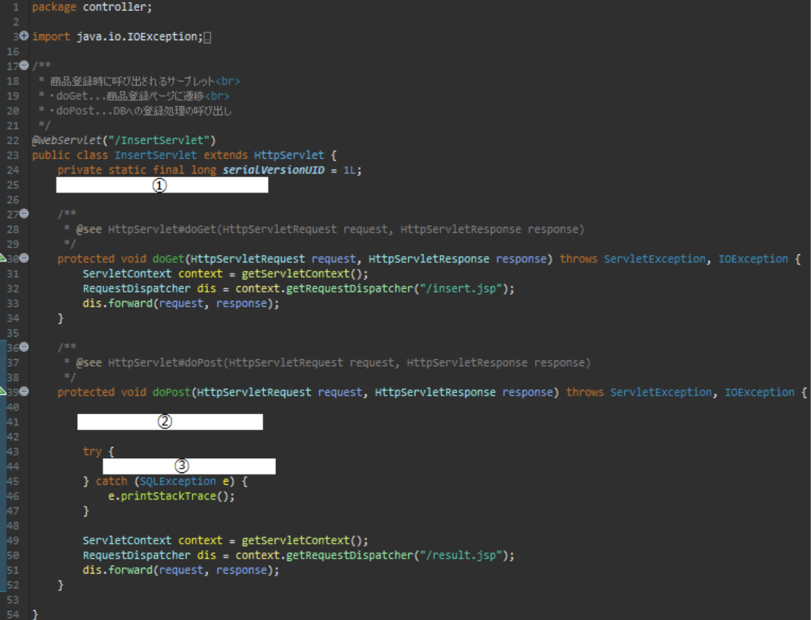

# ②-3 登録機能実装

追記、作成対象ファイルは以下

- ItemDao.java
- InsertItem.java
- InsertServlet.java

●詳細  
商品登録画面にて入力した商品情報DBに登録する機能を実装する

1. 商品登録機能を定義する(ItemDao.java)
2. DB操作インターフェースを実装する商品登録クラスを作成する (InsertItem.java)
3. サーブレットに振り分け処理を追記する(InsertServlet.java)
4. 動作確認

ItemDao.javaに以下のメソッドを追加します

| 項目 | 内容 |
| --- | --- |
| アクセス修飾子 | public |
| 戻り値 | int |
| メソッド(引数) | insert(ItemDto dto) |
| throws | SQLException |
| 仕様 | 引数に受取る『dto』の持つフィールドを一つずつSQL文に組み込み、DBに登録処理を行う。戻り値として成功件数を返す |

## 1 以下の手順で機能を実装してください

- クラス直下で宣言した変数『sql』に文字列” insert into item (code, name, category, price) values (?, ?, ?, ?)”を代入
- int型の変数『n』を宣言し、0を代入
- try句とfinally句を用意する

tryブロック内に以下を記述

- クラス直下で宣言した変数『con』のメソッド『prepareStatement』の引数に上記の変数『sql』を渡し、その戻り値をクラス直下で宣言した変数『ps』に代入
- 変数『ps』のメソッド『setInt』の第一引数に『1』、代二引数に引数『dto.hashCode()』を渡して実行
- 変数『ps』のメソッド『setString』の第一引数に『2』、代二引数に引数『dto.getName()』を渡して実行
- 変数『ps』のメソッド『setString』の第一引数に『3』、代二引数に引数『dto.getCategory()』を渡して実行
- 変数『ps』のメソッド『setInt』の第一引数に『4』、代二引数に引数『dto.getPrice()』を渡して実行
- 変数『ps』のメソッド『excuteUpdate』(引数なし)の戻り値を変数『n』に代入

以上でtryブロックは閉じます  
finallyブロック内に以下を記述

- ps.close();』を記述(リソースの開放)

以上でfinallyブロックは閉じます

- 最後に変数『n』を戻り値として返します

作成したInsertItem.javaに以下のメソッド記を定義(オーバーライド)します

| 項目 | 内容 |
| --- | --- |
| アクセス修飾子 | public |
| 戻り値 | void |
| メソッド(引数) | execute(HttpServletRequest request) |
| throws | SQLException |
| 仕様 | daoオブジェクトを用い、登録処理を行ってその結果によってjspでの表示を振り分ける |

## 2 以下の手順で機能を実装してください

- ItemDaoクラスの変数『dao』を宣言し、『null』を代入
- int型の変数『n』を宣言し、『0』を代入
- String型の変数『name』を宣言し、『request.getParameter(“name”)』の戻り値を代入
- String型の変数『category』を宣言し、『request.getParameter(“category”)』の戻り値を代入
- String型の変数『price』を宣言し、『request.getParameter(“price”)』の戻り値を代入
- name != null』且つ『!name.isEmpty()』且つ『price != null』且つ『!price.isEmpty()』且つ『Judge.isNumber(price)』という条件がtrueだった場合は以下の処理を行う
  - ItemDtoクラスの変数『dto』を宣言し、ItemDtoクラスをインスタンス化して代入
  - 変数『dto』のメソッド『setName』の引数に変数『name』を渡して実行
  - 変数『dto』のメソッド『setCategory』の引数に変数『category』を渡して実行
  - 変数『dto』のメソッド『setPrice』の引数に『Integer.parseInt(price)』を渡して実行
  - 変数『dto』のメソッド『setCode』の引数に『dto.hashCode()』を渡して実行
  - try句とfinally句を用意する

tryブロック内に以下を記述

- 変数『dao』にItemDaoクラスをインスタンス化して代入
- 変数『dao』のメソッド『insert』の引数に変数『dto』を渡し、その戻り値を変数『n』に代入
- 変数『n』が『0』より大きい場合→『request.setAttribute(“message”, “新規商品の登録が完了しました”);』を記述する。
- それ以外の場合、『request.setAttribute(“message”, “商品の登録に失敗しました”);』を記述

以上でtryブロックは閉じます  
finallyブロック内に以下を記述

- 『if(dao != null) dao.close();』を記述

以上でfinallyブロックは閉じます

- 『name != null』且つ『!name.isEmpty()』且つ『price != null』且つ『!price.isEmpty()』且つ『Judge.isNumber(price)』  という条件がfalseだった場合は以下の処理を行う  

- 『request.setAttribute(“message”, “入力が不正です”);』を記述

InsertServlet.javaに以下を追記します

## 3 以下の画像とヒントを参考に機能を実装してください

1. 修飾子『public static』をつけ、DBAccessインターフェースの変数『dbAccess』を宣言
2. InsertItemクラスをインスタンス化し、変数『dbAccess』に代入
3. 変数『dbAccess』のメソッド『execute』の引数に引数『request』を渡して実行

以上で登録機能は実装完了です

## 4 動作確認

『課題2仕様書.pdf』の③登録機能を参考に、正常に動作するかを確認してみましょう！
