# 仕様書

## プロジェクト概要

| 項目名 | 値 |
| --- | --- |
| 動的webプロジェクト名 | **webExam2** |
|||
| パッケージ名 | controller |
| サーブレット名(URLマッピング) | ManageServlet.java(/ ManageServlet) |
| | LoginServlet.java (/LoginServlet) |
| | SearchServlet.java (/SearchServlet) |
| | InsertServlet.java (/InsertServlet) |
| | EditServlet.java (/EditServlet) |
| | DeleteServlet.java(/DeleteServlet) |
| メソッド・スタブ (ManageServlet.java, SearchServlet.java) | ・継承された抽象メソッド |
| | ・doGet() |
| メソッド・スタブ（それ以外） | ・継承された抽象メソッド |
| | ・doGet() |
| | ・doPost() |
|||
| パッケージ名 | dao |
| javaファイル | ItemDao.java |
|||
| パッケージ名 | dbAccess |
| javaファイル | DBAccess.java(インターフェース) |
| | SelectAll.java ← DBAccess.javaを実装 |
| | SelectOne.java ← DBAccess.javaを実装 |
| | SelectCategory.java ← DBAccess.javaを実装 |
| | SelectName.java ← DBAccess.javaを実装 |
| | SelectPrice.java ← DBAccess.javaを実装 |
| | SelectForLogin.java ← DBAccess.javaを実装 |
| | InsertItem.java ← DBAccess.javaを実装 |
| | UpdateItem.java ← DBAccess.javaを実装 |
| | DeleteItem.java ← DBAccess.javaを実装 |
|||
| パッケージ名 | dto |
| javaファイル | ItemDto.java |
|||
| パッケージ名 | filter |
| javaファイル | EncodeFilter.java |
| | Judge.java |
|||
| htmlファイル | manageTop.html |
|||
| JSPファイル名 | manage.jsp |
| | insert.jsp |
| | edit.jsp |
| | confirmation.jsp |
| | result.jsp |
|||
| jarファイル | jstl-api-1.2.jar |
| | jstl-impl-1.2.jar |

赤枠が作成対象、橙枠が編集対象のファイルです  
既存プロジェクトをインポートし、以下の階層図になるようにファイルを作成してください


## DB作成

<details>
    <summary>DB作成手順</summary>
    <div>

次に、データベースの設定をします

以下の中身をコピーし、MySQLに root ユーザでログインして以下を実行してください

```sql
create database javaexam;

use javaexam;

create table if not exists item (
id int NOT NULL PRIMARY KEY AUTO_INCREMENT, 
code int(10) UNIQUE,
name varchar(100), 
category varchar(15),
price int(10));

INSERT INTO item (code, name, category, price) VALUES ('1303339029', 'テレビ', 'electric', 280000);
INSERT INTO item (code, name, category, price) VALUES ('1272641387', 'ゴミ箱', 'general', 2750);
INSERT INTO item (code, name, category, price) VALUES ('1342225858', '罪と罰', 'book', 1056);
INSERT INTO item (code, name, category, price) VALUES ('341467649', 'もやし', 'food', 30);
INSERT INTO item (code, name, category, price) VALUES ('1379626328', 'スニーカー', 'fashion', 4950);
INSERT INTO item (code, name, category, price) VALUES ('116559449', 'グランドピアノ', 'other', 1732500);

create table if not exists user (
id int NOT NULL PRIMARY KEY AUTO_INCREMENT, 
name varchar(100),
password varchar(20) UNIQUE);

INSERT INTO user (name, password) VALUES ('test', '1234567890');

select * from item;
select * from user;
```

以下のような表示になればOKです


    </div>
</details>

## 実行時の画面

下記のようなページ遷移を行うwebシステムを構築します


<details>
    <summary>1. ログイン機能</summary>
    <div>

ログインページ(manageTop.html)

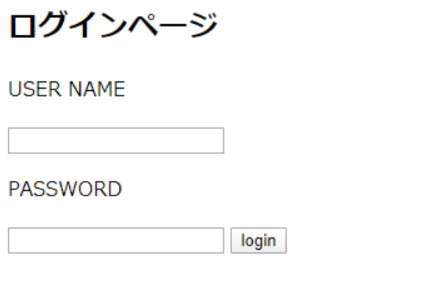

空白のまま【login】ボタン押下 → manageTop.htmlに遷移(同じページに留まる)

DBに登録したUSER NAME, PASSWORDを入力し、【login】ボタン押下

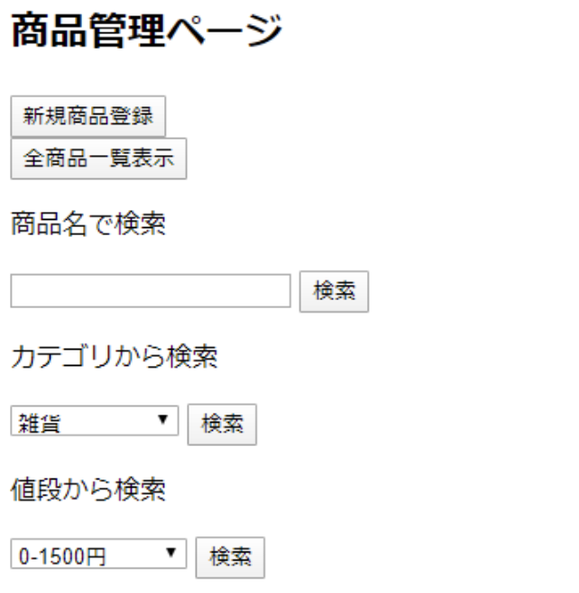

    </div>
</details>

<details>
    <summary>2. 全件検索機能</summary>
    <div>
商品管理ページにて【全商品一覧表示】ボタン押下

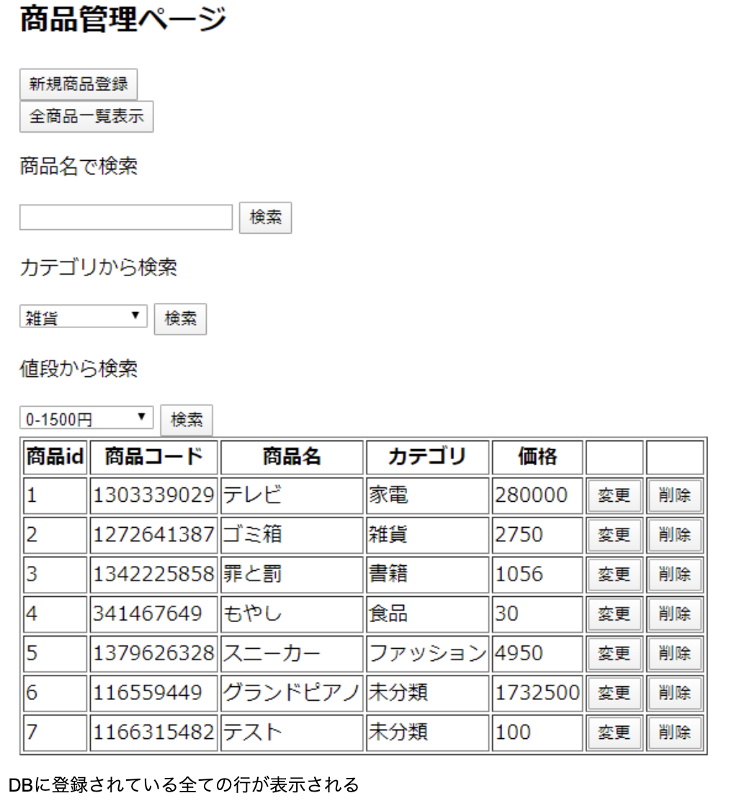

DBに登録されている全ての行が表示される

    </div>
</details>

<details>
    <summary>3. 商品登録機能</summary>
    <div>

商品管理ページにて【新規商品登録】ボタン押下

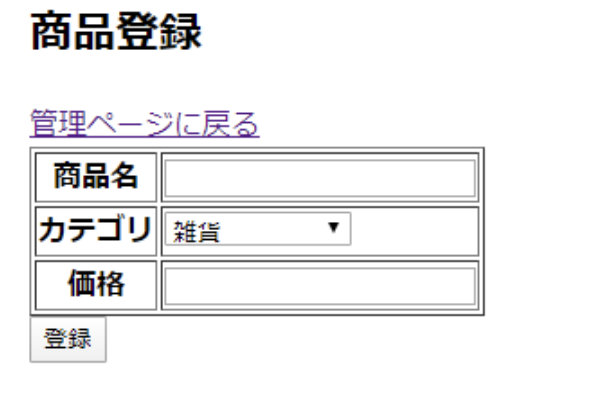

【管理ページに戻る】リンク押下 → 商品管理ページに遷移(戻る)  
空欄がある状態、又は価格に数字以外を入力した状態で【登録】ボタン押下


【管理ページに戻る】リンクを押下 → 商品管理ページに遷移(戻る)  
すべての欄を正しく記入した状態で【登録】ボタン押下

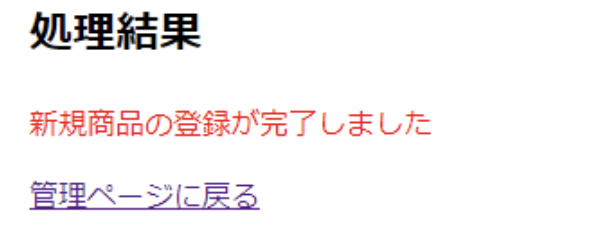

【管理ページに戻る】リンク押下 → 商品管理ページに遷移(戻る)

    </div>
</details>

<details>
    <summary>4. 削除機能</summary>
    <div>

先程変更した商品ID:7『じゃがりこ』の行の【削除】ボタン押下

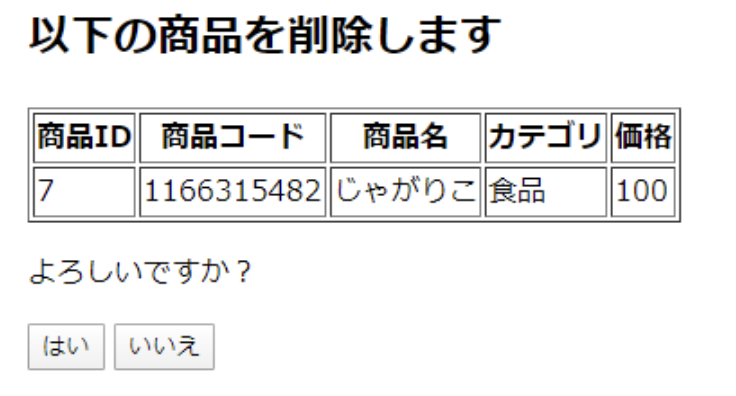

【いいえ】ボタンを押下


【管理ページに戻る】リンクを押下 → 商品管理ページに遷移(戻る)  
【はい】ボタンを押下


【管理ページに戻る】リンクを押下 → 商品管理ページに遷移(戻る)

商品管理ページに戻り、【全商品一覧表示】ボタン押下

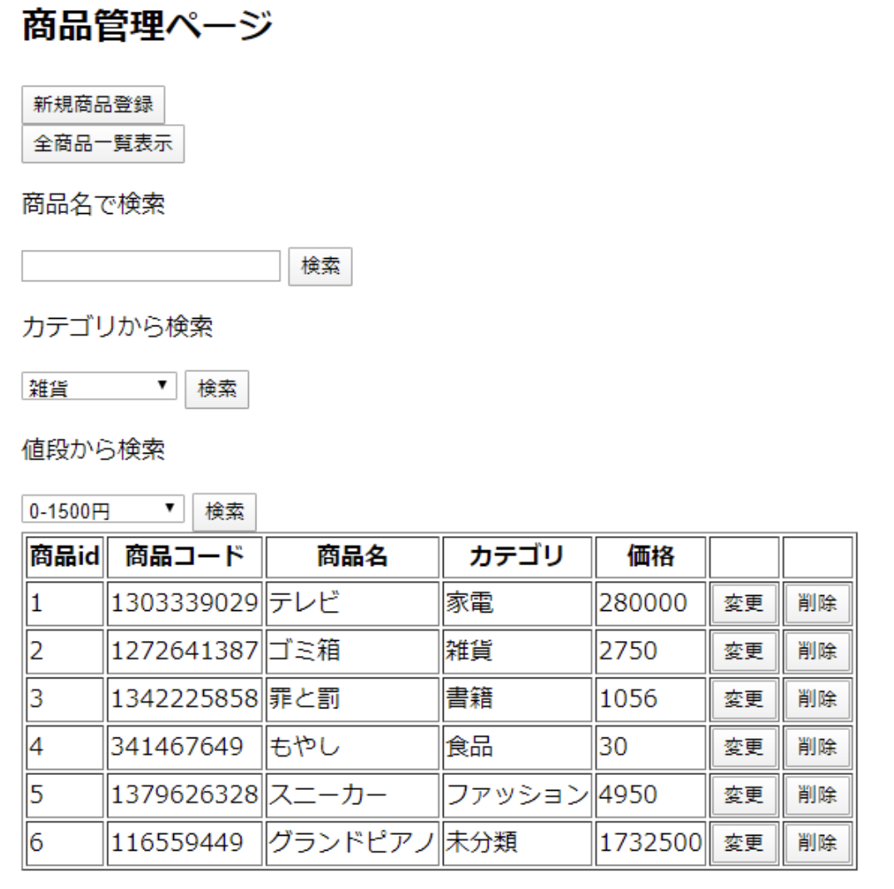

先程削除した『じゃがりこ』の行が削除されている

    </div>
</details>

<details>
    <summary>5. 更新機能</summary>
    <div>

先程登録した商品ID:7『テスト』の行の【変更】ボタン押下

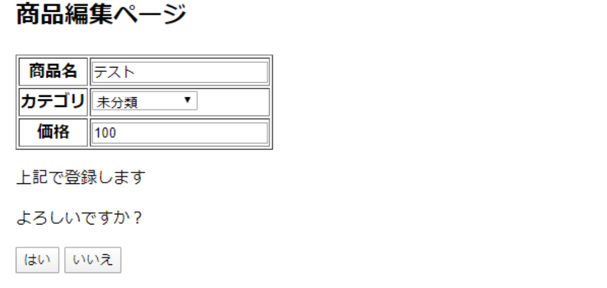

空欄がある状態、又は価格に数字以外を入力した状態で【はい】ボタン押下

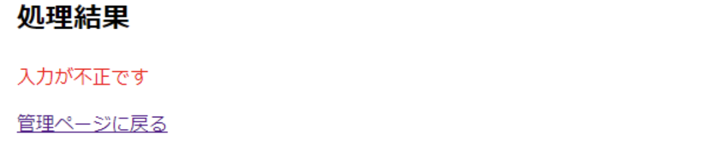

【管理ページに戻る】リンクを押下 → 商品管理ページに遷移(戻る)  
【いいえ】ボタン押下


商品名を『じゃがりこ』、カテゴリを『食品』に変更して【はい】ボタン押下


【管理ページに戻る】リンクを押下 → 商品管理ページに遷移(戻る)

    </div>
</details>

<details>
    <summary>6. 商品名検索機能</summary>
    <div>

商品管理ページにて【商品名で検索】項目の入力欄を空欄にした状態で【検索】ボタン押下

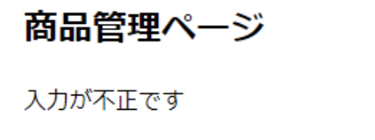
同じページのタイトルの下に文言が出現

商品名で検索】項目の入力欄に『じゃがりこ』を記入して【検索】ボタン押下

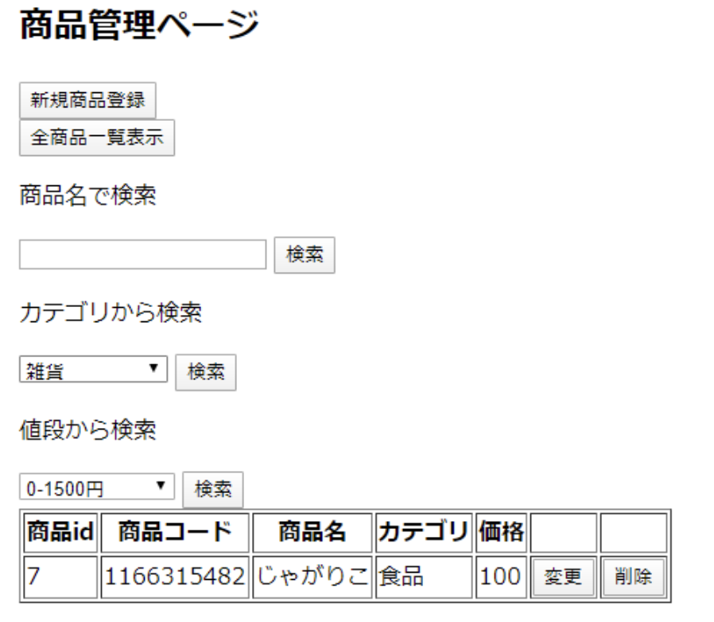

商品名が『じゃがりこ』の行だけ表示される

    </div>
</details>

<details>
    <summary>7. カテゴリ検索機能</summary>
    <div>

商品管理ページにて【カテゴリから検索】項目の【食品】を選択した状態で【検索】ボタン押下

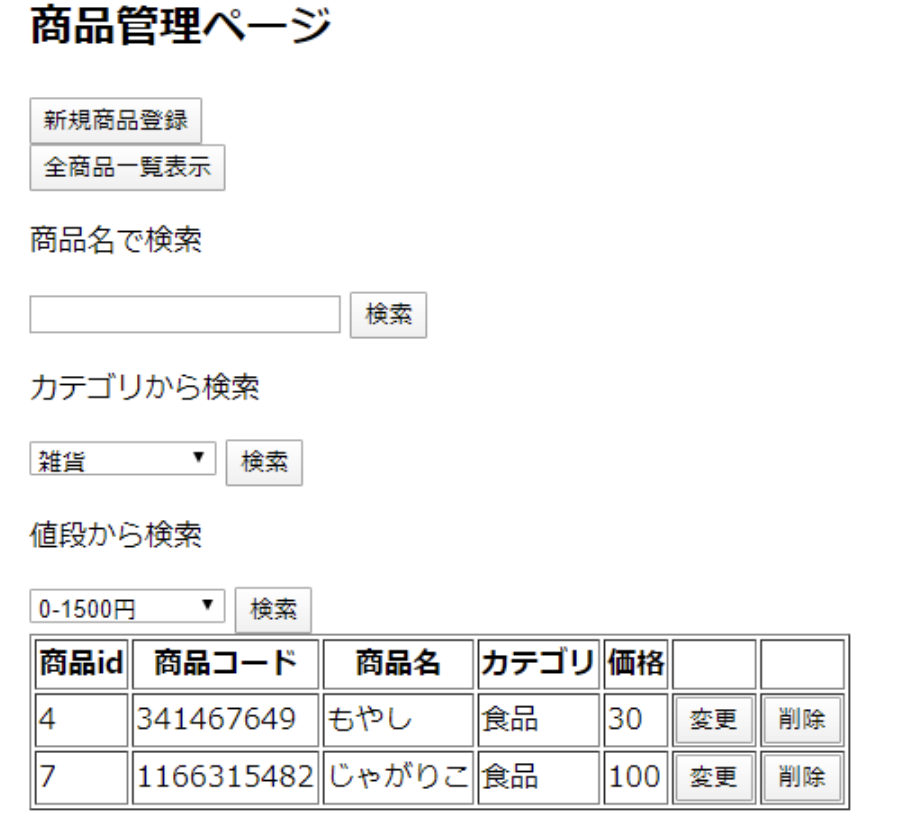

カテゴリが『食品の』行が表示される
    </div>
</details>

<details>
    <summary>8. 値段検索機能</summary>
    <div>

商品管理ページにて【値段から検索】項目の【0-1500円】を選択した状態で【検索】ボタン押下

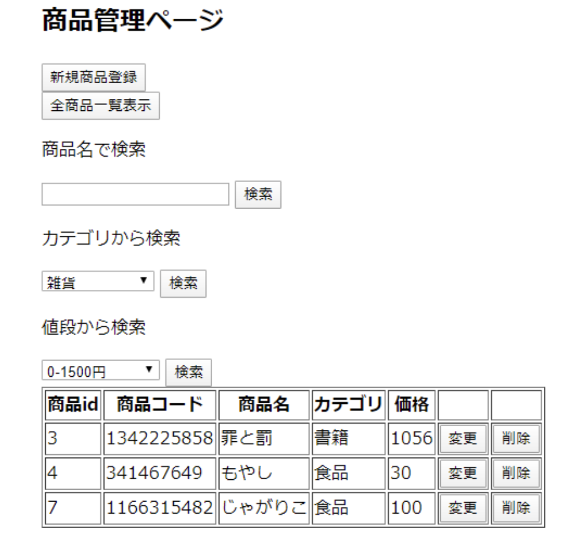

価格が0～1500の行が表示される
    </div>
</details>
