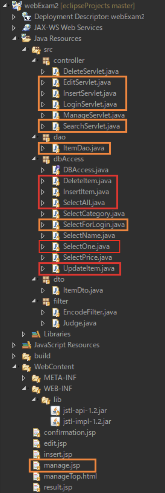
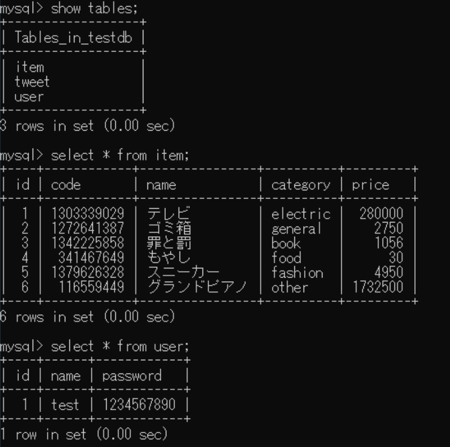

# 仕様書

プロジェクト概要

| 項目名 | 値 |
| --- | --- |
| 動的webプロジェクト名 | webExam2 |
| パッケージ名 | controller |
| サーブレット名(URLマッピング) | ManageServlet.java(/ ManageServlet) |
| | LoginServlet.java (/LoginServlet) |
| | SearchServlet.java (/SearchServlet) |
| | InsertServlet.java (/InsertServlet) |
| | EditServlet.java (/EditServlet) |
| | DeleteServlet.java(/DeleteServlet) |
| メソッド・スタブ (ManageServlet.java, SearchServlet.java) | ・継承された抽象メソッド |
| | ・doGet() |
| メソッド・スタブ（それ以外） | ・継承された抽象メソッド |
| | ・doGet() |
| | ・doPost() |
| パッケージ名 | dao |
| javaファイル | ItemDao.java |
| パッケージ名 | dbAccess |
| javaファイル | DBAccess.java(インターフェース) |
| | SelectAll.java ← DBAccess.javaを実装 |
| | SelectOne.java ← DBAccess.javaを実装 |
| | SelectCategory.java ← DBAccess.javaを実装 |
| | SelectName.java ← DBAccess.javaを実装 |
| | SelectPrice.java ← DBAccess.javaを実装 |
| | SelectForLogin.java ← DBAccess.javaを実装 |
| | InsertItem.java ← DBAccess.javaを実装 |
| | UpdateItem.java ← DBAccess.javaを実装 |
| | DeleteItem.java ← DBAccess.javaを実装 |
| パッケージ名 | dto |
| javaファイル | ItemDto.java |
| パッケージ名 | filter |
| javaファイル | EncodeFilter.java |
| | Judge.java |
| htmlファイル | manageTop.html |
| JSPファイル名 | manage.jsp |
| | insert.jsp |
| | edit.jsp |
| | confirmation.jsp |
| | result.jsp |
| jarファイル | jstl-api-1.2.jar |
| | jstl-impl-1.2.jar |

この色のファイルが編集対象

この色のファイルが新規作成対象

既存プロジェクトをインポートし、左の階層図になるようにファイルを作成してください

赤枠が作成対象、橙枠が編集対象のファイルです

次に、データベースの設定をします

webExam2_sql.txtの中身をコピーし、MySQL Command Clientにペーストしましょう  
useコマンドでjavaexamに移動し、以下のようになればOKです

下記のようなページ遷移を行うwebシステムを構築します

## ①ログイン機能

ログインページ(manageTop.html)

空白のまま【login】ボタン押下 → manageTop.htmlに遷移(同じページに留まる)

DBに登録したUSER NAME, PASSWORDを入力し、【login】ボタン押下

## ②全件検索機能

商品管理ページにて【全商品一覧表示】ボタン押下

DBに登録されている全ての行が表示される

## ③商品登録機能

商品管理ページにて【新規商品登録】ボタン押下

【管理ページに戻る】リンク押下 → 商品管理ページに遷移(戻る)  
空欄がある状態、又は価格に数字以外を入力した状態で【登録】ボタン押下

【管理ページに戻る】リンクを押下 → 商品管理ページに遷移(戻る)  
すべての欄を正しく記入した状態で【登録】ボタン押下

【管理ページに戻る】リンク押下 → 商品管理ページに遷移(戻る)

## ④削除機能

先程変更した商品ID:7『じゃがりこ』の行の【削除】ボタン押下

【いいえ】ボタンを押下

【管理ページに戻る】リンクを押下 → 商品管理ページに遷移(戻る)  
【はい】ボタンを押下

【管理ページに戻る】リンクを押下 → 商品管理ページに遷移(戻る)

商品管理ページに戻り、【全商品一覧表示】ボタン押下

先程削除した『じゃがりこ』の行が削除されている

## ⑤更新機能

先程登録した商品ID:7『テスト』の行の【変更】ボタン押下

空欄がある状態、又は価格に数字以外を入力した状態で【はい】ボタン押下

【管理ページに戻る】リンクを押下 → 商品管理ページに遷移(戻る)  
【いいえ】ボタン押下

商品名を『じゃがりこ』、カテゴリを『食品』に変更して【はい】ボタン押下

【管理ページに戻る】リンクを押下 → 商品管理ページに遷移(戻る)

## ⑥商品名検索機能

商品管理ページにて【商品名で検索】項目の入力欄を空欄にした状態で【検索】ボタン押下

同じページのタイトルの下に文言が出現

商品名で検索】項目の入力欄に『じゃがりこ』を記入して【検索】ボタン押下

商品名が『じゃがりこ』の行だけ表示される

## ⑦カテゴリ検索機能

商品管理ページにて【カテゴリから検索】項目の【食品】を選択した状態で【検索】ボタン押下

カテゴリが『食品の』行が表示される

## ⑧値段検索機能

商品管理ページにて【値段から検索】項目の【0-1500円】を選択した状態で【検索】ボタン押下

価格が0～1500の行が表示される
