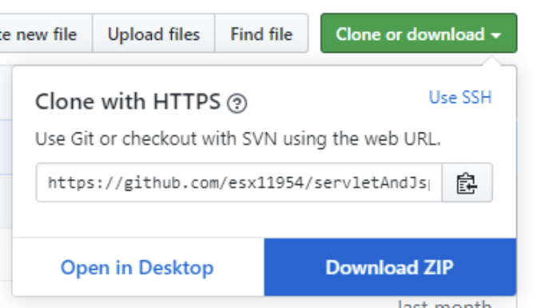
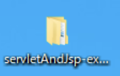
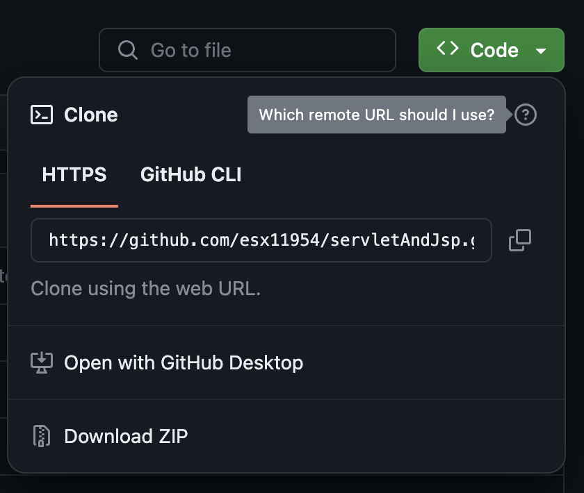
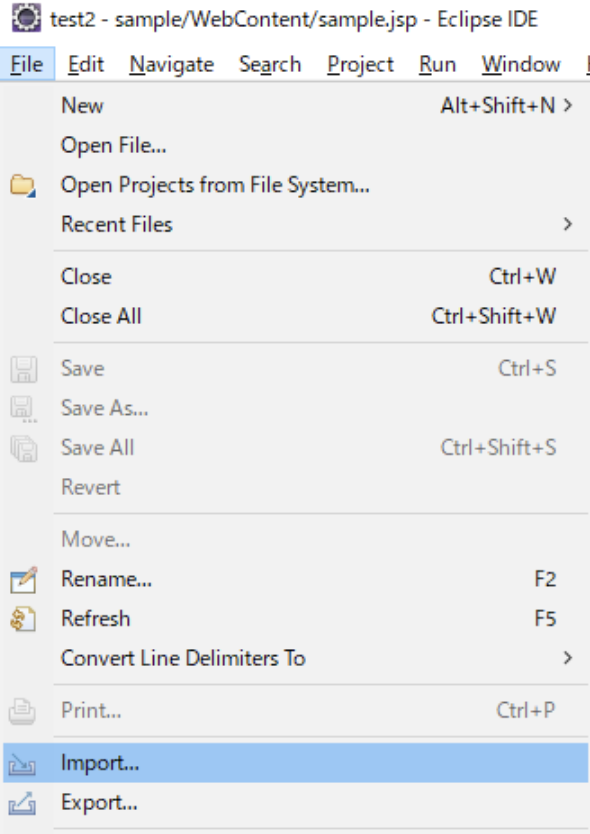
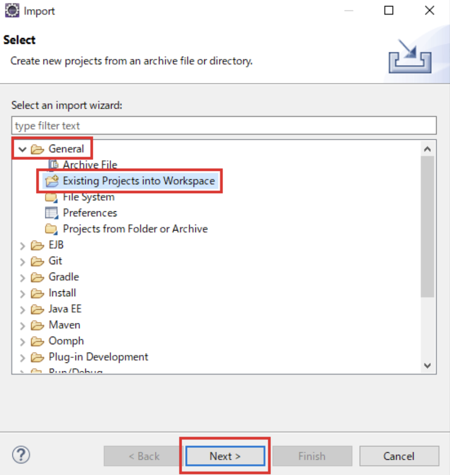
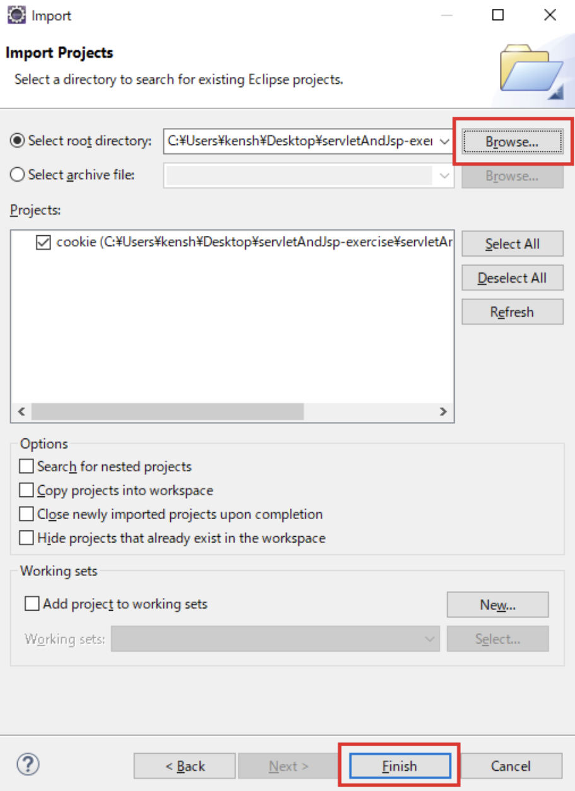

# プロジェクトインポート手順

## githubでダウンロード〜展開まで

1.下記URLにアクセスし、以下のボタンをクリック

[GitHub](https://github.com/esx11954/servletAndJsp/tree/exercise)


2.以下のような表示になるので「DownloadZIP」をクリックし、任意の階層（デスクトップなど）にダウンロードしてください。



3.ダウンロード後、ZIPファイルで右クリック→「すべて展開」を選択し、解凍しておいてください。



## githubコマンドでソースコードをダウンロードする場合

こちらは、上記（githubでダウンロード〜解凍まで）の手順とは別の方法でソースコードをダウンロードする場合にご利用ください。

※どちらの手順でも問題なくソースコードのダウンロードはできます。

1.Windowsデスクトップ左下の検索ボックスに「cmd」と入力し、検索結果として出てきた「コマンドプロンプト」を選択してください。

2.コマンドプロンプトを立ち上げた後、ソースコードをダウンロードしたい任意のディレクトリまで移動します。（ここではc:¥users配下にソースコードをダウンロードします。）

```text
cd {ソースコードをダウンロード先ディレクトリ}
```

3.ダウンロードしたいディレクトリまで移動後、GitHubリポジトリを開きます。（1.で記載したURLにアクセスしてください。）

4.リポジトリの右側にあるボタン（＜＞Code）ボタンを押下し、プルダウンメニューを開きHTTPSタブを選択し記載されているURLをコピーします。



```Text
https://github.com/esx11954/servletAndJsp.git
```

※このURLは現在表示しているリポジトリのURLとなり、このURLを使いソースコードをダウンロードします。

5.先ほど立ち上げたコマンドプロンプトに以下コマンドを入力しEnterを押下してください。

```Text
git clone https://github.com/esx11954/servletAndJsp.git
```

コマンド実行結果（以下のようになっていたらダウンロードは無事に完了となります。）

```Text
Cloning into 'servletAndJsp'...
remote: Enumerating objects: 793, done.
remote: Counting objects: 100% (793/793), done.
remote: Compressing objects: 100% (346/346), done.
remote: Total 793 (delta 330), reused 714 (delta 262), pack-reused 0
Receiving objects: 100% (793/793), 4.85 MiB | 5.09 MiB/s, done.
Resolving deltas: 100% (330/330), done.
```

6.ダウンロードが開始されますので、指定した任意のディレクトリ配下にソースコードフォルダがダウンロードされていれば完了です。

## eclipse上での操作

1.上部の「ファイル」から「インポート」をクリック



2.以下の画面が表示されるので赤枠部分を選択した状態でで「Next」ボタンを押下



3.以下の画面が現れるので赤枠をクリックし、該当プロジェクトを選択後、「完了」ボタンを押下



以上でインポートは完了です。
