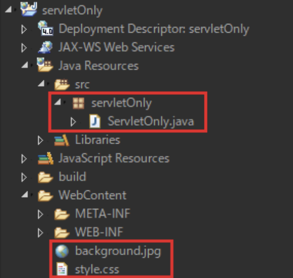
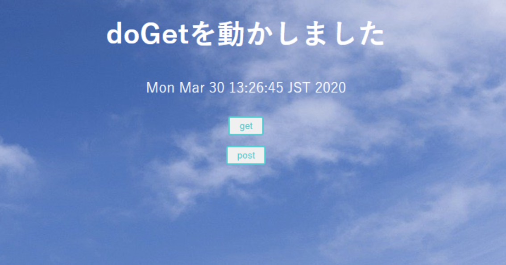
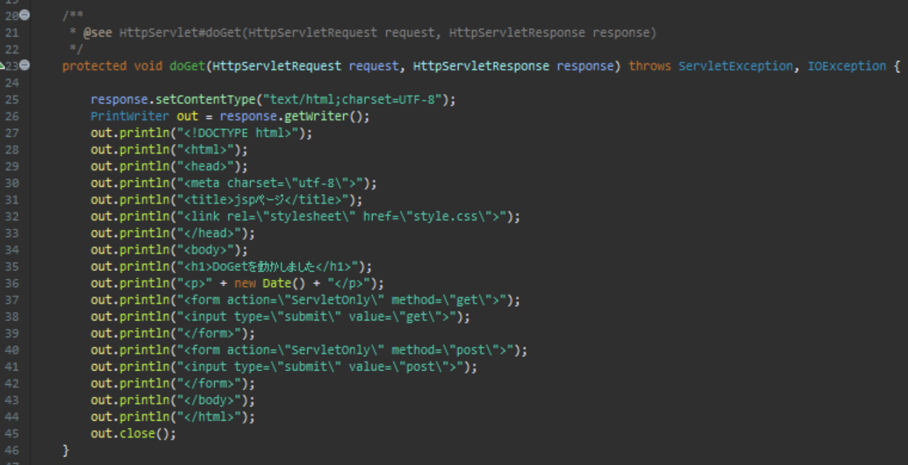
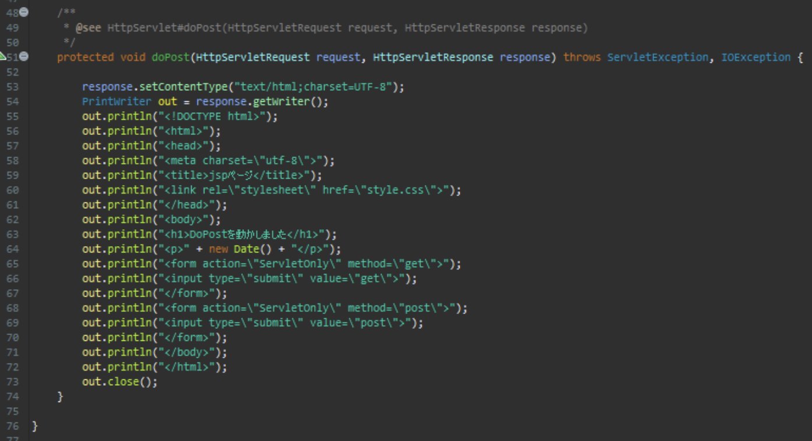

# 演習 1

以下のプロジェクトを作成してください。

| 項目名 | 値 |
| --- | --- |
| 動的Webプロジェクト名 | **servletOnly** |
|||
| パッケージ名 | servletOny |
| サーブレット名 | ServletOnly.java |
| URLマッピング | /ServletOnly |
| メソッド・スタブ | ・継承された抽象メソッド ・doGet() ・doPost() |
|||
| CSSファイル | style.css |
| 画像ファイル | background.jpg |

:::info
CSSファイル、画像ファイルは **[こちら](./files/servletOnly.zip)** からダウンロードして使用してください
:::



上のようなプロジェクト階層になればOK

今回編集が必要なのは以下のファイル

- ServletOnly.java

## 実行時の画像

起動時(ServletOnly.java)、【get】ボタン押下時



【post】ボタン押下時


## ファイル編集

画像のように各ファイルを編集してください。

:::caution
以下のコード内に `new Date()` と出てきますが、このクラスはJava8以降**非推奨**となりました  
このまま使用する場合は以下のインポート文をクラス上部に追記して下さい
```java
import java.util.Date;
```

Dateクラスの後継として、現在では以下のクラスが提供されています  
```java
java.time.LocalDateTime
java.time.LocalDate
java.time.LocalTime
```
実際の業務で非推奨のクラスを使用し続けることはリスクに繋がるので、余裕のある方は置き換えてみましょう
:::

#### ServletOnly(doGet)



#### ServletOnly.java(doPost)


