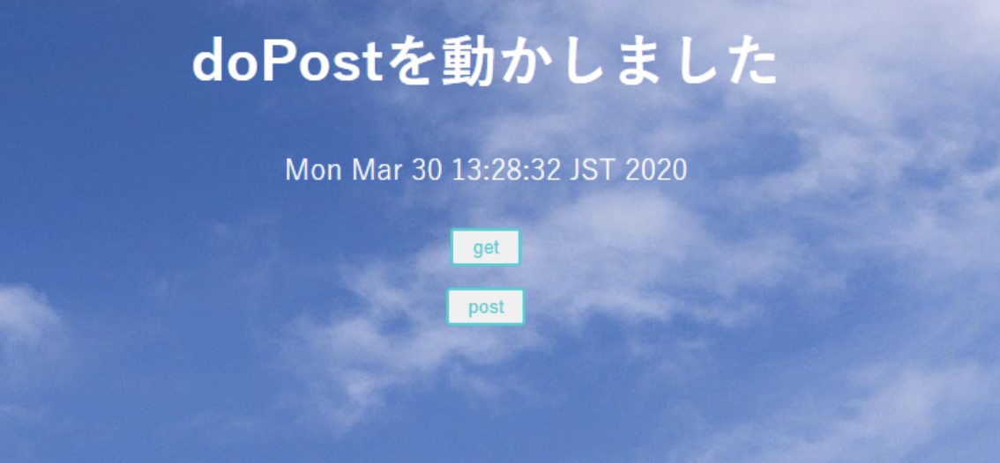

以下のプロジェクトを作成してください。

| 項目名 | 値 |
| --- | --- |
| 動的Webプロジェクト名 | servletOnly |
|||
| パッケージ名 | servletOny |
| サーブレット名 | ServletOnly.java |
| URLマッピング | /ServletOnly |
| メソッド・スタブ | ・継承された抽象メソッド ・doGet() ・doPost() |
|||
| CSSファイル | style.css |
| 画像ファイル | background.jpg |

上のようなプロジェクト階層になればOK

今回編集が必要なのは以下のファイル

- ServletOnly.java

実行時の画像

起動時(ServletOnly.java)、【get】ボタン押下時

【post】ボタン押下時

画像のように各ファイルを編集してください。

ServletOnly(doGet)

 ServletOnly.java(doPost)

