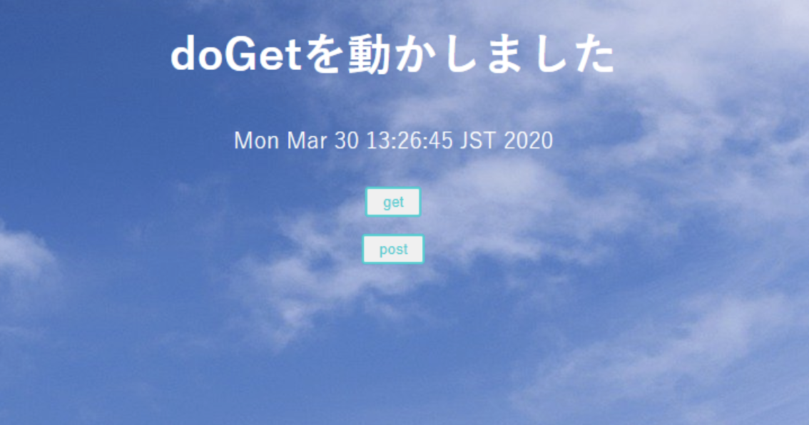
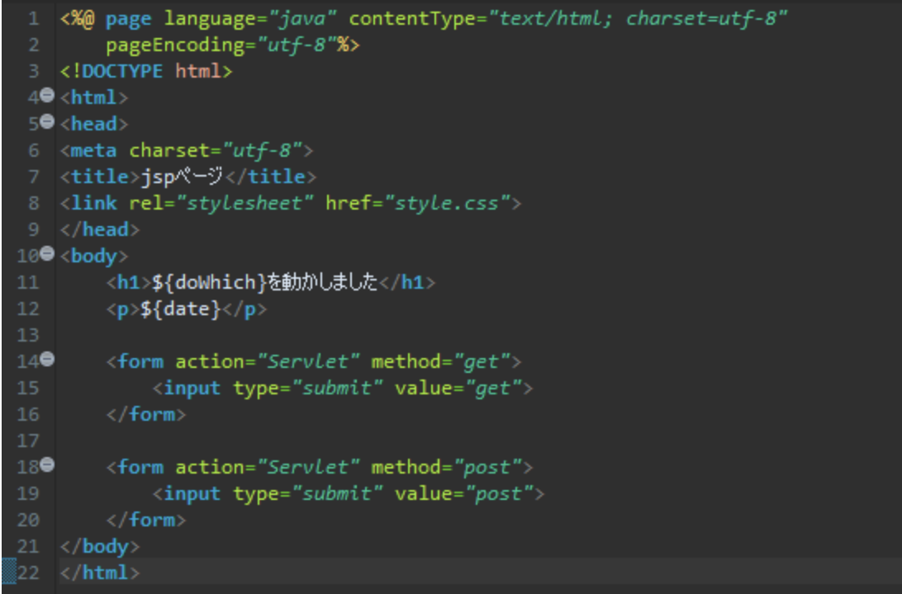

# 演習 2

以下のプロジェクトを作成してください。

| 項目名 | 値 |
| --- | --- |
| 動的Webプロジェクト名 | **serverAndJsp** |
|||
| パッケージ名 | servlet |
| サーブレット名 | Servlet.java |
| URLマッピング | /Servlet |
| メソッド・スタブ | ・継承された抽象メソッド ・doGet() ・doPost() | 
|||
| JSPファイル名 | View.jsp |
|||
| CSSファイル | style.css |
| 画像ファイル | background.jpg |

:::info
CSSファイル、画像ファイルは **[こちら](./files/servletAndJSP.zip)** からダウンロードして使用してください
:::

上のようなプロジェクト階層になればOK

今回編集が必要なのは以下の2ファイル

- Servlet.java
- view.jsp

## 実行時の画像

起動時(Servlet.java)、【get】ボタン押下時

【post】ボタン押下時

## ファイル編集

画像のように各ファイルを編集してください。

#### Servlet.java

#### view.jsp

