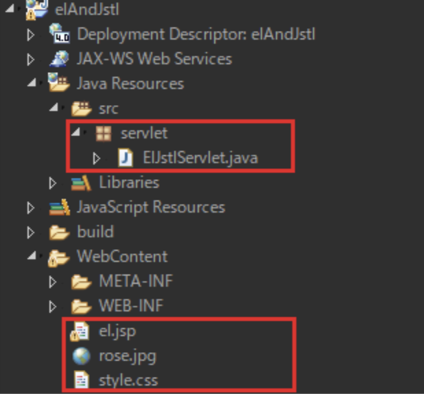
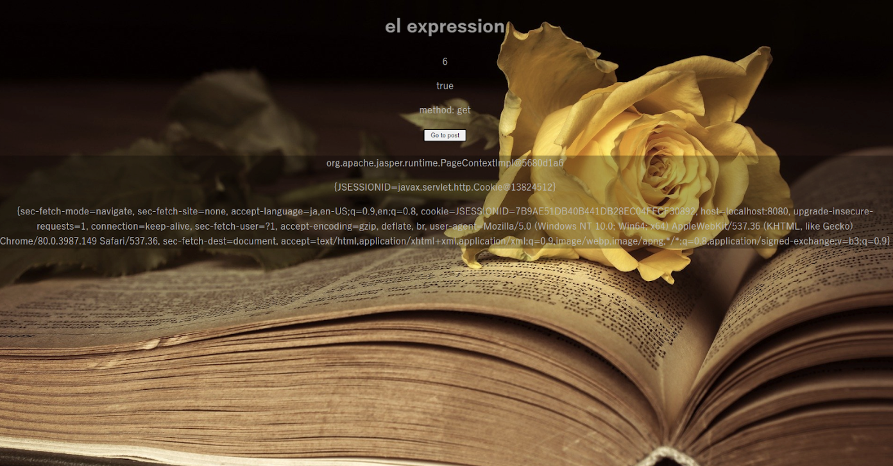
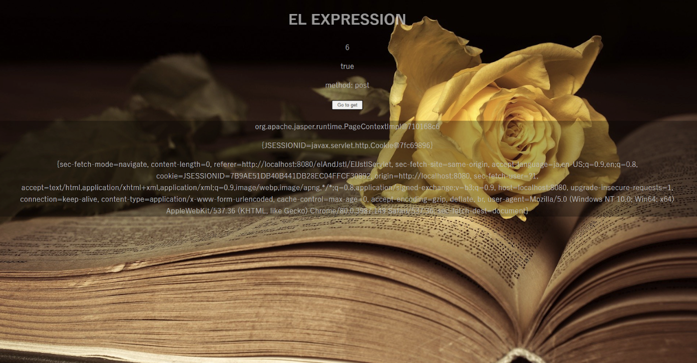
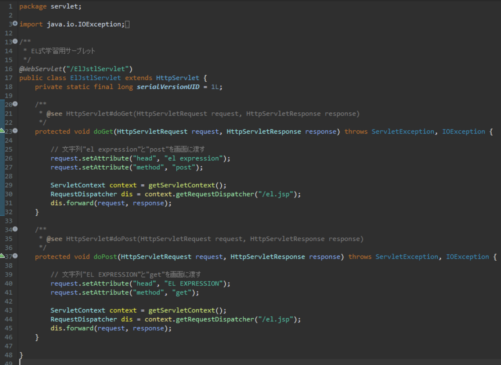
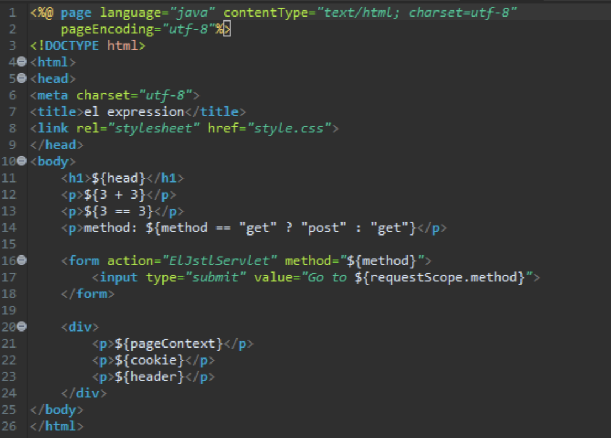

以下のプロジェクトを作成してください。

| 項目名 | 値 |
| --- | --- |
| 動的Webプロジェクト | elAndJstl |
|||
| パッケージ名 | servlet |
| サーブレット名 | ElJstlServlet.java |
| URLマッピング | / ElJstlServlet |
| メソッド・スタブ | ・継承されたメソッド ・doGet() ・doPost() |
|||
| JSPファイル名 | el.jsp |
|||
| CSSファイル | style.css |
| 画像ファイル | rose.jpg |

上のようなプロジェクト階層になればOK

今回編集が必要なのは以下の2ファイル

- ElJstlServlet.java
- el.jsp

実行時の画像

起動時(ElJstlServlet.java)、【Go to get】ボタン押下時

【Go to post】ボタン押下時

画像のように各ファイルを編集してください

ElJstlServlet.java

el.jsp

