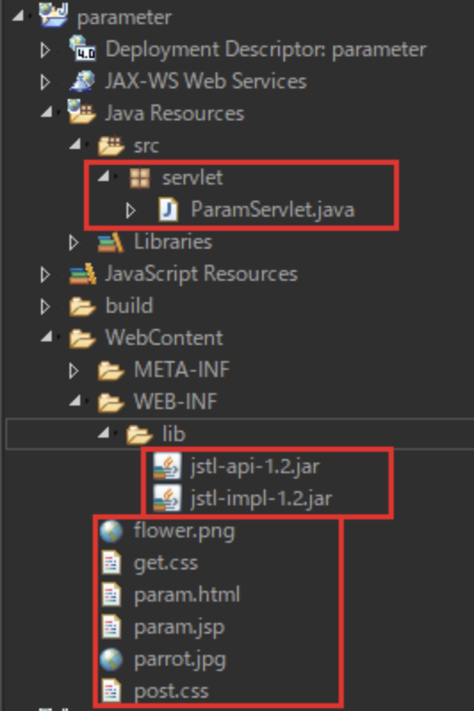
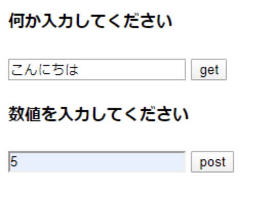
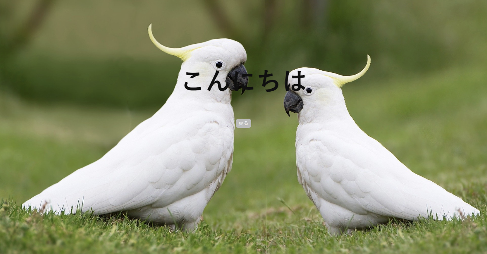
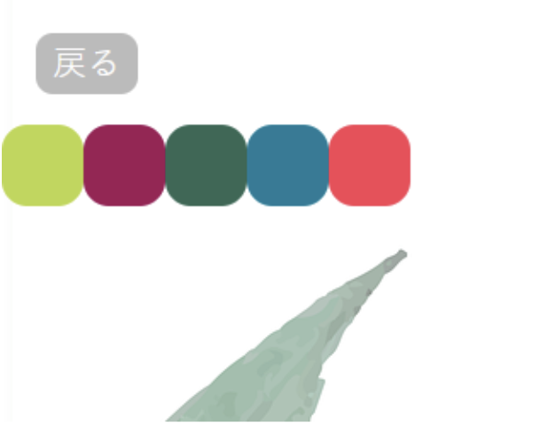
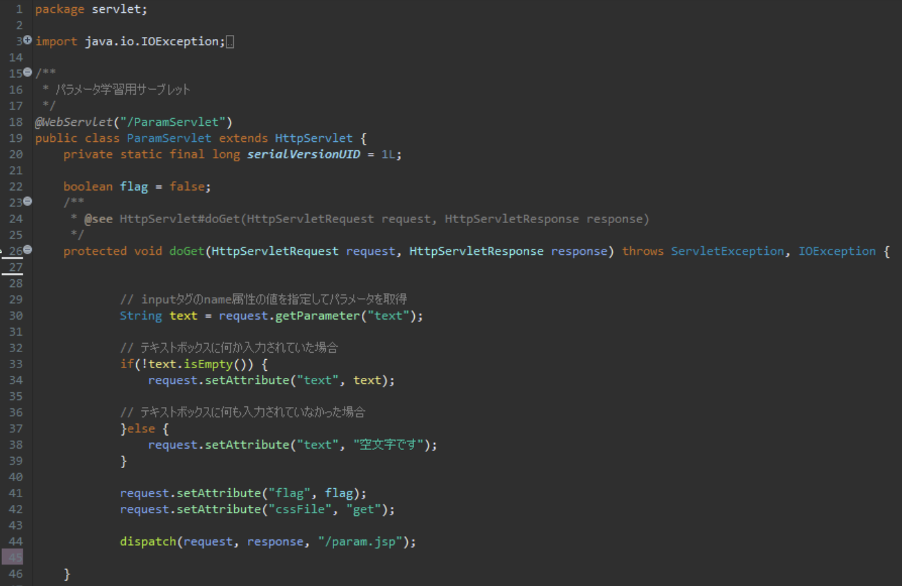
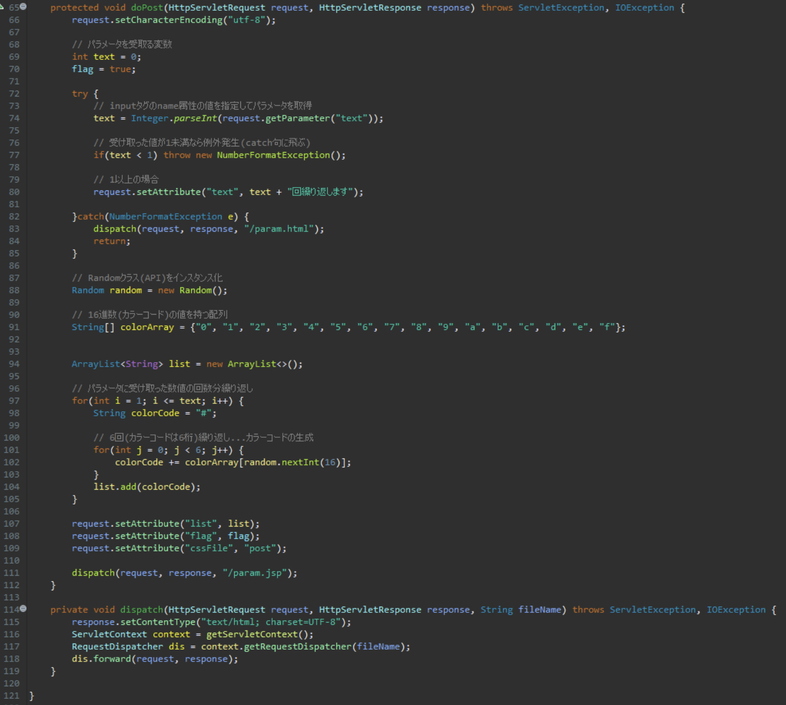
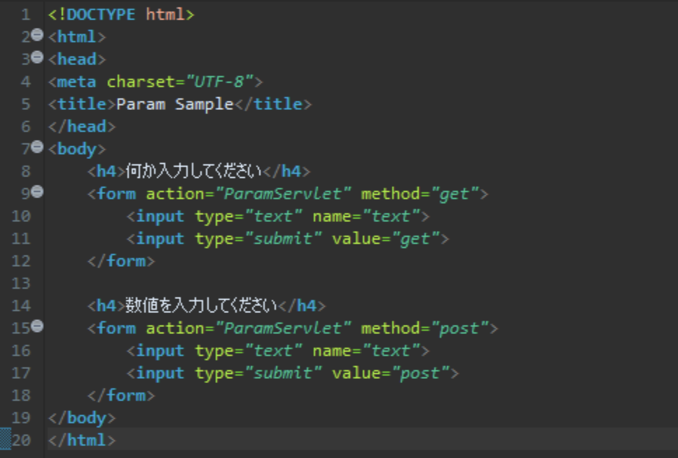
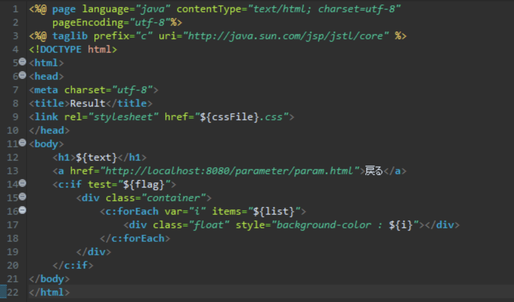
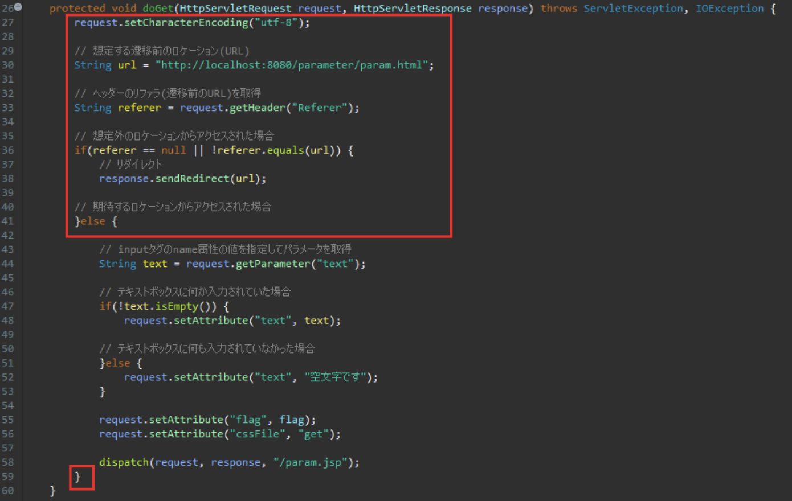

# 演習 4

以下のプロジェクトを作成してください

|項目名 | 値 |
| --- | --- |
| 動的webプロジェクト名 | **parameter** |
|||
| パッケージ名 | servlet |
| サーブレット名 | ParamServlet.java |
| URLマッピング | /ParamServlet |
| メソッド・スタブ | ・継承された抽象メソッド ・doGet() ・doPost() |
|||
| HTMLファイル名 | param.html|
| JSPファイル名 | param.jsp |
|||
| CSSファイル | get.css |
| | post.css |
| 画像ファイル | flower.png |
| | parrot.jpg |
| Jarファイル | jstl-api-1.2.jar |
| | jstl-impl-1.2.jar |

:::info
CSSファイル、画像ファイル、jarファイルは **[こちら](./files/parameter.zip)** からダウンロードして使用してください
:::

上のようなプロジェクト階層になればOK

今回編集が必要なのは以下の3ファイル

- ParameterServlet.java
- param.jsp
- param.html

## 実行時の画像

起動時(param.html)

【get】ボタン押下時

【post】ボタン押下時

戻る】ボタン(共通)押下時…param.htmlに戻る

## ファイル編集

画像のように各ファイルを編集してください

#### paramServlet.java(doGet)

#### paramServlet.java(doPost以下)

#### param.html

#### param.jsp

## 応用

ヘッダー情報のリファラを使用し、リダイレクト処理を加えます  
こうすることで想定外のアクセスに対処することが可能です

paramServlet.javaのdoGetメソッドにリダイレクト処理を追記しましょう

