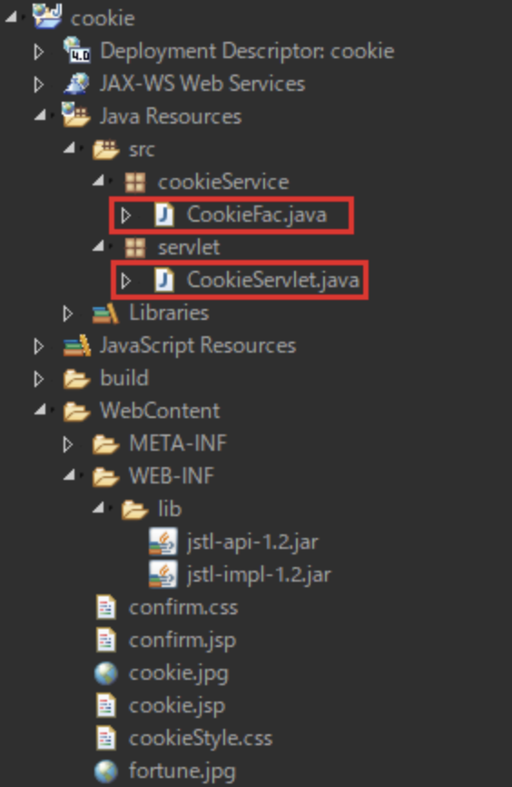
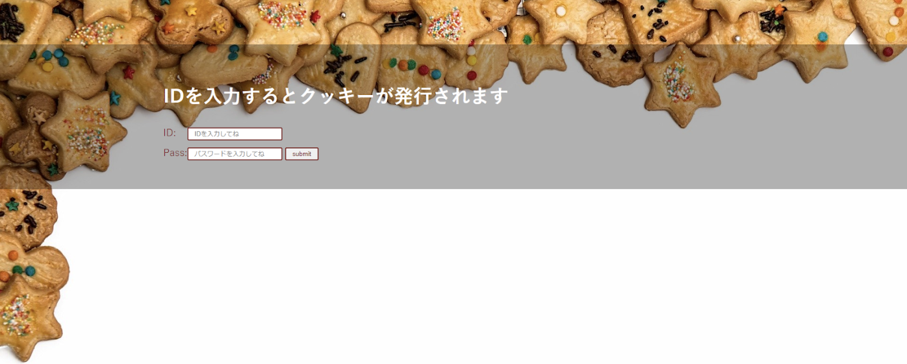
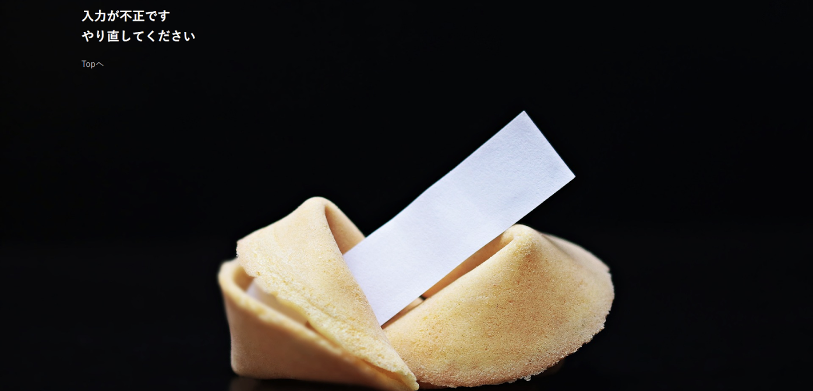
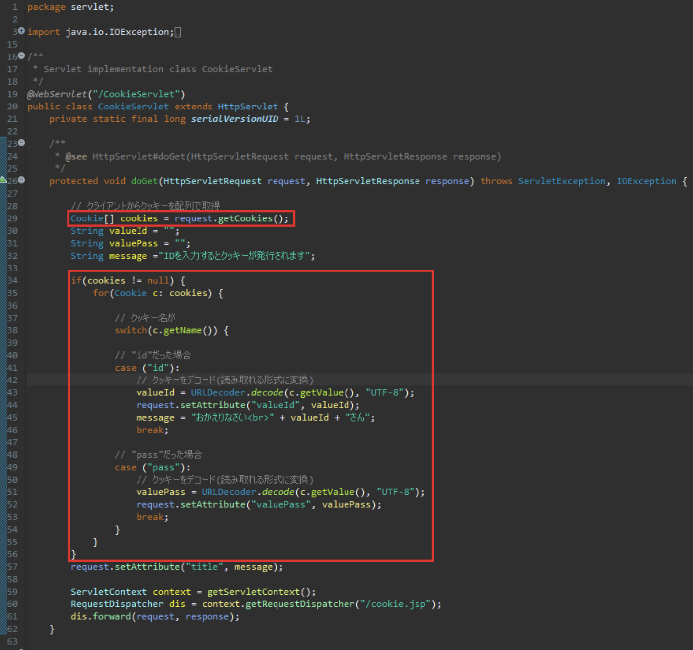
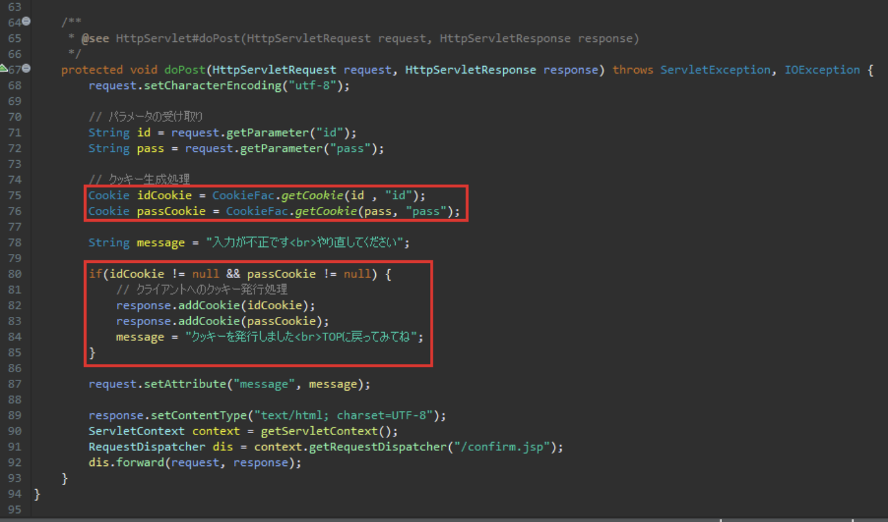
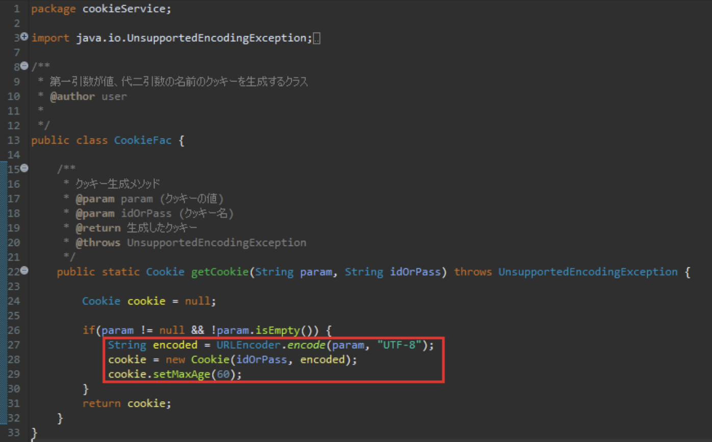

# 演習 5

以下のプロジェクトをワークスペースにインポートしてください

| 項目名 | 値 |
| --- | --- |
| 動的webプロジェクト名 | **cookie** |
|||
| パッケージ名 | servlet |
| サーブレット名 | CookieServlet.java |
| URLマッピング | /CookieServlet |
| メソッド・スタブ | ・継承された抽象メソッド ・doGet() ・doPost() |
|||
| パッケージ名 | cookieService |
| javaファイル | CookieFac.java |
|||
| JSPファイル名 | cookie.jsp |
| | confirm.jsp |
|||
| CSSファイル | cookieStyle.css |
| | confirm.css |
| 画像ファイル | cookie.jpg |
| | fortune.jpg |
| jarファイル | jstl-api-1.2.jar |
| | jstl-impl-1.2.jar |

今回は既存プロジェクトをインポートし、赤い四角で囲われたファイルを編集します

クラスは作成済みなので必要箇所を追記してください

## 実行時の画像

起動時(CookieServlet.java)

ID欄、Pass欄を記入して【submit】ボタン押下

ID欄、Pass欄を記入せずに【submit】ボタン押下

【Topへ】リンク押下時…初期画面に戻る

## ファイル編集

画像のように各ファイルを編集してください

#### CookieServlet.java(doGet)

#### CookieServlet.java(doPost)

#### CookieFac.java

