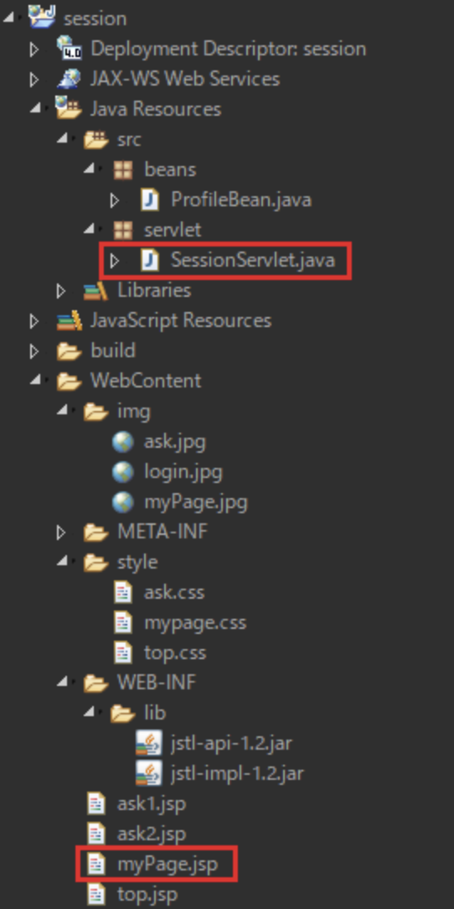
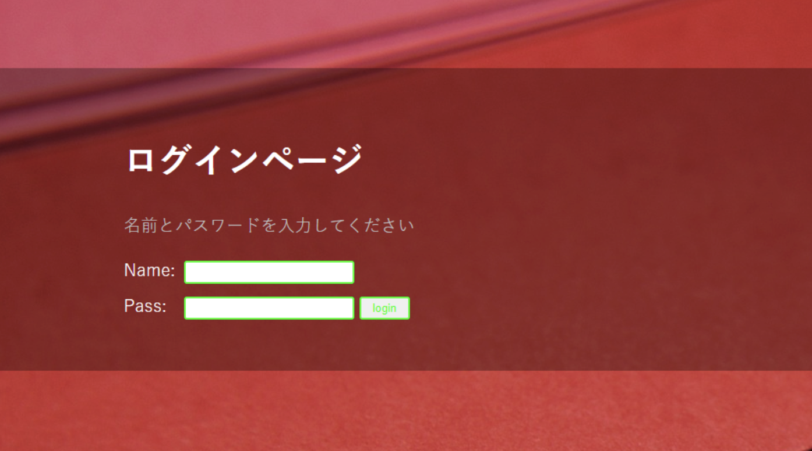
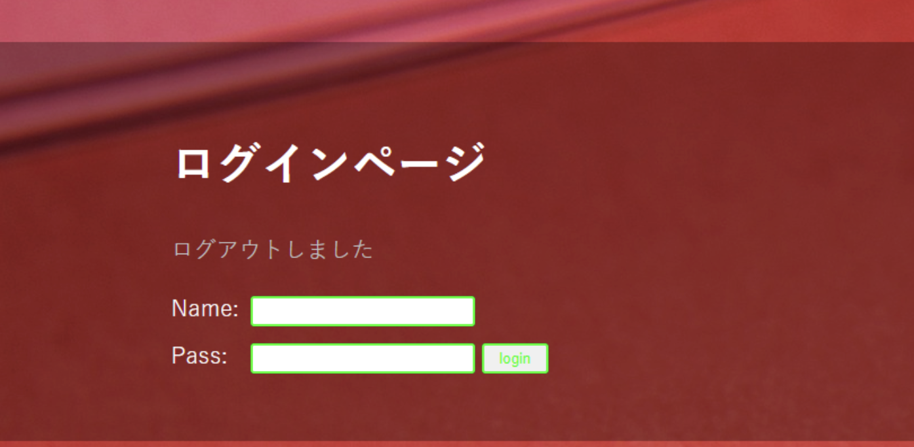

# 演習 6

以下のプロジェクトをワークスペースにインポートしてください

| 項目名 | 値 |
| --- | --- |
| 動的webプロジェクト名 | **session** |
|||
| パッケージ名 | servlet |
| サーブレット名 | SessionServlet.java |
| URLマッピング | /SessionServlet |
| メソッド・スタブ | ・継承された抽象メソッド ・doGet() ・doPost() |
|||
| パッケージ名 | beans |
| javaファイル | ProfileBean.java |
|||
| JSPファイル名 | ask1.jsp |
| | ask2.jsp |
| | myPage.jsp |
| | top.jsp |
|||
| CSSファイル | ask.css |
| | mypage.css |
| | top.css |
| 画像ファイル | ask.jpg |
| | login.jpg |
| | myPage.jpg |
| jarファイル | jstl-api-1.2.jar |
| | jstl-impl-1.2.jar |

既存プロジェクトをインポートし、赤い四角で囲われたファイルを編集します

ファイルは作成済みなので必要箇所を追記してください

## 実行時の画像

起動時(SessionServlet.java)

Pass欄に『reglecasse』以外を記入して【login】ボタン押下

Name欄を適当に、Pass欄は『reglecasse』を記入して【login】ボタン押下

【profile】ボタン押下時

【next】ボタン押下時

【next】ボタン押下時

【logout】ボタン押下時

## ファイル編集

画像のように各ファイルを編集してください

#### SessionServlet.java(doGet)

#### SessionServlet.java(doPost)前半

#### SessionServlet.java(doPost)後半

#### myPage.jsp

