以下のプロジェクトをワークスペースにインポートしてください

| 項目名 | 値 |
| --- | --- |
| 動的webプロジェクト名 | beans |
|||
| パッケージ名 | servlet |
| サーブレット名(URLマッピング) | BeansServlet.java(/ BeansServlet) |
| | AddMenuServlet.java(/ AddMenuServlet) |
| | DeleteMenuServlet.java(/ DeleteMenuServlet) |
| メソッド・スタブ |・継承された抽象メソッド ・doGet() ・doPost() |
|||
| パッケージ名 | bean |
| javaファイル | FoodBean.java |
|||
| パッケージ名 | filter |
| javaファイル | EncodeFilter.java |
|||
| パッケージ名 | initialize |
| javaファイル | CreateMenu.java |
|||
| JSPファイル名 | beansTop.jsp |
| | edit.jsp |
|||
| CSSファイル | bean.css |
| 画像ファイル | menu.jpg |
| jarファイル | jstl-api-1.2.jar |
| | jstl-impl-1.2.jar |

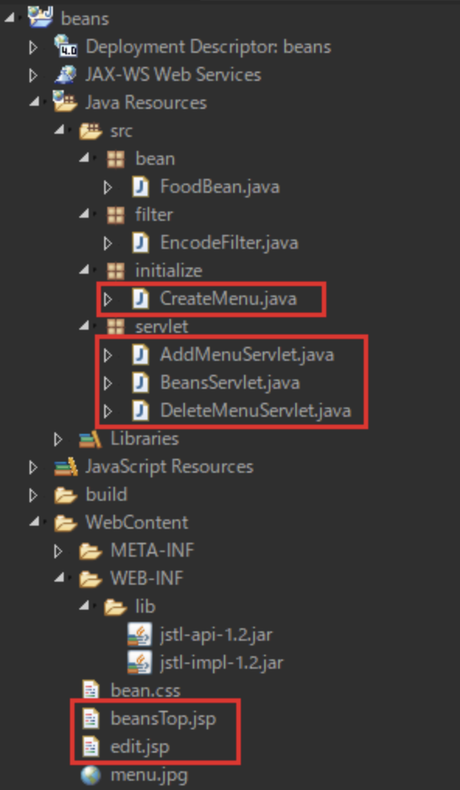

既存プロジェクトをインポートし  
赤い四角で囲われたファイルを編集します

ファイルは作成済みなので必要箇所を追記してください

実行時の画像

起動時(BeanServlet.java)

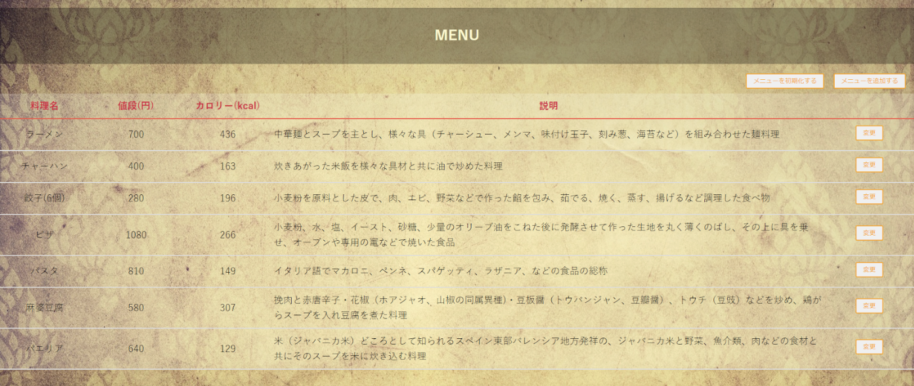

ラーメンの【変更】ボタンを押下

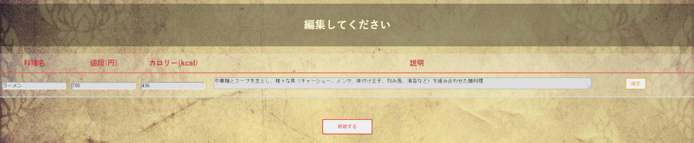

編集画面で値段を700から800に変更して【確定】ボタン押下

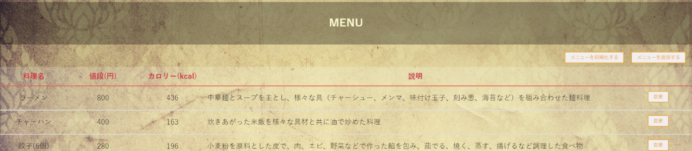

編集画面で全て空白にして【確定】ボタン押下

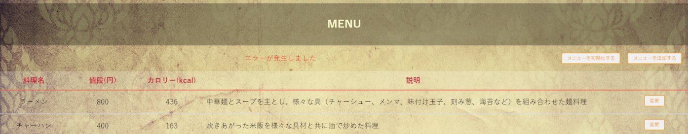

編集画面で【削除】ボタンを押下

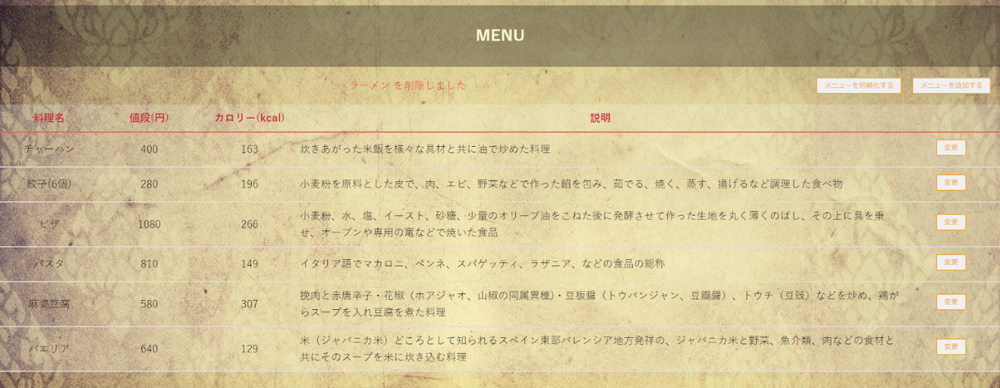

【メニューを追加する】ボタンを押下

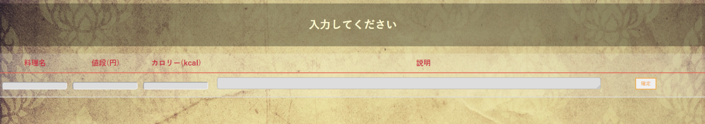

入力画面で全て空欄のまま【確定ボタン】を押下

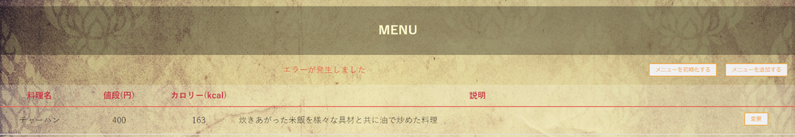

入力画面で適当に値を入力して【確定ボタン】を押下

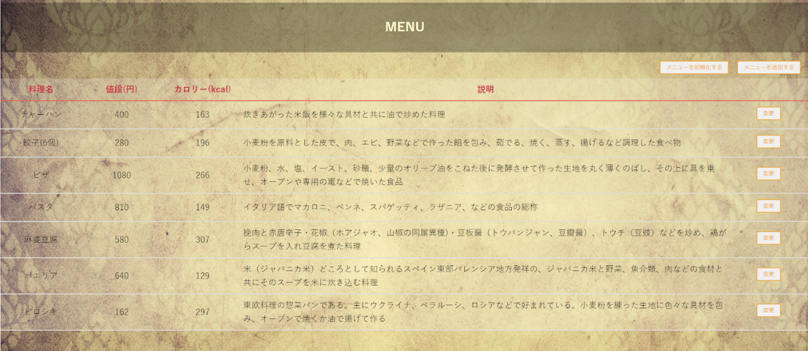

【メニューを初期化する】ボタンを押下

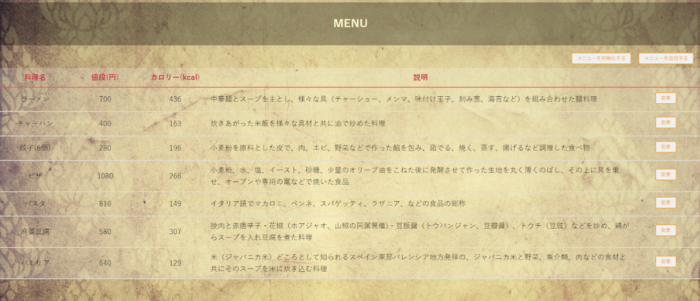

画像のように各ファイルを編集してください

BeanServlet.java(doPost)

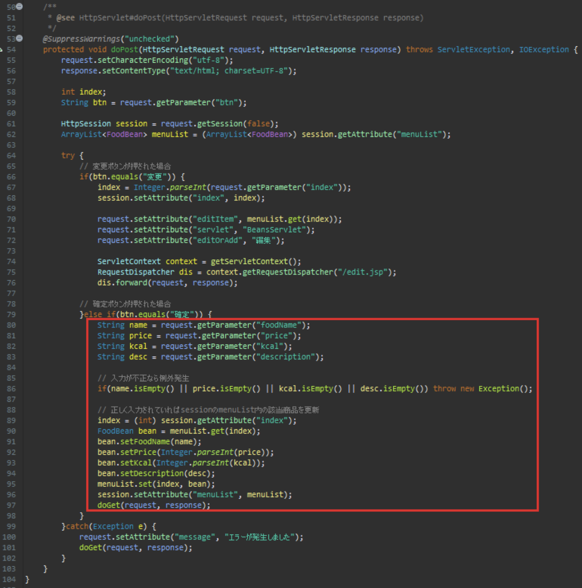

AddMenuServlet.java(doPost)

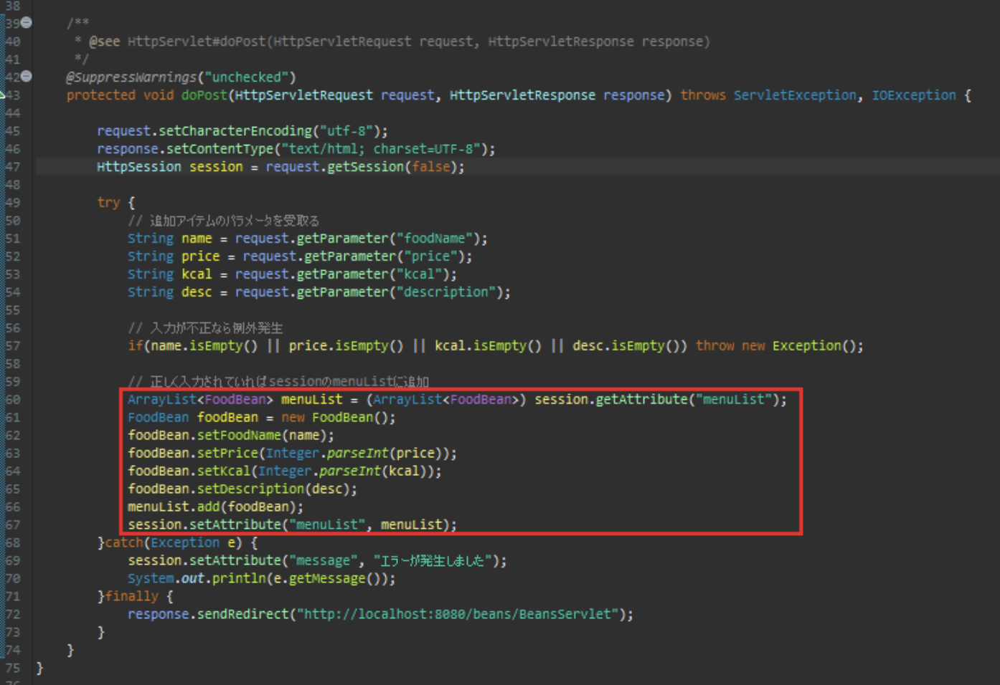

DeleteMenuServlet.java(doGet)

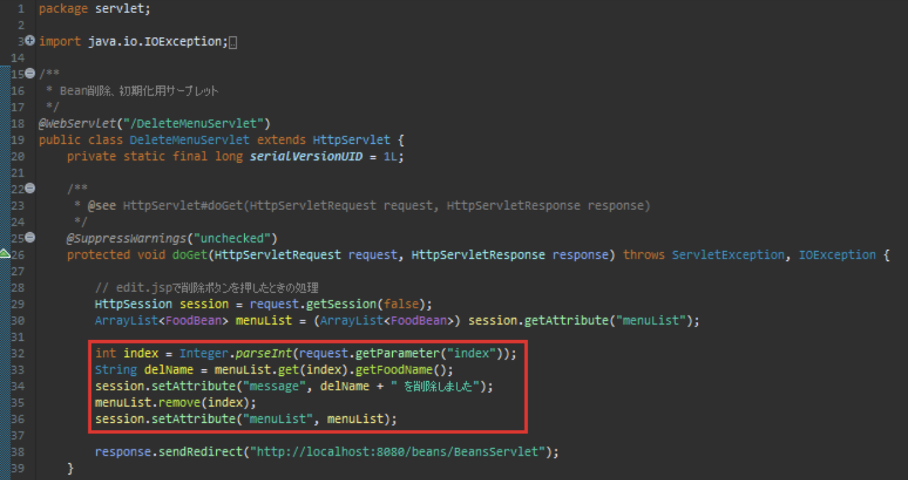

CreateMunu.java(createMenuList)

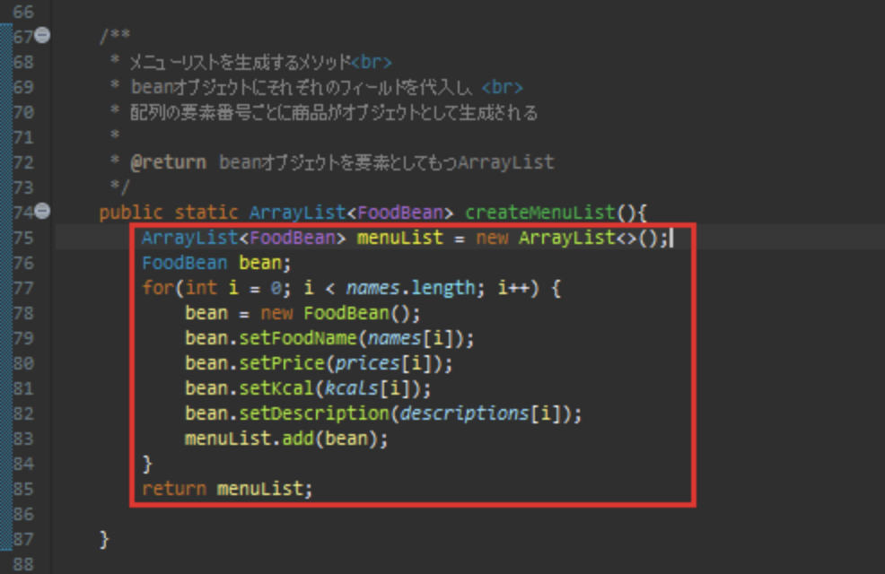

beansTop.jsp

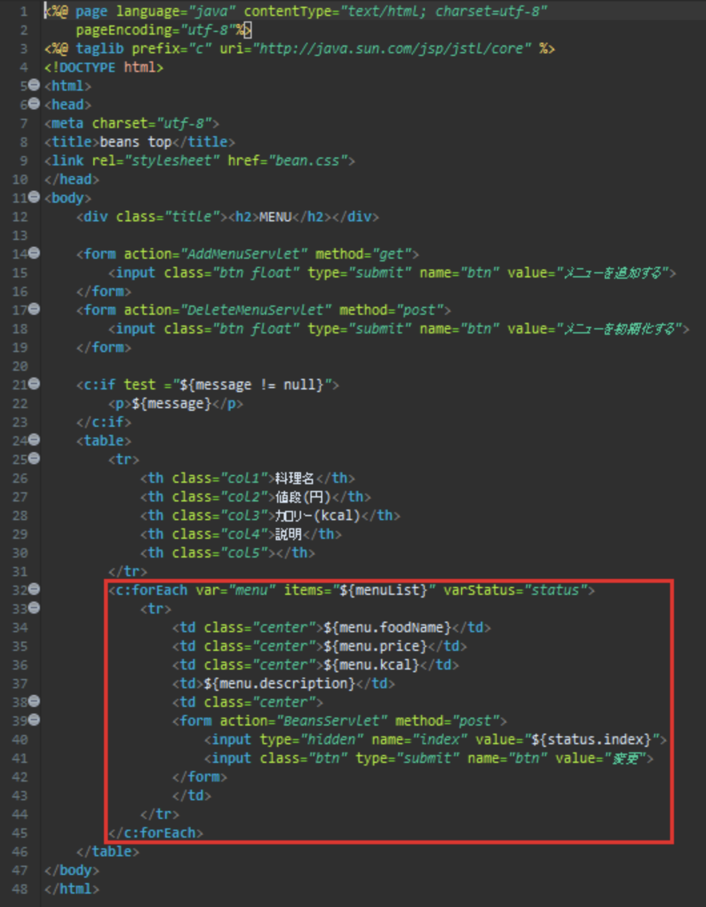

edit.jsp

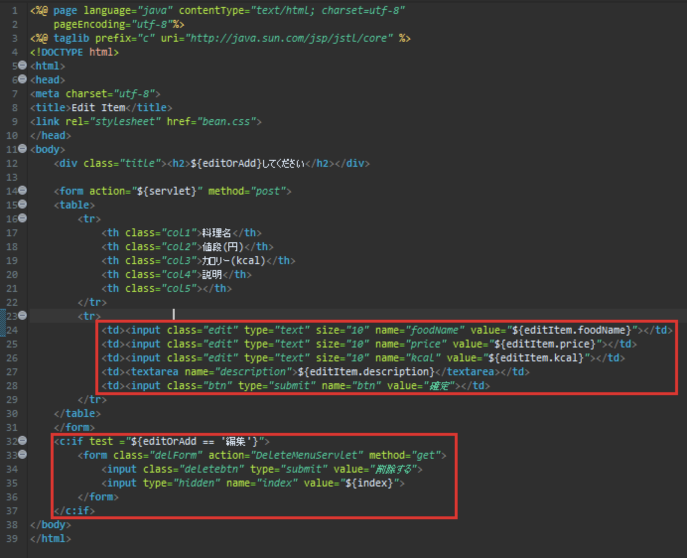
