# 演習 8

以下のプロジェクトをワークスペースにインポートしてください

| 項目名 | 値 |
| --- | --- |
| 動的webプロジェクト名 | **database** |
|||
| パッケージ名 | controller |
| サーブレット名 | DBServlet.java |
| URLマッピング | /DBServlet |
| メソッド・スタブ | ・継承された抽象メソッド ・doGet() ・oPost() |
|||
| パッケージ名 | dao |
| javaファイル | Dao.java |
|||
| パッケージ名 | dto |
| javaファイル | MessageDto.java |
|||
| パッケージ名 | filter |
| javaファイル | ReqFil.java |
| | ResFil.java |
|||
| パッケージ名 | service |
| javaファイル名 | DBAccess.java(インターフェース) |
| | Delete.java ← DBAccess.javaを実装 |
| | Insert.java ← DBAccess.javaを実装 |
| | Select.java ← DBAccess.javaを実装 |
|||
| JSPファイル名 | db.jsp |
|||
| CSSファイル | style.css |
| 画像ファイル | delete_icon_hover.png |
| | delete_icon.png |
| | user_icon.png |
| jarファイル | jstl-api-1.2.jar |
| | jstl-impl-1.2.jar |

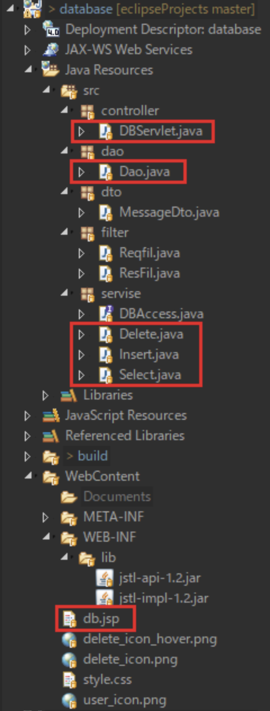

既存プロジェクトをインポートし  
赤い四角で囲われたファイルを編集します

ファイルは作成済みなので必要箇所を追記してください

## JDBCドライバ追加

:::caution
※JDBCドライバを使用するため以下の設定をまだできていない場合は行ってください
:::
[手順リンク](/eightbit-saurus/docs/java/環境構築/Eclipse環境構築3)


## DB作成

次に、データベースの設定をします

以下の中身をコピーし、MySQLに **root** ユーザでログインして以下を実行してください  

```sql
create database javaweb;

use javaweb;

create table if not exists tweet (
id int NOT NULL PRIMARY KEY AUTO_INCREMENT, 
content varchar(100), 
date timestamp default CURRENT_TIMESTAMP);

INSERT INTO tweet (content) VALUES ('test');

select * from tweet;
```
 
以下のようになればOKです

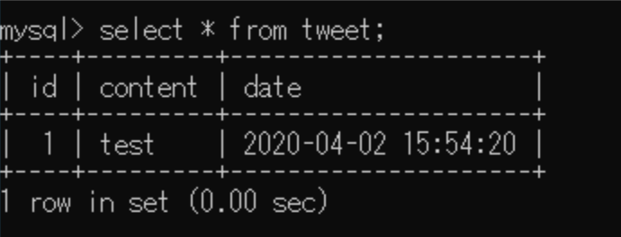

## 実行時の画像

起動時(DBServlet.java)

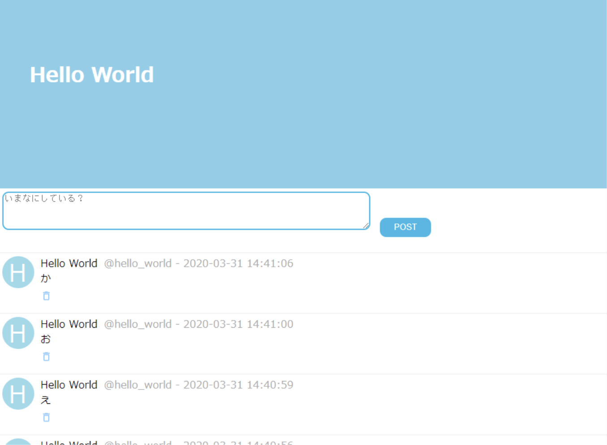

入力欄に何も入れず、又は100文字以上入力して【POST】ボタン押下

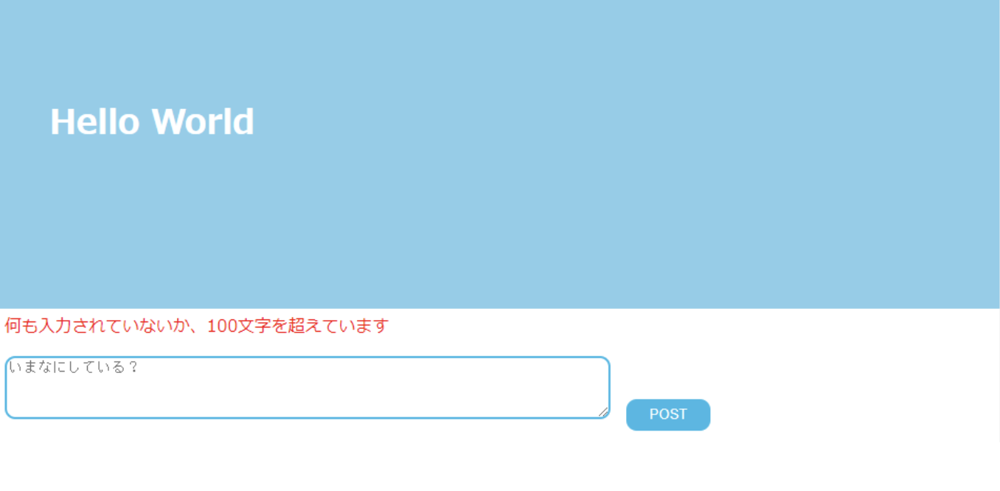

ゴミ箱ボタンを押下

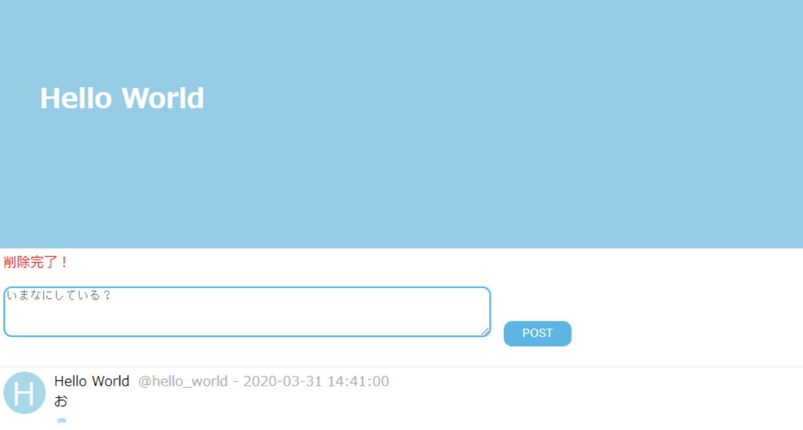

『テスト』と入力して【POST】ボタン押下

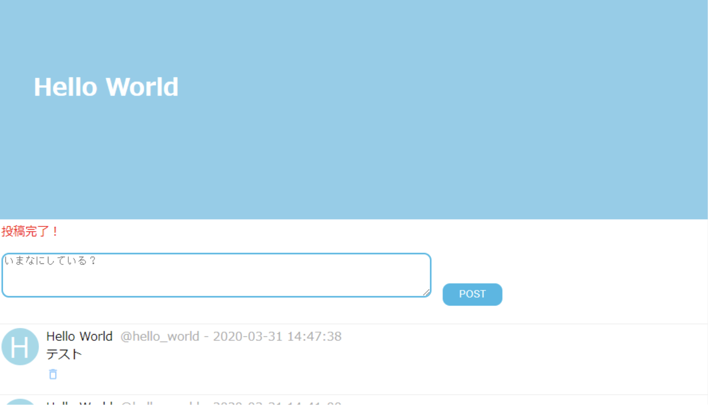

## ファイル編集

画像のように各ファイルを編集してください

#### DBServlet.java


#### Dao.java①

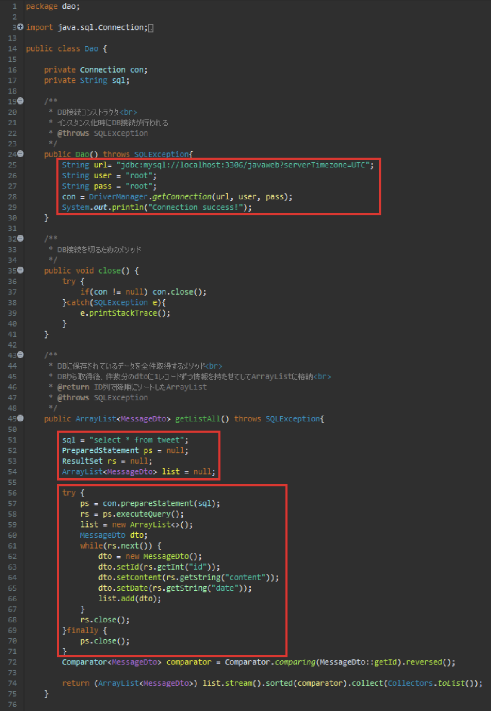

#### Dao.java②

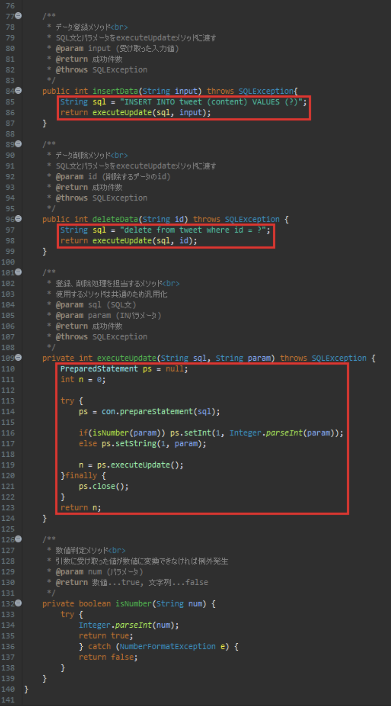

#### Select.java

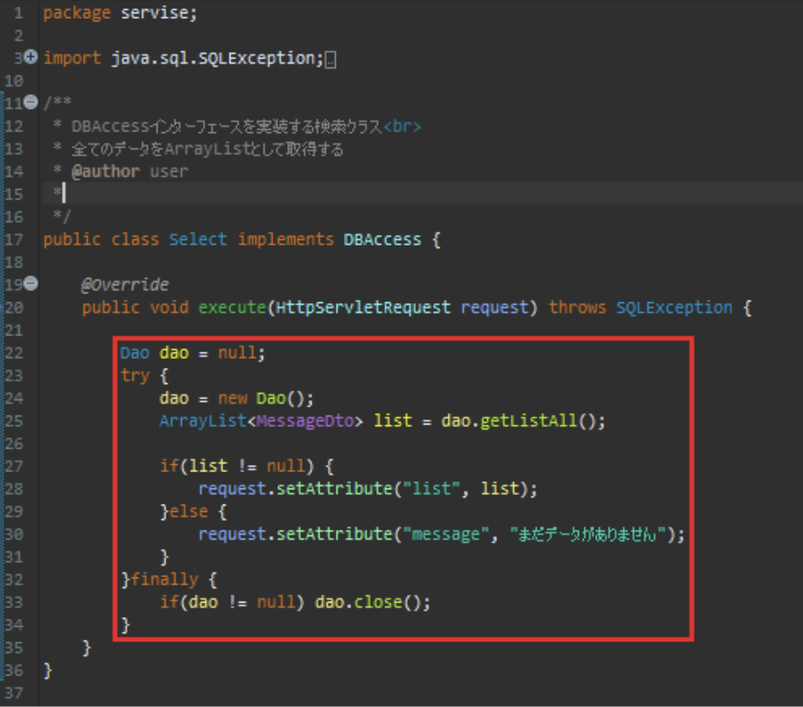

#### Insert.java

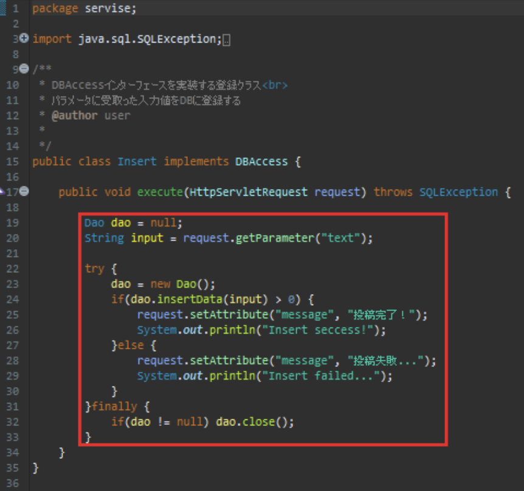

#### Delete.java

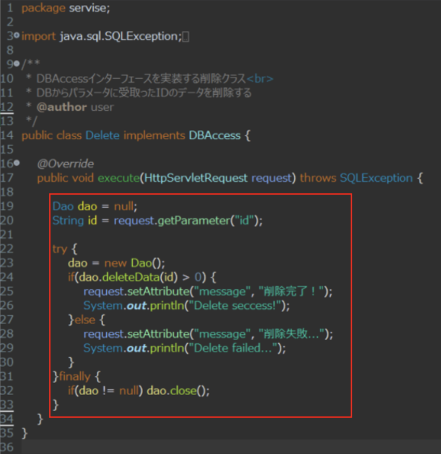

#### db.jsp

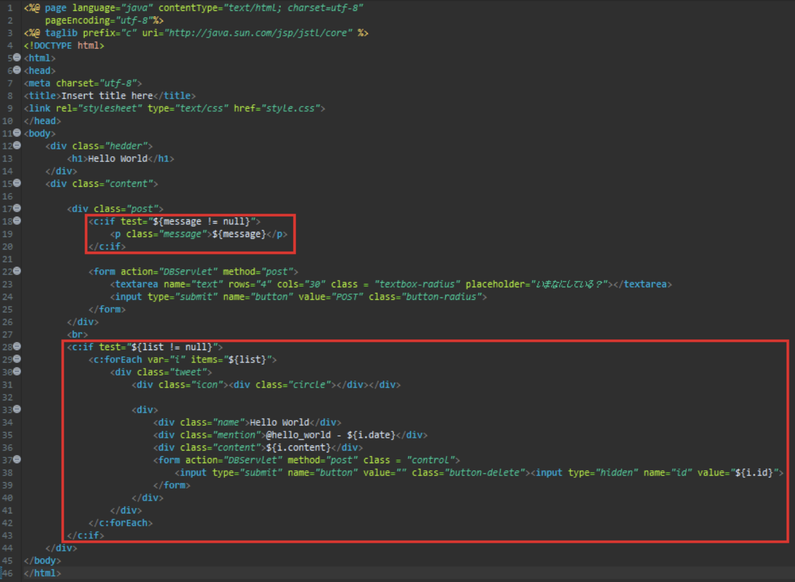
