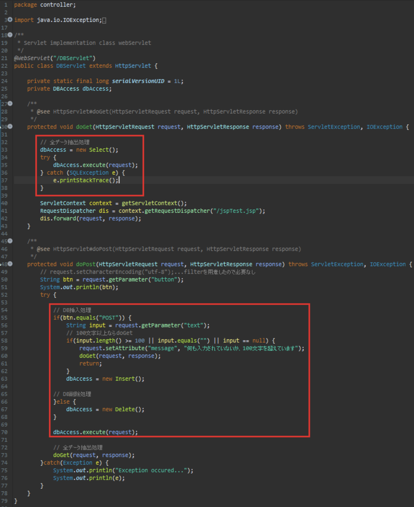

以下のプロジェクトをワークスペースにインポートしてください

| 項目名 | 値 |
| --- | --- |
| 動的webプロジェクト名 | database |
|||
| パッケージ名 | controller |
| サーブレット名 | DBServlet.java |
| URLマッピング | /DBServlet |
| メソッド・スタブ | ・継承された抽象メソッド ・doGet() ・oPost() |
|||
| パッケージ名 | dao |
| javaファイル | Dao.java |
|||
| パッケージ名 | dto |
| javaファイル | MessageDto.java |
|||
| パッケージ名 | filter |
| javaファイル | ReqFil.java |
| | ResFil.java |
|||
| パッケージ名 | service |
| javaファイル名 | DBAccess.java(インターフェース) |
| | Delete.java ← DBAccess.javaを実装 |
| | Insert.java ← DBAccess.javaを実装 |
| | Select.java ← DBAccess.javaを実装 |
|||
| JSPファイル名 | db.jsp |
|||
| CSSファイル | style.css |
| 画像ファイル | delete_icon_hover.png |
| | delete_icon.png |
| | user_icon.png |
| jarファイル | jstl-api-1.2.jar |
| | jstl-impl-1.2.jar |

既存プロジェクトをインポートし  
赤い四角で囲われたファイルを編集します

ファイルは作成済みなので必要箇所を追記してください

※JDBCドライバを使用するため以下の設定を行ってください

【Run】タブをクリック

【Run Configurations...】をクリック

【Classpath】タブをクリック

【User Entries】をクリック

【Ad External JARs...】をクリック

上記のjarファイルを選択して【開く】ボタン押下

右下の【Run】ボタンをクリック...終わり

次に、データベースの設定をします

database_sql.txtの中身をコピーし、MySQL Command Clientにペーストしましょう  
その後、useコマンドでjavawebに移動し、select文で全件抽出します  
以下のようになればOKです

実行時の画像

起動時(DBServlet.java)

入力欄に何も入れず、又は100文字以上入力して【POST】ボタン押下

ゴミ箱ボタンを押下

『テスト』と入力して【POST】ボタン押下

画像のように各ファイルを編集してください

DBServlet.java

Dao.java①

Dao.java②

Select.java

Insert.java

Delete.java

db.jsp

