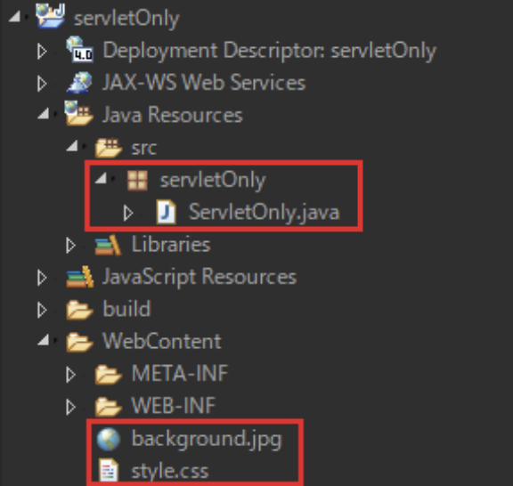

# はじめに

演習を始める前に以下を読了して下さい  

## 学習の進め方

演習 1 から 演習 4 まで、及び課題 1 については**プロジェクトを作成**し、必要なファイルは作成して下さい  

**演習 4までが完了したら**課題 1 に着手しましょう

演習 5 から 演習 8 まで、及び課題 2 については**プロジェクトをインポート**し、必要なファイルは作成して下さい  
インポートについては [**こちら**](/eightbit-saurus/docs/java/Exercise/JavaWeb/page1) の手順を参考にしましょう  

**演習 8 までが完了したら**課題 2 に着手しましょう

:::info
演習を進める中で知らない概念やオブジェクトが多数出てきます  
必要な知識は以下のスライドにまとめているので参考にしてください  
[参考URLまとめ](https://docs.google.com/presentation/d/1Xb67tN5DGnEcpEr6L9bJll5J7jqmrGkN8H22i_wbBxM/edit?usp=sharing)
:::

:::caution
## 新規動的webプロジェクト作成時の注意点  
2021年のEclipseアップデートにより、動的webプロジェクトのデフォルトのフォルダ階層が変更されました  
演習や課題のページにおける以下の画像では
- 「**src**」の中にjavaファイル  
- 「**WebContent**」の中に静的リソース  

がそれぞれ格納されています  

新規作成時は、役割は同じですが以下のようにフォルダ名が変わるので注意して下さい

|旧フォルダ名|新フォルダ名|
|---|---|
|src|src/main/java|
|WebContent|src/main/webapp|

**※プロジェクトをインポートした場合、旧フォルダ階層が適用されたプロジェクトがインポートされますが、そのまま使用して問題ありません**

:::

