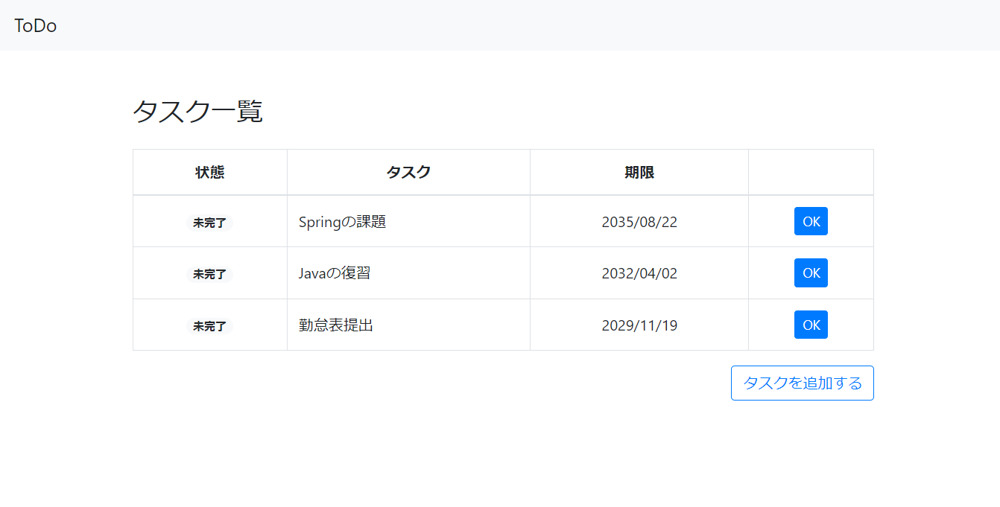
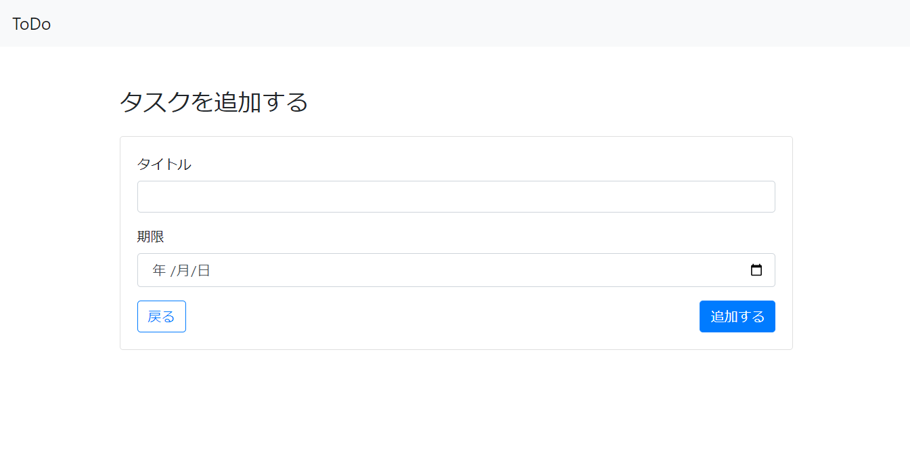

# Spring 課題1


まずは以下のプロジェクトを**既存Gradleプロジェクト**としてEclipseにインポートしましょう

- [JPAサンプルプロジェクト](https://github.com/esx11954/jpa-sample)  
- [MyBatisサンプルプロジェクト](https://github.com/esx11954/mybatis-sample)

それぞれのリポジトリにそれぞれの簡単な使用方法や概要が記載されているので確認して下さい  
確認できたら以下の課題に取り組みましょう


## 目標成果物

#### タスク一覧画面



#### タスク追加画面



#### 機能一覧
- タスク**一覧表示**
- タスク**ステータス変更**（未完了→完了）
- タスク**追加**

:::info
※JPA, MyBatisどちらを使っても構いません
:::


## HTMLテンプレート

以下のコードを作成したHTMLファイルに貼り付けて使用して下さい  
見た目が気になるようでしたらCSSも作成して下さい  
Thymeleafの構文を使用して目的に沿って修正しましょう

<details>
  <summary>タスク一覧画面 HTML (taskList.html)</summary>
  <div>
```html
<!DOCTYPE html>
<html lang="ja" xmlns:th="http://www.thymeleaf.org">
<head>
  <meta charset="UTF-8" />
  <meta name="viewport" content="width=device-width, initial-scale=1.0" />
  <meta http-equiv="X-UA-Compatible" content="ie=edge" />
  <title>ToDo</title>
  <link rel="stylesheet" href="https://stackpath.bootstrapcdn.com/bootstrap/4.1.2/css/bootstrap.min.css" />
  <link rel="stylesheet" href="/app.css" />
</head>
<body>
  <header class="mb-5">
    <nav class="navbar navbar-light bg-light">
      <a href="/" class="navbar-brand">ToDo</a>
    </nav>
  </header>
  <main>
    <div class="todo-container">
        <h1 class="h3 mb-4">タスク一覧</h1>
        <table class="table table-bordered mb-3">
          <thead>
            <tr>
              <th>状態</th>
              <th>タスク</th>
              <th>期限</th>
              <th></th>
            </tr>
          </thead>
          <tbody>
            <tr>
              <td class="text-center">
                <span class="badge badge-pill badge-success">完了</span>
              </td>
              <td>Springの勉強</td>
              <td class="text-center">2018/08/22</td>
              <td class="text-center">-</td>
            </tr>
            <tr>
              <td class="text-center">
                <span class="badge badge-pill badge-light">未完了</span>
              </td>
              <td>JavaScriptの勉強</td>
              <td class="text-center">2018/08/22</td>
              <td class="text-center">
                <form action="#">
                  <button class="btn btn-sm btn-primary" type="submit">OK</button>
                </form>
              </td>
            </tr>
            <tr>
              <td class="text-center">
                <span class="badge badge-pill badge-light">未完了</span>
              </td>
              <td>来期目標提出</td>
              <td class="text-center">2018/08/22</td>
              <td class="text-center">
                <form action="#">
                  <button class="btn btn-sm btn-primary" type="submit">OK</button>
                </form>
              </td>
            </tr>
          </tbody>
        </table>
        <div class="text-right">
          <a href="/add.html" class="btn btn-outline-primary">タスクを追加する</a>
        </div>
      </div>
  </main>
</body>
</html>
```    
  </div>
</details>


<details>
  <summary>タスク追加画面 HTML (taskAdd.html)</summary>
  <div>
    ```html
<!DOCTYPE html>
<html lang="ja" xmlns:th="http://www.thymeleaf.org">
<head>
  <meta charset="UTF-8" />
  <meta name="viewport" content="width=device-width, initial-scale=1.0" />
  <meta http-equiv="X-UA-Compatible" content="ie=edge" />
  <title>ToDo</title>
  <link rel="stylesheet" href="https://stackpath.bootstrapcdn.com/bootstrap/4.1.2/css/bootstrap.min.css" />
  <link rel="stylesheet" href="/app.css" />
</head>
<body>
  <header class="mb-5">
    <nav class="navbar navbar-light bg-light">
      <a href="/" class="navbar-brand">ToDo</a>
    </nav>
  </header>
  <main>
    <div class="todo-container">
      <h1 class="h3 mb-4">タスクを追加する</h1>
      <div class="card">
        <div class="card-body">
          <form action="#">
            <div class="form-group">
              <label for="title">タイトル</label>
              <input class="form-control" type="text" id="title" name="title" />
            </div>
            <div class="form-group">
              <label for="limit">期限</label>
              <input class="form-control" type="date" id="limit" name="limit" />
            </div>
            <div class="d-flex justify-content-between align-items-center">
              <a href="/" class="btn btn-outline-primary">戻る</a>
              <button class="btn btn-primary" type="submit">追加する</button>
            </div>
          </form>
        </div>
      </div>
    </div>
  </main>
</body>
</html>
    ```
  </div>
</details>


<details>
  <summary>共通CSS (app.css)</summary>
  <div>
```css
.todo-container {
  margin: 0 auto;
  max-width: 840px;
  padding: 0 2%;
}

.table th {
  text-align: center;
}

.table td {
  vertical-align: middle;
}
```
  </div>
</details>


## DB情報

DBクライアントにて以下のクエリを実行して環境を用意して下さい  
DB名、テーブルの列定義等、必要な情報は確認しておきましょう  

<details>
  <summary>DB環境作成クエリ</summary>
  <div>
```sql
# DB作成
CREATE DATABASE IF NOT EXISTS task;

USE task;

# テーブル作成
CREATE TABLE IF NOT EXISTS task (
  id bigint(20) NOT NULL AUTO_INCREMENT,
  task varchar(255),
  due date,
  status boolean,
  PRIMARY KEY (id)
);

# テストデータ
insert into task(task, due, status) values 
  ("Springの課題", "2035/08/22", 0),
  ("Javaの復習", "2032/04/02", 0),
  ("勤怠表提出", "2029/11/19", 0)
;
```
  </div>
</details>


:::tip
## 進め方

上記でインポートしたプロジェクトを参考にして構築しましょう

<details>
  <summary>1. 初期動作確認手順</summary>
  <div>
    1. 新規プロジェクトを作成する
    2. コントローラクラスを作成し、`@GetMapping` を付与したメソッドを用意する
    3. 以下のテンプレートを貼り付けたHTMLファイルを作成する
    4. プロジェクトを起動し、用意したメソッドのパスにブラウザからアクセスする
    5. 正常にHTMLファイルが表示される事を確認する
  </div>
</details>

<details>
  <summary>2. DB連携動作確認手順</summary>
  <div>
    1. DBとテーブルを作成し、テストデータを挿入する
    2. `application.properties` に接続情報を記入する
    3. DBにアクセスするために必要なクラスやインターフェースを作成する
    4. サービスクラスを作成し、必要なメソッドを定義する
    5. コントローラクラス内で *3* で作成した全件検索メソッドを呼び出す
    6. *5* の戻り値をコンソールに出力し、正常にDBにアクセスできる事を確認する
  </div>
</details>

<details>
  <summary>3. 一覧データ画面出力手順</summary>
  <div>
    1. *1. 初期動作確認* で作成したHTMLファイルのテーブル部分にThymeleafでForeach構文を仕込む
    2. Foreach内でDBから取得したデータの各オブジェクトの必要なフィールドを呼び出す
    3. 一覧画面のパスにアクセスし、DBから取得したデータが画面に一覧表示されることを確認する
  </div>
</details>

<details>
  <summary>4. 画面遷移確認手順</summary>
  <div>
    1. コントローラにタスク追加画面遷移用の`@PostMapping`を付与したメソッドを用意する
    2. `taskList.html`内formタグのaction属性に適当な値を記入する
    3. プロジェクトを起動し、タスク一覧画面から追加画面に遷移する
    4. 正常にタスク追加画面が表示されることを確認する   
  </div>
</details>

<details>
  <summary>5. タスク追加動作確認手順</summary>
  <div>
    1. コントローラにタスク追加用の`@PostMapping`を付与したメソッドを用意する
    2. DBに追加するために必要なクラスやインターフェースを作成する
    3. `taskAdd.html`からパラメータを送るために必要な記述を追記する
    4. プロジェクトを起動し、タスク画面から適当なデータを入力し、追加ボタンを押下する
    5. タスク一覧画面に追加したタスクが表示されていることを確認する
  </div>
</details>
:::


:::info
上記の課題が完了した場合は以下の機能を追加してみましょう
- タスク編集機能
- タスク追加時、編集時バリデーション機能
- タスク削除機能
- タスク完了状況切替機能
:::
