# Spring 課題3


<details>
  <summary>環境構築</summary>
  <div>
    <details>
        <summary>データベース作成</summary>
        <div>


#### 1. 以下のリンクからpython**3.x系**をインストールして下さい  
[python 公式](https://www.python.org/)


#### 2. python がインストールされていることを確認して下さい  
コマンドプロンプトを開き、`python -V`を実行し、  
以下のような表示が出力されることを確認

```
C:\Users>python -V
Python 3.11.4
```

***※バージョン部分は異なる場合があります***


#### 3. 以下のリンクからリポジトリをzipで任意のフォルダにダウンロードして下さい
[bookdb-py](https://github.com/esx11954/bookdb-py)

ダウンロード後上記リンクの**readme.md**を参照し、  
ユーザの設定及び必要モジュールのインストールを行い、  
ローカル環境にデータベースを作成して下さい
        </div>
    </details>

    <details>
        <summary>プロジェクトインポート</summary>
        <div>

#### 1. 課題用リポジトリリソースをダウンロード  
以下のリンクから課題用リポジトリリソースをzipでダウンロードして下さい 
 
[課題用リソース](https://github.com/esx11954/books/archive/refs/heads/booksExam.zip)


#### 2. Eclipseにインストール 
ダウンロードしたzipを展開後、  
Eclipseから展開したフォルダ内のプロジェクトをインポートして下さい 
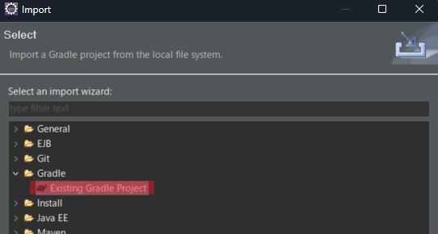


#### 3. 動作確認 
インポートが完了したらプロジェクトを実行し、  
以下の画面が表示されることを確認して下さい
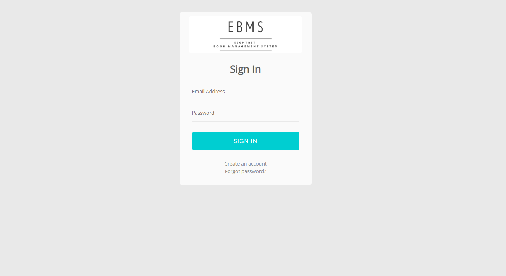

        </div>
    </details>


    <details>
        <summary>ログイン</summary>
        <div>

このプロジェクトは書籍管理を目的としたシステムです
管理者はこのシステムにサインインし、各種機能を利用すると想定します  

以下の認証情報でログインし、履歴一覧ページが表示されることを確認して下さい  
ログインできない場合はDBが正常に作成されていない可能性があります  

#### 認証情報  

| メールアドレス | eightbit@eightbit.co.jp |
|---|---|
| **パスワード** | **eightbit** |

:::caution

ログイン後、mysqlで「**java.lang.IllegalArgumentException: HOUR_OF_DAY: 0 ->1**」というエラーが出る場合

上記の例外が発生した場合はDBを作り直して下さい   

**原因**  
過去に日本で導入されたサマータイムという制度が関係しています  
詳しくは[こちら](https://getore.blogspot.com/2021/07/mysqljavalangillegalargumentexception.html)を参照して下さい


:::
        </div>
    </details>


  </div>
</details>

<details>
    <summary>課題概要</summary>
    <div>

このシステムには以下3つの一覧画面が用意されており、  
それぞれが詳細ページ及び更新用モーダルを持ちます  
書籍、ユーザ一覧画面は新規登録画面が用意されています  

- **履歴一覧画面**
    - 履歴詳細画面
        - データ更新用モーダル


- **書籍一覧画面**
    - 新規書籍登録画面
    - 書籍詳細画面
        - データ更新用モーダル
        - 書籍貸出手続き画面


- **ユーザ一覧画面**
    - 新規ユーザ登録画面
    - ユーザ詳細画面
        - データ更新用モーダル


インポートしたプロジェクトの**serviceパッケージ内のファイル**を修正(機能を実装)することでシステムが正常に動作するようになります  

修正対象ファイルは以下の3つです  
- <em>/books/src/main/java/com/eightbit/books/service/UserService.java</em>
- <em>/books/src/main/java/com/eightbit/books/service/BookService.java</em>
- <em>/books/src/main/java/com/eightbit/books/service/HistoryService.java</em>


:::tip
### ポイント

例えば検索機能を実装する場合、  
検索ボタンをクリックしたタイミングで  
1. どのコントローラのどのメソッドにリクエストが飛ぶか
2. そのメソッドは引数として何をどのような型で受け取るか
3. そのメソッド内ではどのような処理が行われるか(serviceクラスのどのメソッドが呼ばれるか)
4. サービスクラスのメソッドは引数として何をどのような型で受け取るか
5. サービスクラスのメソッドは最終的な戻り値として何を返却すればいいのか
6. DBから何のデータを問い合わせる必要があるのか
7. DBに問い合わせる際、どのメソッドを使用するか  
8. 戻り値が必要ない場合は何をもって処理終了とするか  

等を考える必要があります  
ユーザ視点の画面の動き、修正対象メソッドの前後の処理の繋がりを意識しましょう  
また、余裕があればModelオブジェクトの持つデータがThymeleafでどのようにパースされるかを確認しましょう
:::

    </div>
</details>

<details>
    <summary>Step1. ユーザ関連機能</summary>
    <div>
## 画面一覧


### 一覧ページ
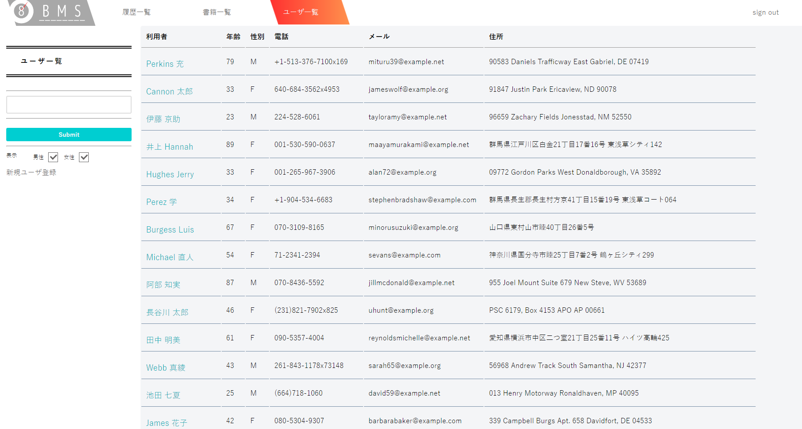

### 詳細ページ
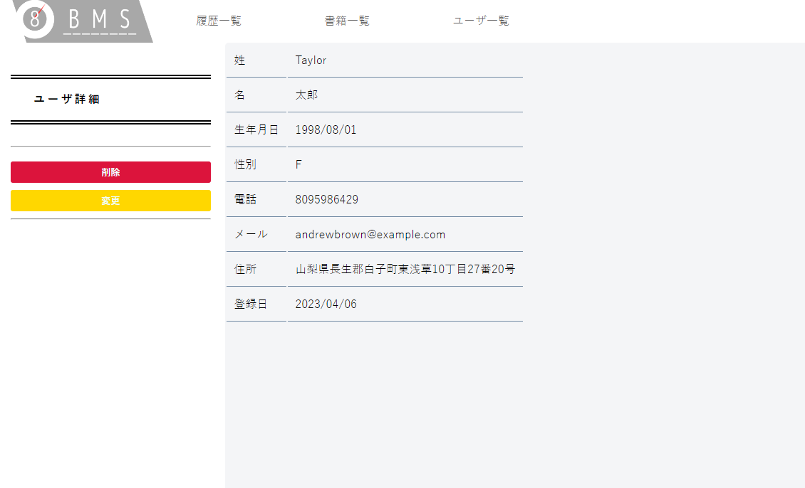

### 変更ページ(モーダル)
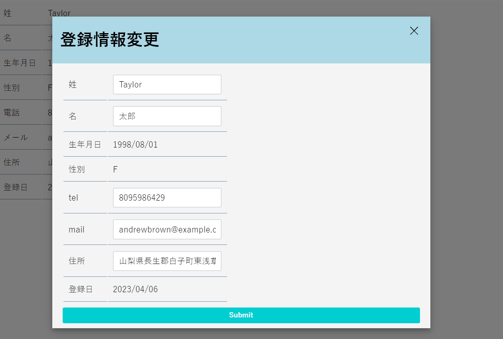


## 課題

以下の機能は必要なメソッドは存在しますが、処理が実装されていません  
編集対象ファイルの該当メソッドに要件に合うように処理を追記して下さい

編集対象ファイル：<em>/books/src/main/java/com/eightbit/books/service/UserService.java</em>  


**特定ユーザ検索(名前)**  
:::note
編集対象メソッド ： <em>searchUser</em>  
ユーザ名から該当ユーザを検索する機能  
検索クエリから姓、名どちらも検索できるようにしましょう
:::

使用イメージ

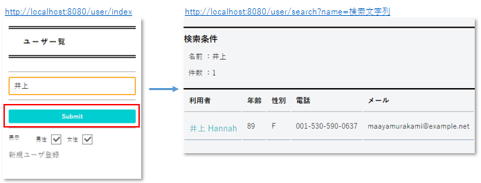

**特定ユーザ検索(ID)**
:::note

編集対象メソッド ： <em>searchUserById</em>  
IDから該当ユーザを検索する機能  
一覧ページのリンクから特定ユーザの詳細ページへ遷移する際に使用する
:::

使用イメージ

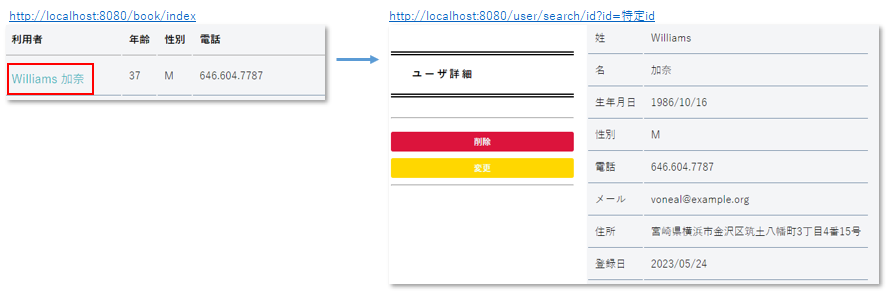

**ユーザ登録情報更新**  
:::note
編集対象メソッド ： <em>updateUser</em>  
ユーザの登録情報を更新する機能  
モーダルに入力した内容が登録後即時反映される
:::

使用イメージ

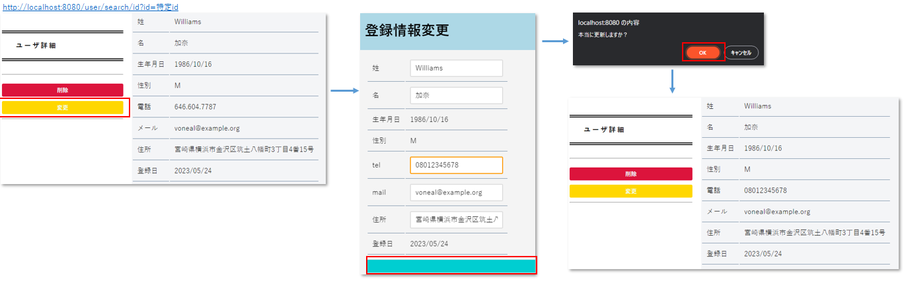

**新規ユーザ登録**  
:::note
編集対象メソッド ： <em>userRegist</em>  
新規ユーザデータをDBに登録する機能  
登録後はユーザ一覧画面で該当ユーザを検索し、登録されていることを確認して下さい
:::

使用イメージ

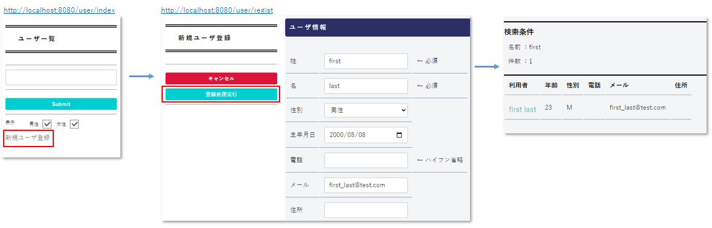

**ユーザ削除**  
:::note
編集対象メソッド ： <em>deleteUserAndHistoryData</em>  
ユーザデータを削除する機能  
特定のユーザを削除した場合、そのユーザに紐づくhistoryテーブルの履歴データも削除しましょう  
削除後はユーザ一覧画面で該当ユーザを検索し、削除されていることを確認して下さい
:::

使用イメージ

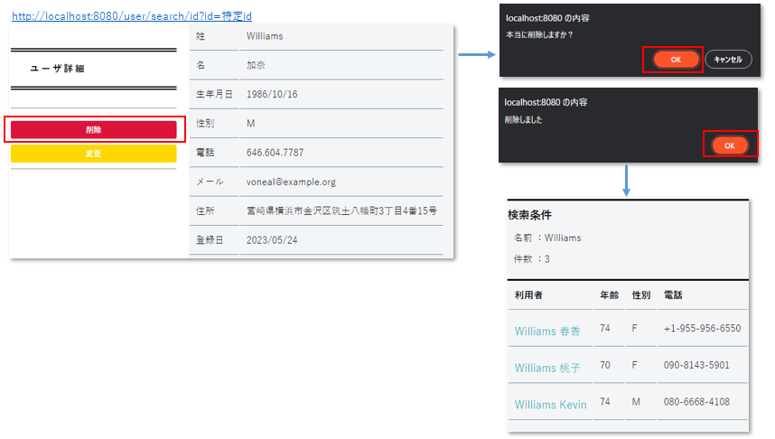

以上でユーザ関連機能の課題は終了です

    </div>
</details>

<details>
    <summary>Step2. 書籍関連機能</summary>
    <div>
## 画面一覧


### 一覧ページ
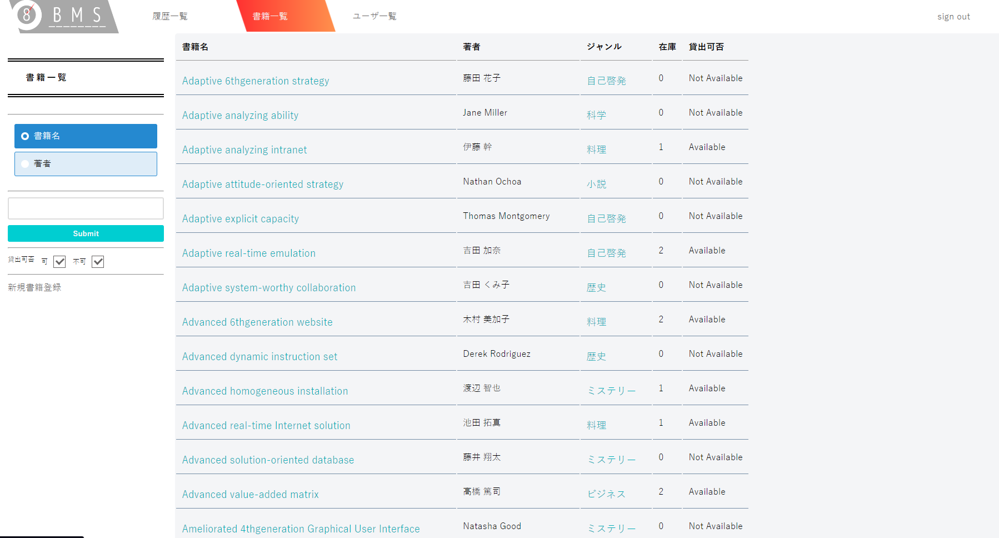

### 詳細ページ
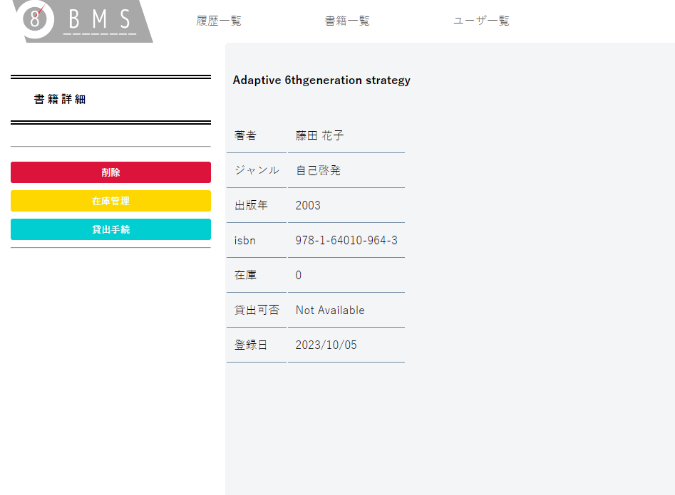

### 変更ページ(モーダル)
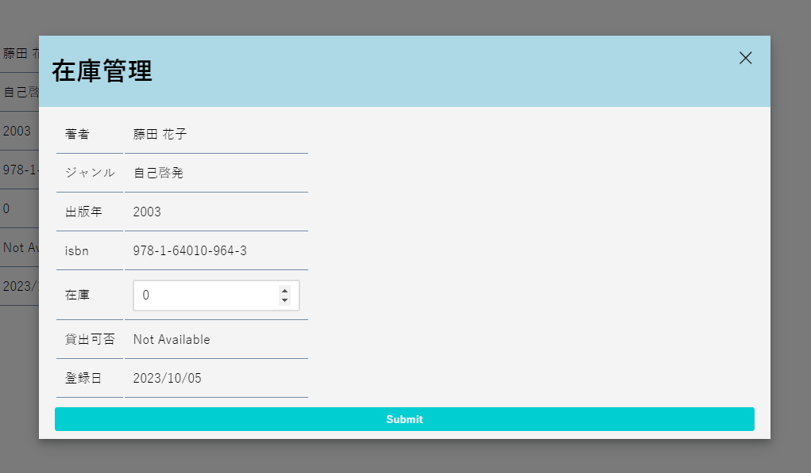

### 書籍貸出ページ
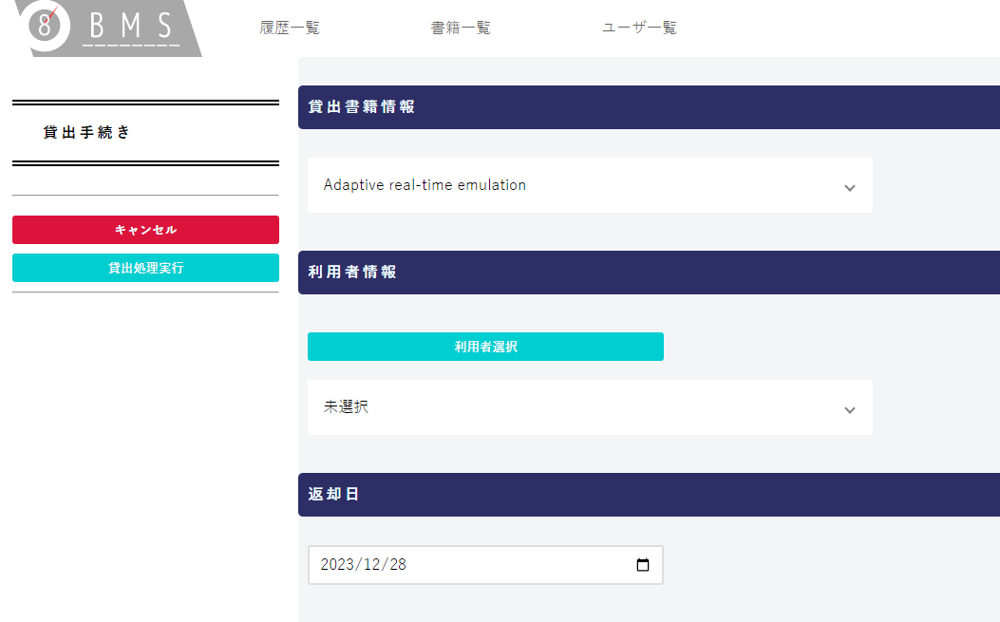


## 課題

以下の機能は必要なメソッドは存在しますが、処理が実装されていません  
編集対象ファイルの該当メソッドに要件に合うように処理を追記して下さい

編集対象ファイル：<em>/books/src/main/java/com/eightbit/books/service/BookService.java</em>  


**特定書籍検索(書籍名、著者名)**  

:::note
編集対象メソッド ： <em>searchBook</em>  
書籍名から該当書籍を検索する機能  
ラジオボタンによって検索対象を切り替えましょう(リポジトリのメソッドを使い分けましょう)  
:::

使用イメージ(書籍名検索)
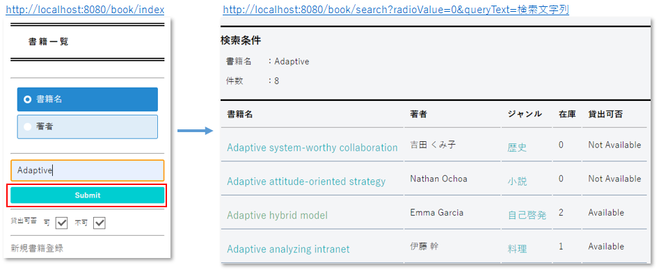
使用イメージ(著者名検索)
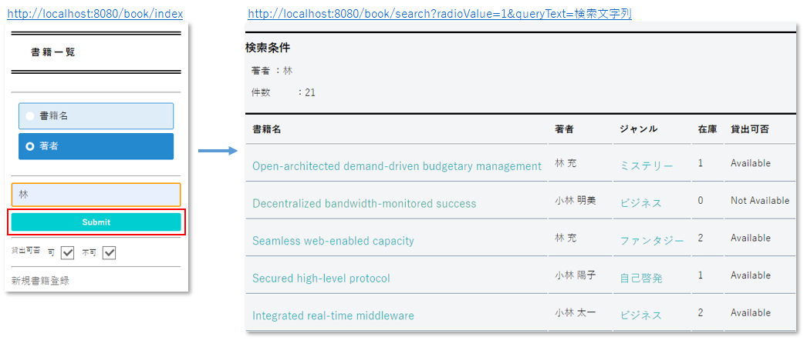


**特定書籍検索(ID)**  

:::note
編集対象メソッド ： <em>findOne</em>  
IDから該当書籍を検索する機能  
一覧ページのリンクから特定書籍の詳細ページへ遷移する際に使用する
:::

使用イメージ
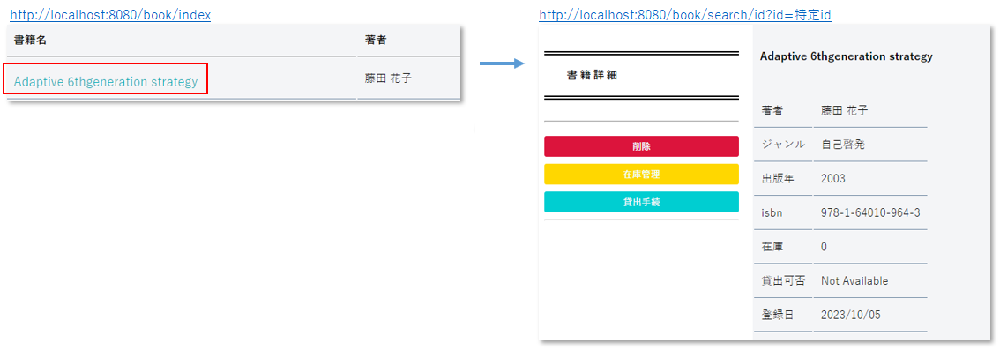


**特定書籍検索(ジャンル)**  

:::note
編集対象メソッド ： <em>searchBookGenre</em>  
ジャンルから該当書籍を検索する機能  
一覧ページのリンクからジャンル名をクリックし、特定ジャンルに絞り込む際に使用する
:::

使用イメージ
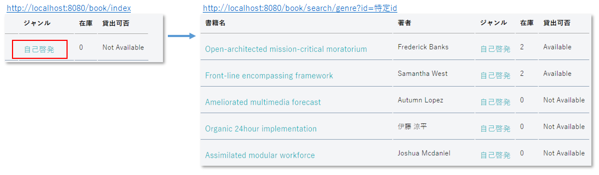


**書籍在庫情報更新**  

:::note
編集対象メソッド ： <em>updateBookStock</em>  
書籍の在庫情報を更新する機能  
モーダルに入力した内容が登録後即時反映される
:::

使用イメージ
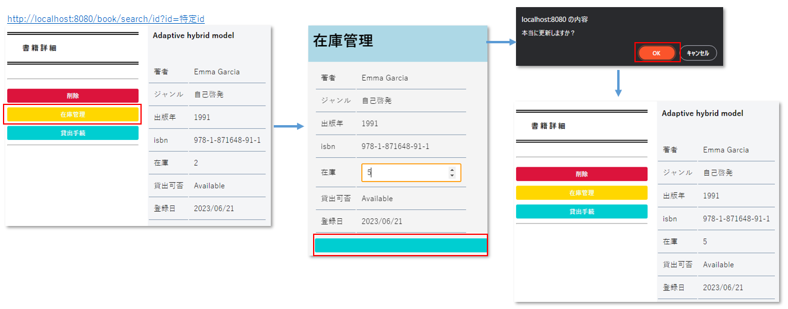


**新規書籍登録**  

:::note
編集対象メソッド ： <em>bookRegist</em>  
新規書籍データをDBに登録する機能  
登録後は書籍一覧画面で該当書籍を検索し、登録されていることを確認して下さい
:::

使用イメージ
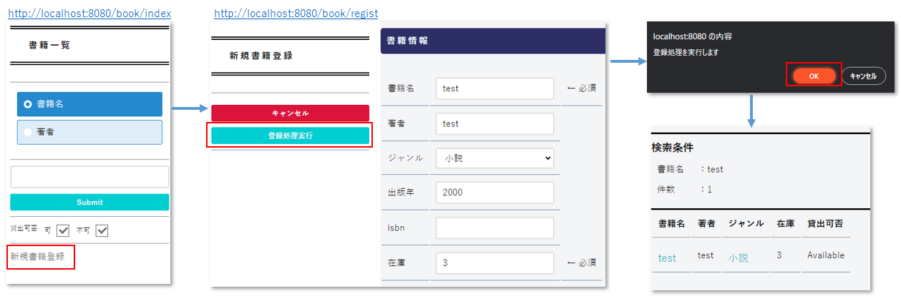


**書籍削除**  

:::note
編集対象メソッド ： <em>deleteBookAndHistoryData</em>  
書籍データを削除する機能  
特定の書籍を削除した場合、その書籍に紐づくhistoryテーブルの履歴データも削除しましょう  
削除後は書籍一覧画面で該当書籍を検索し、削除されていることを確認して下さい
:::

使用イメージ
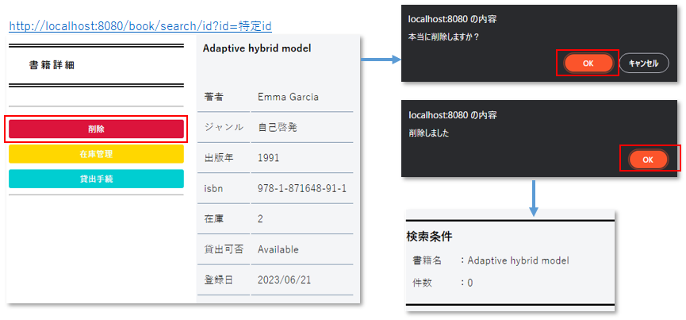


以上で書籍関連機能の課題は終了です
    </div>
</details>

<details>
    <summary>Step3. 履歴関連機能</summary>
    <div>
## 画面一覧


### 一覧ページ
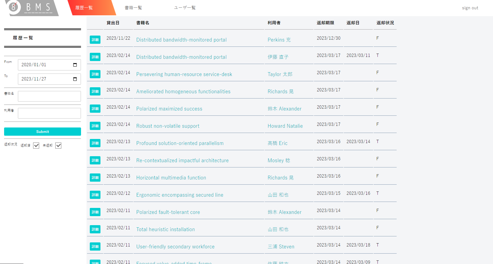

### 詳細ページ
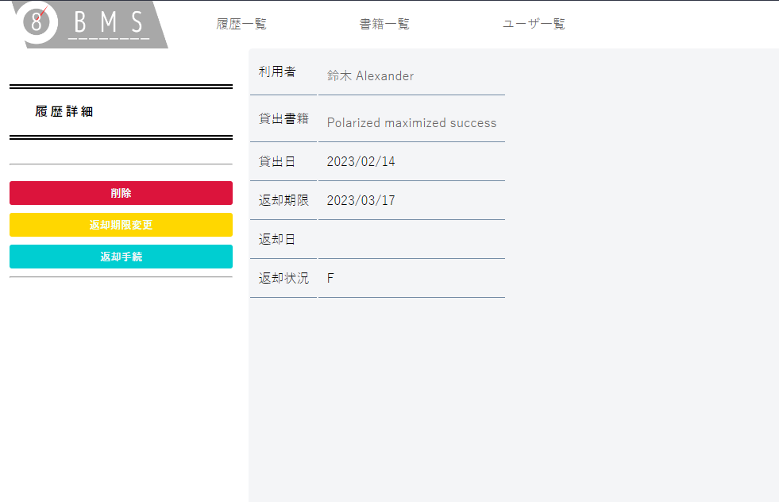

### 変更ページ(モーダル)
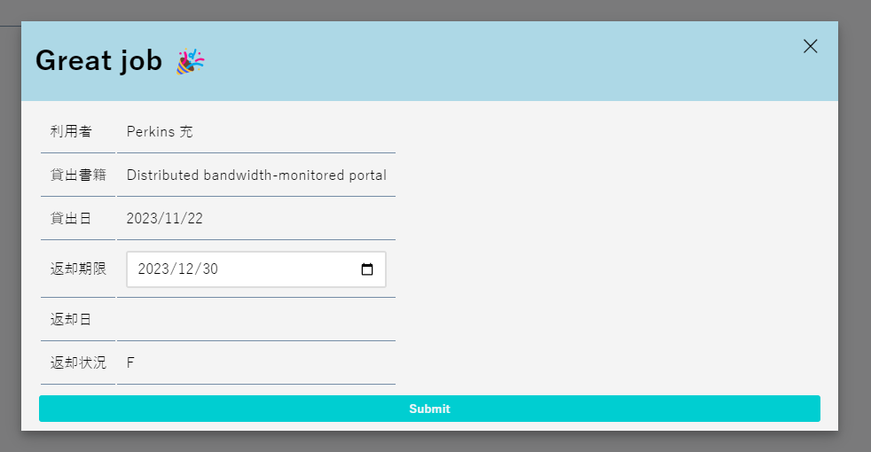

### 書籍貸出ページ
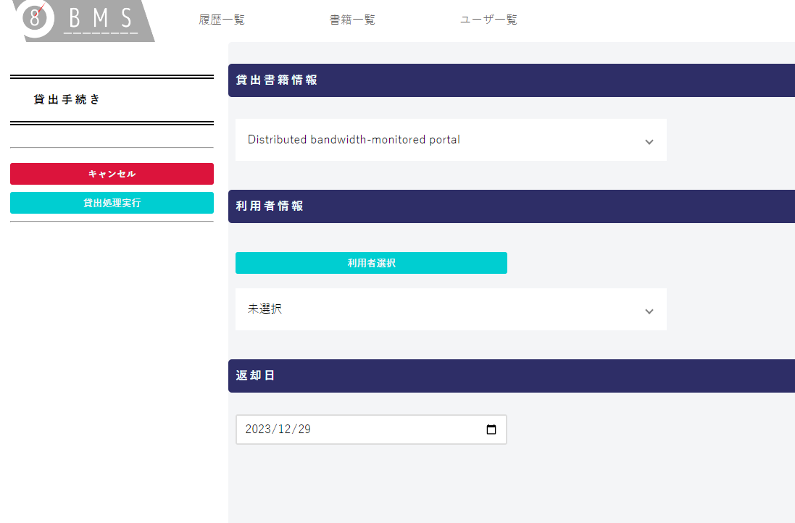


## 課題

以下の機能は必要なメソッドは存在しますが、処理が実装されていません  
編集対象ファイルの該当メソッドに要件に合うように処理を追記して下さい

編集対象ファイル：<em>/books/src/main/java/com/eightbit/books/service/HistoryService.java</em>  


**特定履歴検索(書籍名、ユーザ名)**  

:::note
編集対象メソッド ： <em>searchHistory_book</em>  
書籍名及びユーザ名から該当履歴データを検索する機能  
画面において入力されている項目、入力されていない項目を判定して処理を振り分けましょう  
条件によってリポジトリに用意されているメソッドを使い分けることになります  
:::

使用イメージ(書籍名検索)
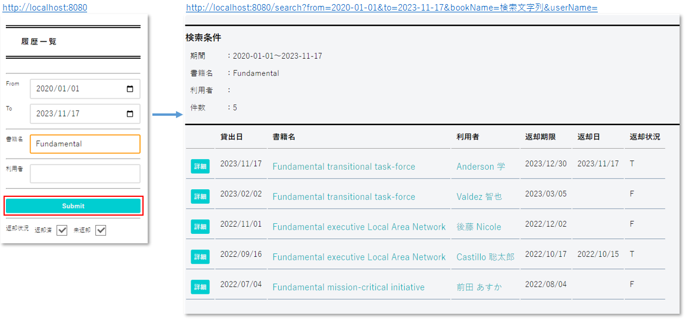
使用イメージ(ユーザ名検索)
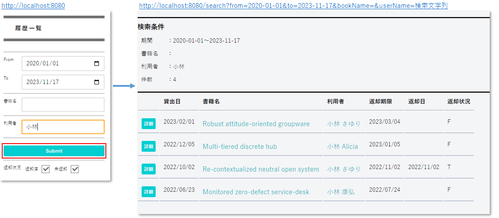


**特定履歴検索(ID)**  

:::note
編集対象メソッド ： <em>findOne</em>  
IDから該当履歴データを検索する機能  
一覧ページのリンクから特定履歴データの詳細ページへ遷移する際に使用する
:::

使用イメージ
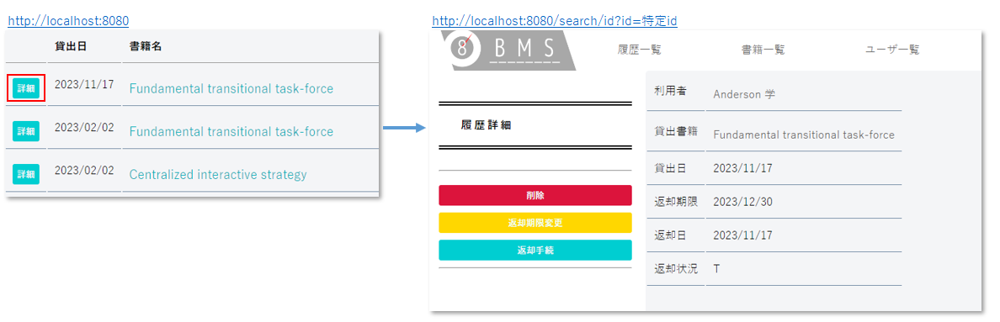


**返却期限更新**  

:::note
編集対象メソッド ： <em>updateDueDate</em>  
貸出書籍の返却期限をを更新する機能  
モーダルに入力した内容が登録後即時反映される
:::

使用イメージ
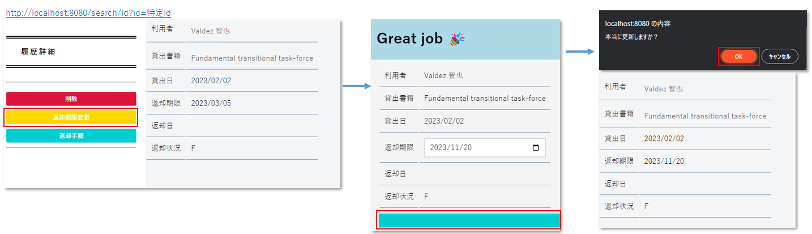


**新規貸出履歴データ登録**  

:::note
編集対象メソッド ： <em>checkoutBook</em>  
新規履歴データをDBに登録する機能(貸出処理)  
登録後は履歴一覧画面で該当履歴データを検索し、登録されていることを確認して下さい  
貸出手続ページは**書籍詳細ページから**遷移することになるので注意しましょう  
また、貸出手続き処理後は貸出対象書籍の在庫数が「1」減っていることを確認しましょう  
:::

使用イメージ
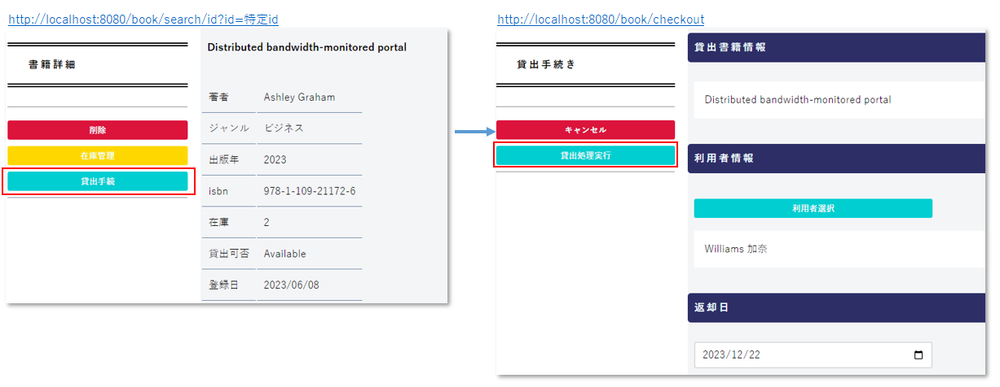
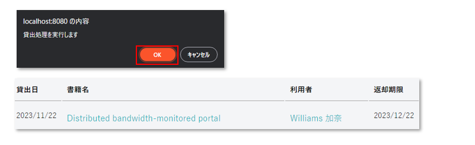


**書籍返却**  

:::note
編集対象メソッド ： <em>returnBook</em>  
貸し出していた書籍の返却処理をする機能  
返却処理後は履歴一覧画面で該当履歴を検索し、以下を確認しましょう  
- 返却日に返却時の日時が反映されていること、  
- 返却状況が「T」になっていること
- 返却対象書籍の在庫数が「1」増えていること
:::

使用イメージ
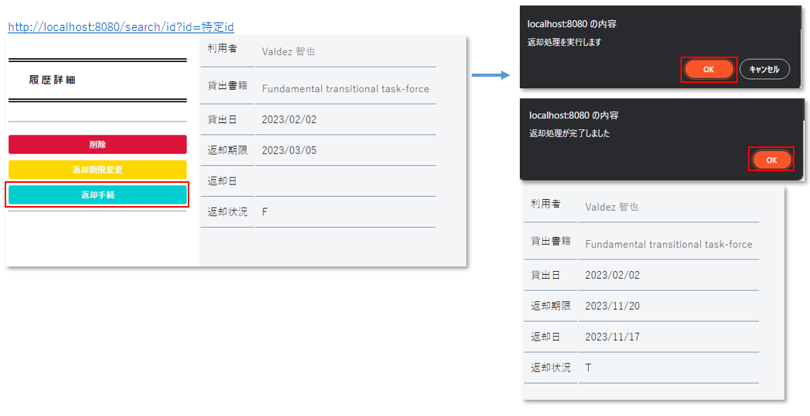


**履歴データ削除**  

:::note
編集対象メソッド ： <em>deleteHistory</em>  
履歴データを削除する機能  
削除後は履歴一覧画面で該当履歴を検索し、削除されていることを確認して下さい  
また、返却状況が「F」のデータを削除した場合、削除対象データに紐づく書籍の在庫数が「1」増えていることを確認しましょう  
:::

使用イメージ
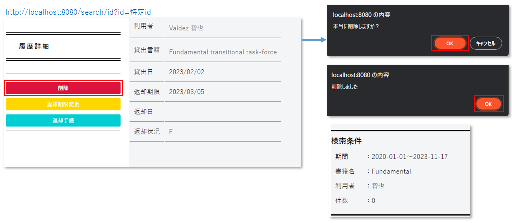


以上で履歴関連機能の課題は終了です
    </div>
</details>
