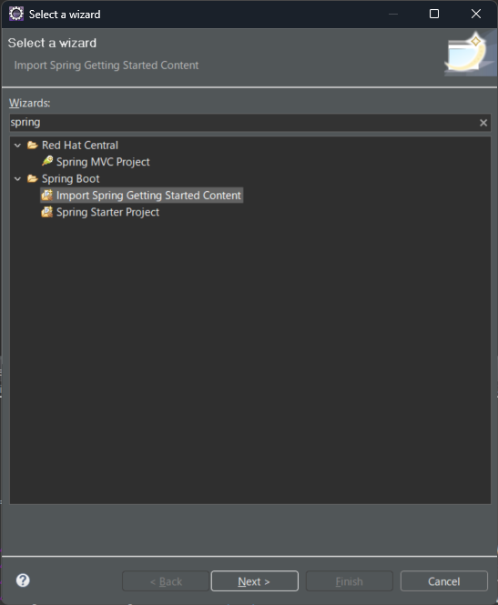
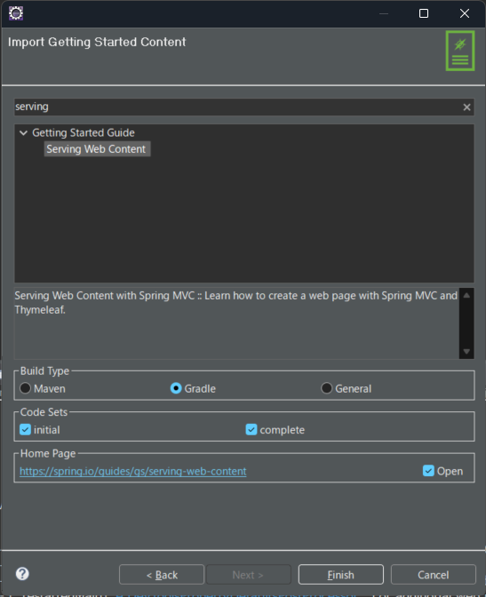
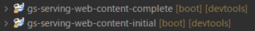

# Introduction

[**Spring公式**](https://spring.io/guides)が提供するサンプルプロジェクトをインポートし、  
最小限の構成におけるwebプロジェクトの動作を確認します  

<details>
    <summary>インポート手順</summary>
    <div>

1. Eclipseの上部メニュー **File** > **New** > **Other** をクリックし、  
**Select a wizard**画面から**Spring Boot** > **Import Spring Getting Started Content** を選択し、`Next`



2. 次の画面ではインポート対象のプロジェクト名で検索し、該当プロジェクトをクリックして下さい  
また、以下の項目が画面と一致していることを確認して下さい

|項目名|値|
|--|--|
|Build Type|Gradle|
|Code Sets|✅️Initial, ✅️Complete|
|Home Page|✅️Open|

確認できたら `Finish` をクリックし、しばらく待ちます




3. プロジェクトエクスプローラに以下2つのプロジェクトがインポートされている事を確認してください  




    </div>
</details>

<details>
    <summary>進め方</summary>
    <div>
インポート2つのプロジェクトは以下のように違いがあります。

- **gs**-[プロジェクト名]-**complete**  
特に編集等を加えなくても実行でき、動作するプロジェクト (例外あり)  
プロジェクト起動後はControllerのMappingURLを確認後ブラウザ等からリクエストを送り、動作確認してください

- **gs**-[プロジェクト名]-**initial**  
↑のcompleteを参考にして足りない箇所を補完して下さい  
最終的にcompleteと同じ様に動作することを確認します  


　
    </div>
</details>


## 1. serving web content
[公式ガイド(Thymeleaf Web 画面の作成)](https://spring.pleiades.io/guides/gs/serving-web-content)

## 2. validating form input
[公式ガイド(Web 画面フォーム入力チェック)](https://spring.pleiades.io/guides/gs/validating-form-input)

## 3. accessing data mysql
[公式ガイド(JPA で MySQL データアクセス)](https://spring.pleiades.io/guides/gs/accessing-data-mysql)

:::caution
#### 実行時に **ClassNotFoundException** が出る場合
JDBCがロードされていないというエラー内容です  
build.gradleのdependencyブロックに以下を追記し、`Refresh Gradle Project`をして下さい
```java
runtimeOnly 'com.mysql:mysql-connector-j'
```
:::
