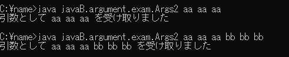

# 11. 例外処理

画像の様な実行結果となるように以下のプログラムに追記して下さい

```java showLineNumbers 
package javaB.argument.exam;

class Args2{
    public static void main(String[] args){
        if(args.length > 0){
            String str = "";
            /* ★Args2.png の実行結果となるようにfor文でargsの中身を連結しましょう */

            System.out.println("引数として " + str + "を受け取りました");
        }else{
            System.out.println("引数を入力してください");
        }
    }
}
```

#### 実行結果


