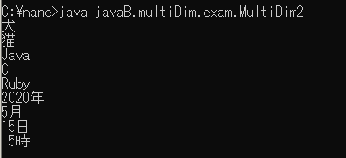

# 2. 多次元配列

画像の様な実行結果となるように以下のプログラムに追記して下さい

```java {8-9} showLineNumbers 
package javaB.multiDim.exam;

class MultiDim2{
    public static void main(String[] args){
        String[][] goods = {{"犬", "猫"},
                            {"Java", "C", "Ruby"},
                            {"2020年", "5月", "15日", "15時"}};
        /* ★ここに多次元配列のすべての要素を出力する処理を記入 */

    }
}
```

#### 実行結果


