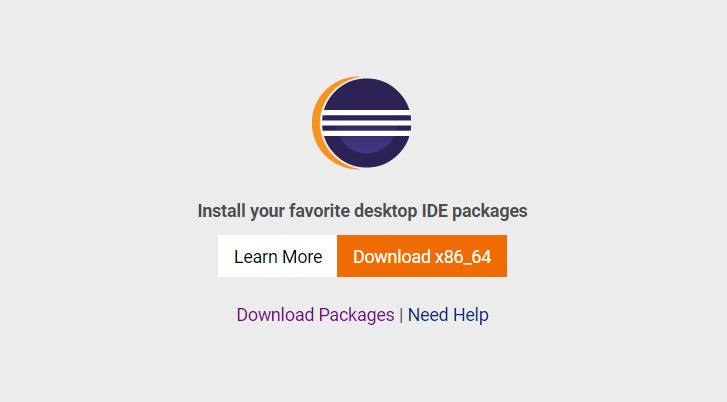
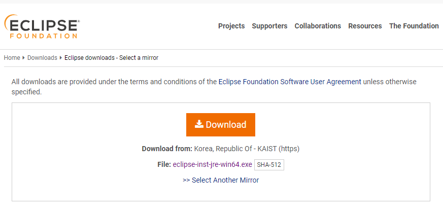
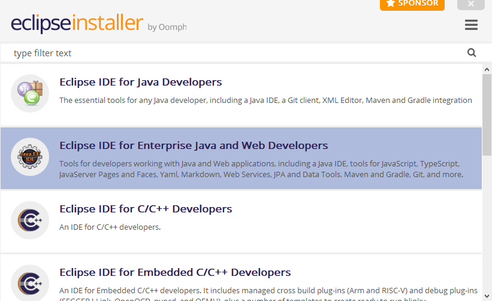
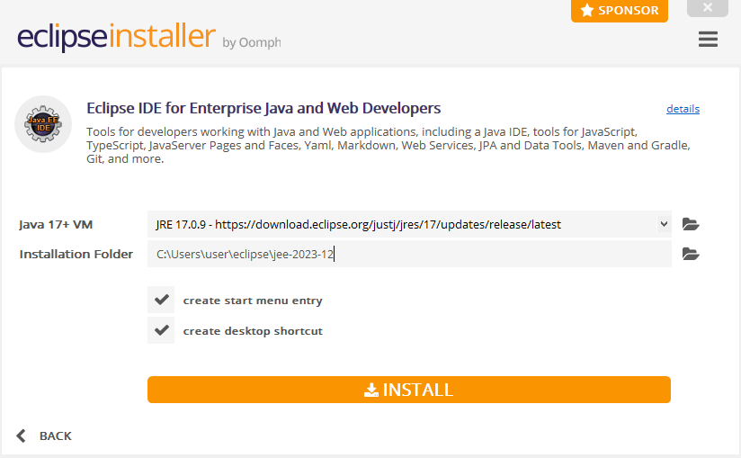
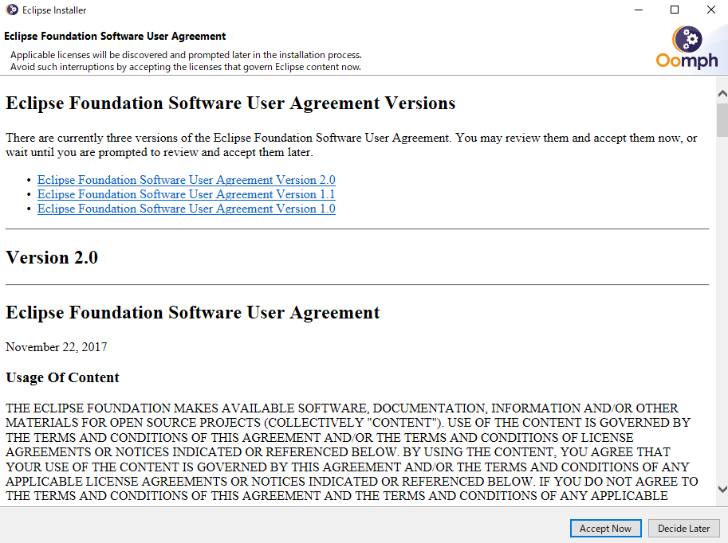
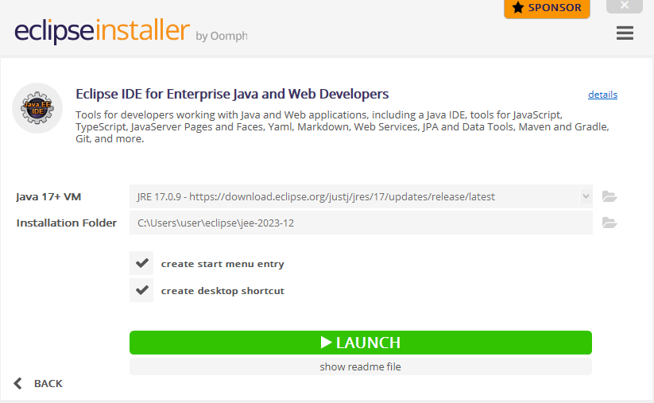
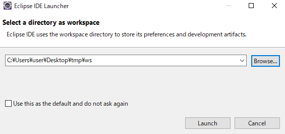

## Eclipseインストール

以下の公式ページにアクセスし、**Download x86_64**をクリックして下さい  

[公式ページ(Eclipse foundation)](https://www.eclipse.org/downloads/)

ページ遷移したら**Download**をクリックして下さい  
クリックするとインストーラファイルのダウンロードが始まります  

ダウンロードしたインストーラを起動し、以下の画面になったら 

**Eclipse IDE For Enterprise Java and Web Developers**をクリックします

以下の画面では特に変更なしで**INSTALL**をクリックし、インストールを開始します

以下の画面が現れた場合、**Accept Now**をクリックして下さい

インストールが完了すると緑色の**LAUNCH**ボタンが表示されるので、クリックします

起動後、ワークスペースフォルダを指定する画面が表示されます  
任意のパスに作業フォルダを作成し、それをワークスペースとして指定しましょう  
**Launch**をクリックするとEclipseの画面が立ち上がります  
この際、welcomeページが表示されますが、閉じてしまって構いません

以上でEclipseのインストールは完了です

