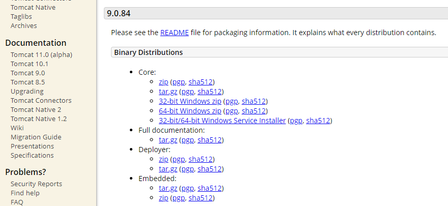
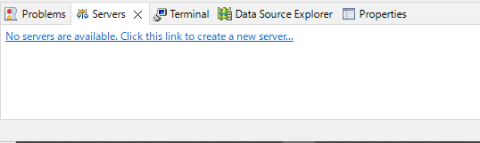
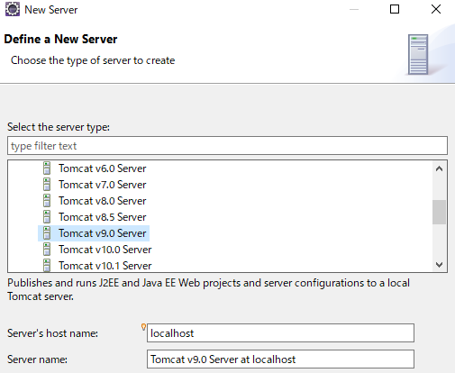
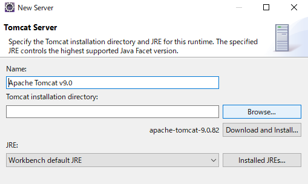

## Tomcatインストール

以下の公式ページにアクセスし、**64-bit Windows zip**をクリックして下さい  
クリックするとファイルのダウンロードが始まります  
[公式ページ(Apache Tomcat)](https://tomcat.apache.org/download-90.cgi)  

ダウンロードが完了したら圧縮ファイルを展開し、任意のフォルダに格納して下さい  

Eclipseの画面下、**Servers**タブを開き、  
**No servers are available. Click this link to create a new server**をクリックして下さい  

以下の画面が表示されるので、「Apache」 > 「Tomcat v9.0 Server」を選択し、次の画面へ進みます  

以下の画面では**Browse**をクリックし、先程展開したTomcatフォルダのパスを指定しましょう  
指定後、**Finish**をクリックしてtomcatの設定は完了です  

以上でTomcatのインストールは完了です

