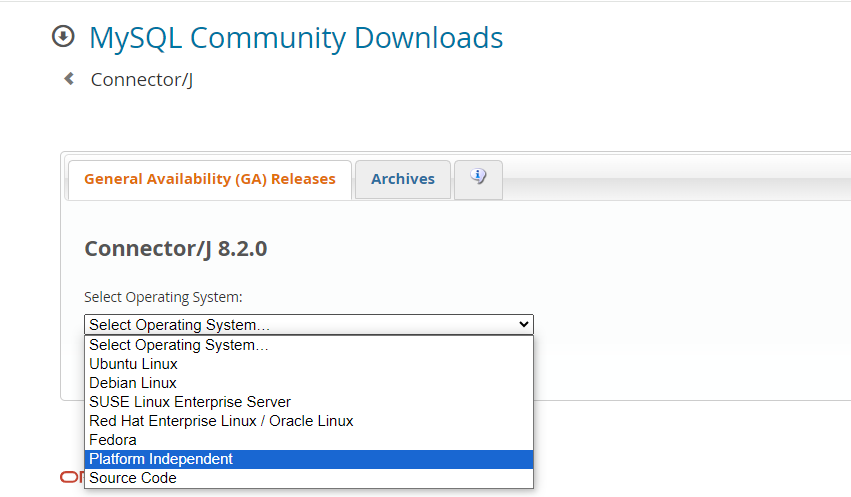
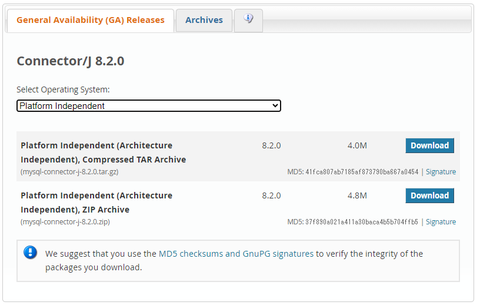
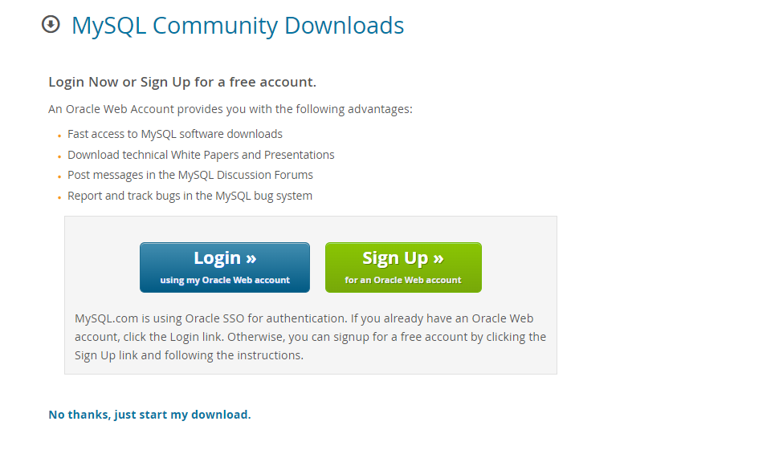
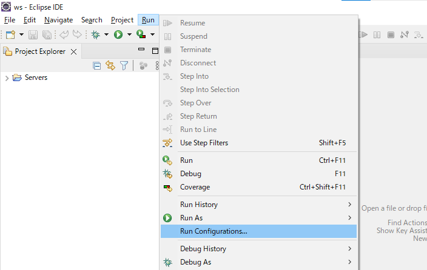
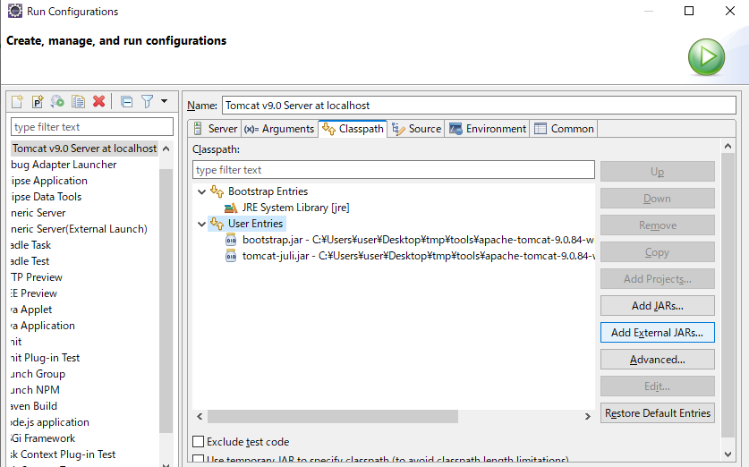
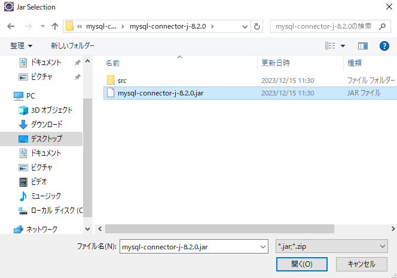
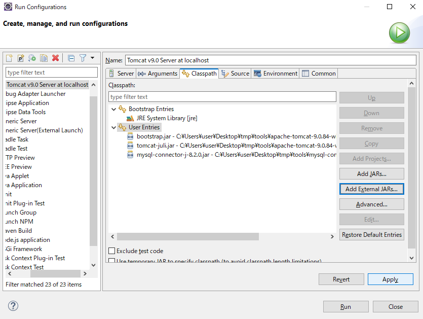

## JDBCドライバ追加

以下の公式ページにアクセスし、ドロップダウンリストから**Platform Independent**を選択して下さい  
[公式ページ(MySQL)](https://dev.mysql.com/downloads/connector/j/5.1.html)  

以下のように画面が切り替わるので、**ZIP Archive**の方の**Download**をクリックして下さい

次の画面では下部の**No thanks, just start my download.**をクリックして下さい  
クリックするとファイルのダウンロードが始まります  

ダウンロードが完了したら圧縮ファイルを展開し、任意のフォルダに格納して下さい  

Eclipseの画面上部メニュー、**Run** > **Run Configurations**をクリックし、実行構成の画面を開きます    

実行構成の画面中央の**Classpath**タブを開き、**User Entries**を選択した状態で  
画面右の**Add External JARs**をクリックして下さい

エクスプローラの画面が表示されるので、先程展開したフォルダ内の  
**mysql-connector-j-8.x.x.jar**を選択し、「開く」をクリックして下さい  

以下のように**User Entries**内に指定したjarファイルが表示されていることを確認し、  
**Aplly**をクリックした後に**close**をクリックして下さい

以上でJDBCドライバの追加は完了です

