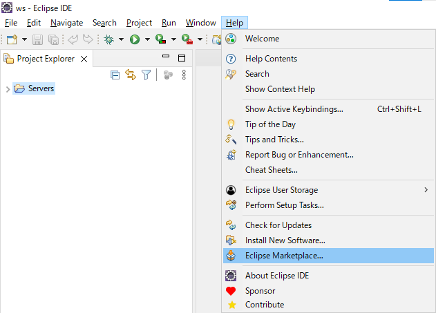
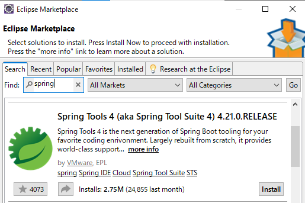
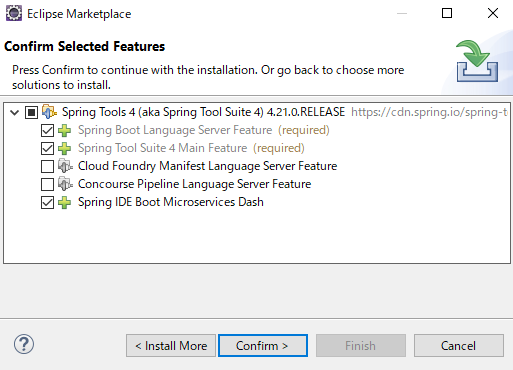
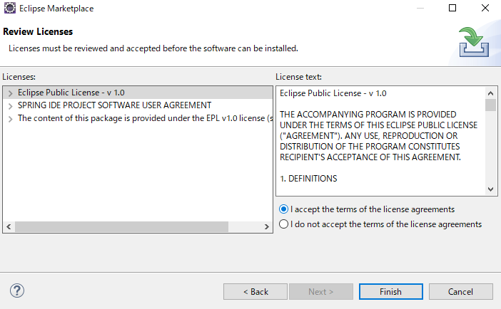
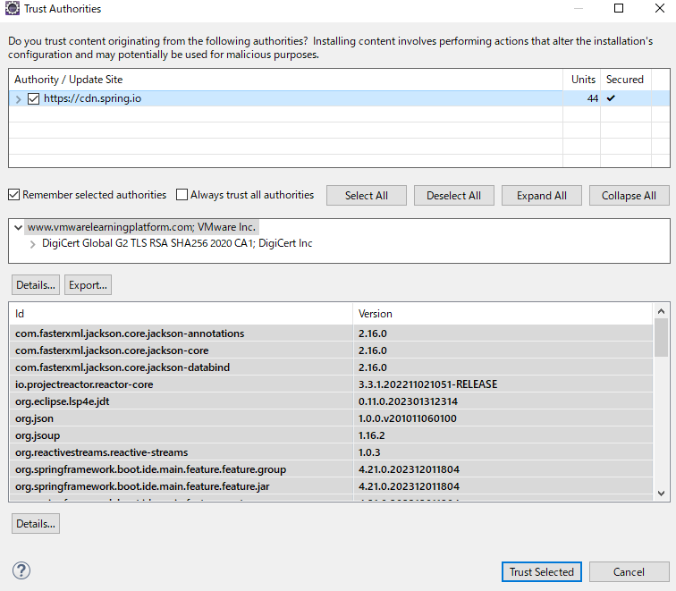
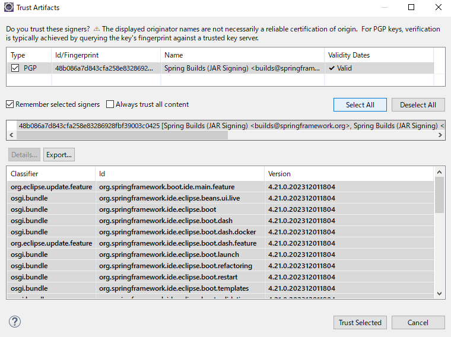
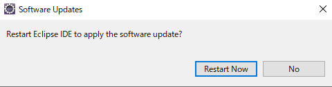

## STS4(Spring Tool Suite4)のインストール

Eclipseの画面上部メニュー、**Help** > **Eclipse Marketplace**をクリックし、  
マーケットプレイスの画面を開きます  

以下の画面が表示されるので、検索欄に**spring**を入力し、Enterキーを押して下さい  
検索結果の中に**Spring Tools4**という項目が出てくるので、**Install**をクリックしましょう  

以下の画面では特に変更を加えずに**Confirm**をクリックして下さい  

ライセンス同意画面が表示されるので、  
**I accept the terms of the license agreements**を選択した状態で**Finish**をクリックして下さい  

次の画面では画面中央の**Select All**をクリック後、画面下部の**Trust Selected**をクリックします

この画面でも画面中央の**Select All**をクリック後、画面下部の**Trust Selected**をクリックして下さい

以下のポップアップではSTSをインストールするために再起動する必要があるので**Restart Now**をクリックして下さい

以上でSTSのインストールは完了です

