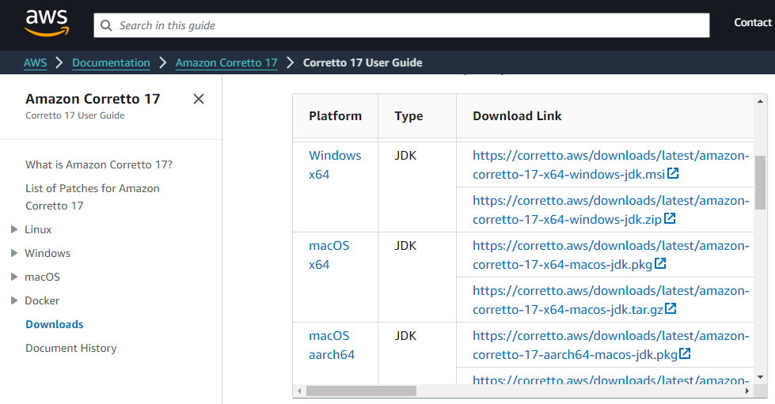
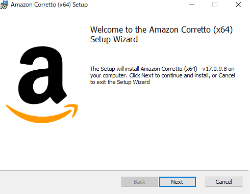
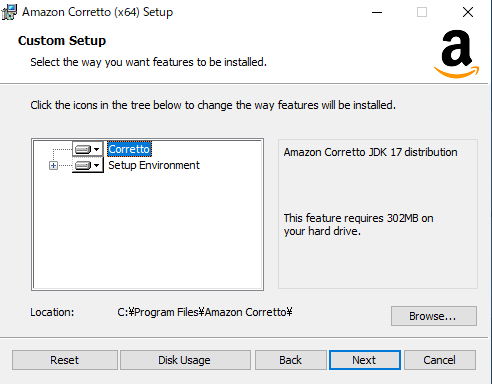
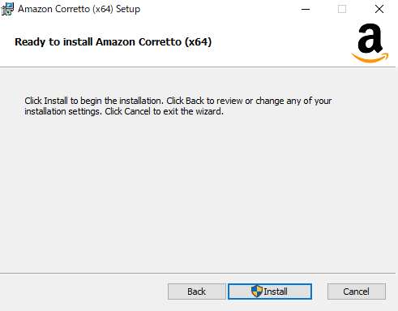
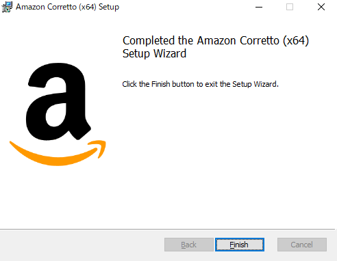
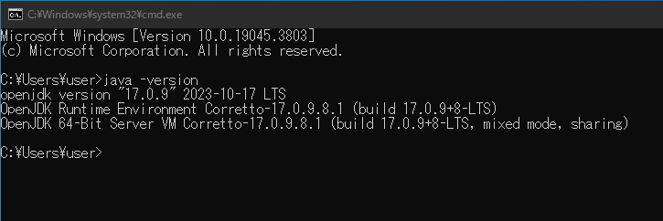

## インストーラのダウンロード

以下のリンクからAWS公式のダウンロードページにアクセスして下さい  

- [公式ダウンロードページ](https://docs.aws.amazon.com/corretto/latest/corretto-17-ug/downloads-list.html)

*Platform*：Windows x64  
*Type*：JDK  
*Download Link*：https://corretto.aws/downloads/latest/amazon-corretto-17-x64-windows-jdk.msi

上記のmsiファイル(インストーラ)をダウンロードし、実行して下さい

## インストーラ起動

インストーラを実行すると以下の画面が表示されるので `Next` をクリック

特に変更はせず `Next` をクリック

`Install` をクリック  
Amazon Correttoの場合、インストール時に勝手にパスが通ります

インストールが完了すると以下の画面が表示されるので `Finish` をクリックして画面を閉じます

コマンドプロンプトを起動し、  
`java -version` を実行してJDKのバージョンが表示されることを確認して下さい

以上でJavaのインストールは完了です！