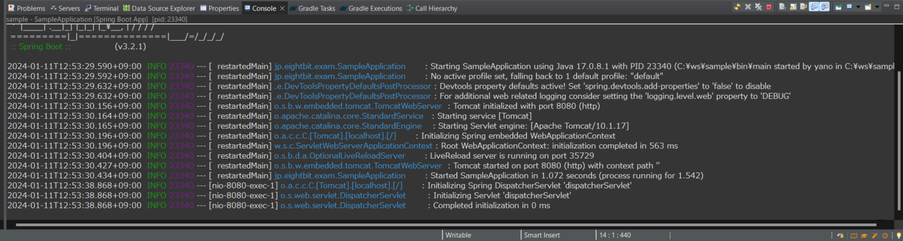

## Springサンプルプロジェクト作成


### 新規プロジェクト作成

Eclipse画面上部メニュー `File` > `New` > `Other` をクリックして下さい


以下の画面が表示されるので、**Wizards** 欄に「spiring」と入力し、  
`Spring Boot` > `Spring Starter Project` を選択して `Next` をクリックします


### プロジェクト概要項目設定

以下の画面ではプロジェクト名や使用する言語、言語のバージョン、ビルドツール等を選択(又は入力)します  
画像と同じ様に設定して `Next` をクリックしましょう


### 依存関係設定

以下の画面ではこのプロジェクトで使用する機能の依存関係を設定追加します  
**Available** 欄に「web」や「dev」と入力し、該当機能にチェックを入れ、  
以下が **Selected** 欄に表示されることを確認して下さい  
- Spring Web
- Spring Boot DevTools

確認できたら `Finish` をクリックして下さい


Eclipseのプロジェクトエクスプローラに先程作成したプロジェクトが表示されていることを確認しましょう


### サンプルファイル作成

プロジェクトエクスプローラの  
`sample` > `src/main/java` > `jp.eightbit.exam` を右クリックし、  
`New` > `Class` をクリックして下さい


以下の画面では作成するクラスのクラス名やその他継承クラスや実装インターフェース等を決められますが、  
今回は必要ないのでクラス名(Name)欄だけ「Controller」と入力し、`Finish` をクリックします


### Javaファイル編集

クラスを作成するとjavaファイルが表示されるので、これを編集します  
クラス名の上に `@RestController` と入力し、
クラス内には以下を貼り付けて下さい
```java showLineNumbers
@GetMapping("/hello")
public String hello(@RequestParam(value = "name", defaultValue = "World") String name) {
    return String.format("Hello %s!", name);
}
```
貼り付けたら以下画像と相違ないことを確認して下さい


#### 必要パッケージのインポート

赤い波線部分は必要なパッケージ(クラスファイル)がインポートされていない箇所です  
これを解消するため、赤い波線部分にマウスオーバーして下さい  
ポップアップが表示され、エラー内容とそれを解決するための提案がいくつか表示されるので、  
`import ~` の項目をクリックして下さい
:::tip
エラー箇所にマウスオーバーした場合、**~ quick fix available**と表示されますが、  
`import ~`が複数表示されることがあります  

これは同名メソッドやアノテーションが複数クラスに定義されていることに起因します  
この機能を使用してインポートする場合はインポート対象がどのパッケージに所属するのかを確認するように心がけましょう


:::


全てのエラーを解消し、以下のような状態になっていることを確認して下さい


### プロジェクト実行

プロジェクトを右クリックし、 `Run As` > `Spring Boot App` をクリックして下さい


Eclipse画面下のコンソールに実行時のログが表示され、画面と同じ状態になることを確認しましょう



任意のブラウザにて、以下のURLにアクセスし、画面と同じ様に表示されることを確認しましょう
- http://localhost:8080/hello
- http://localhost:8080/hello?name=eightbit


以上で新規プロジェクトの作成及び実行確認は完了です！


