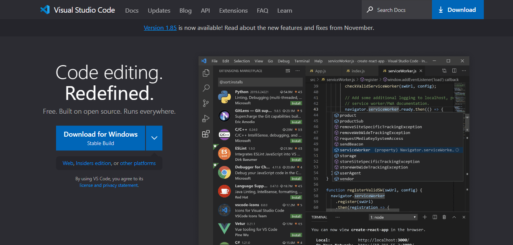
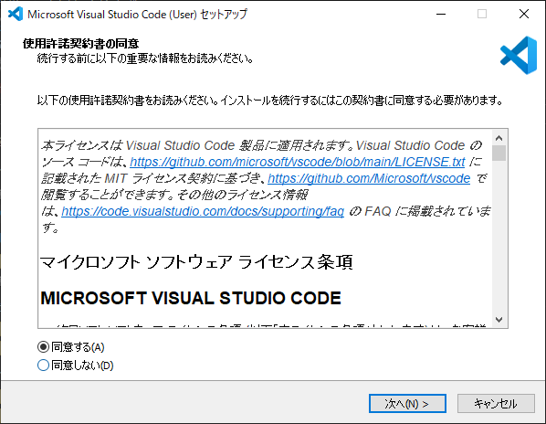
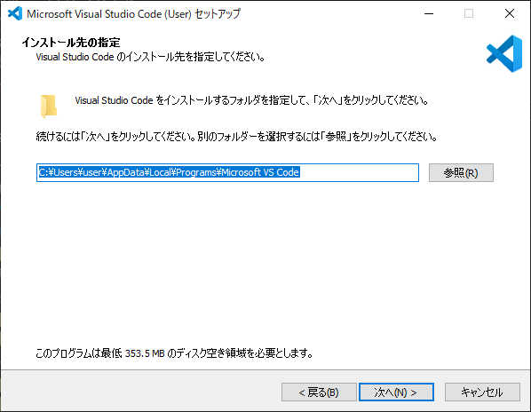
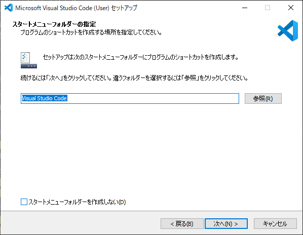
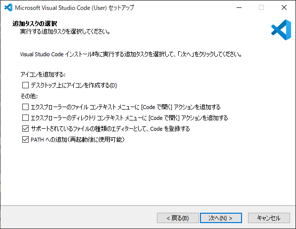
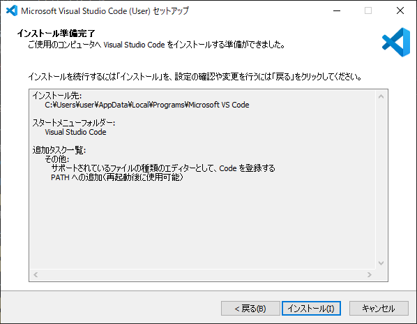
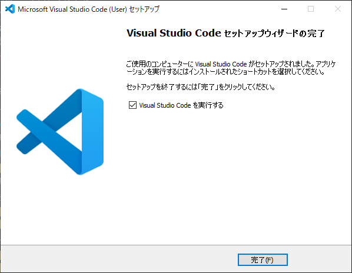
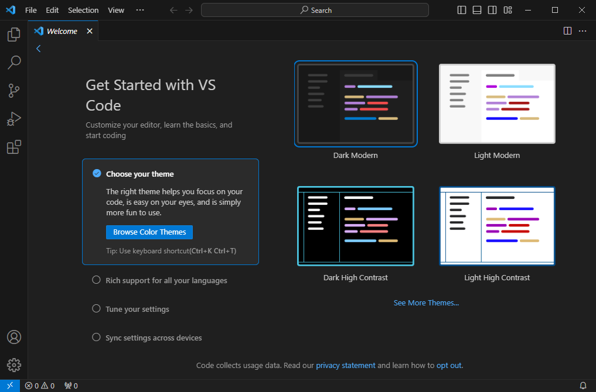

## インストーラのダウンロード

以下のリンクからAWS公式のダウンロードページにアクセスして下さい  

- [公式ダウンロードページ](https://code.visualstudio.com/)

## インストーラ起動
インストーラを実行すると以下の画面が表示されるので  
利用規約に同意し、 `次へ` をクリック

特に変更はせず `次へ` をクリック

特に変更はせず `次へ` をクリック

特に変更はせず `次へ` をクリック

`インストール` をクリック

`完了` をクリック

以下の画面が表示されたら正常にインストールされています

