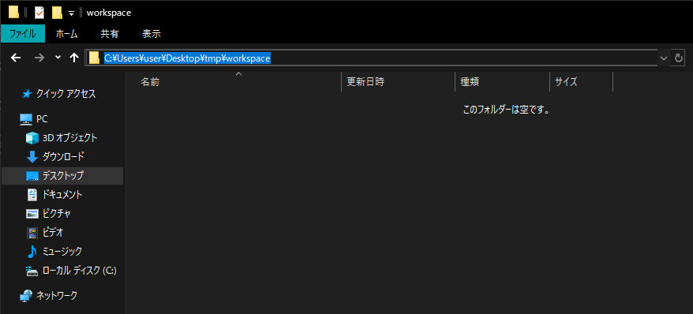
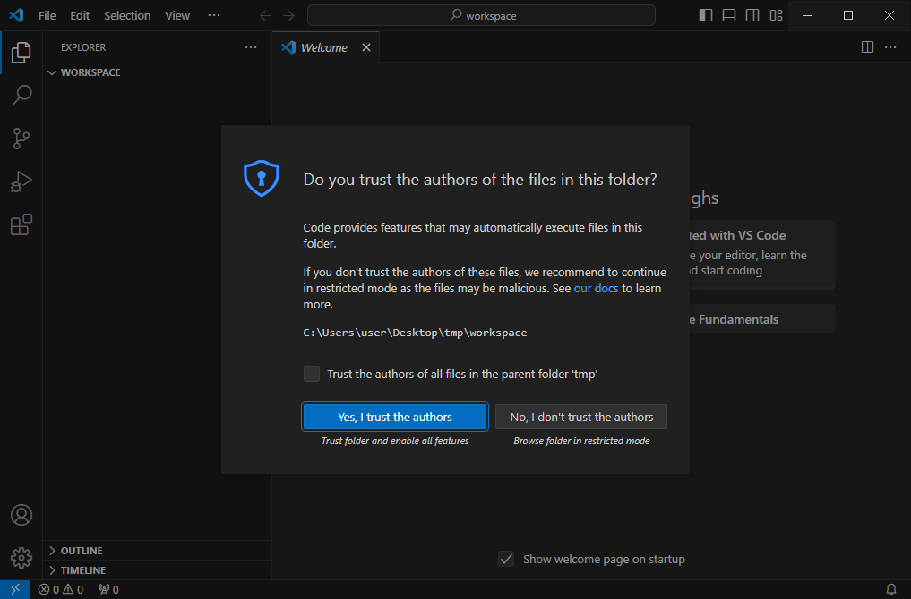
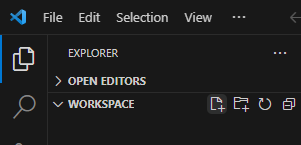
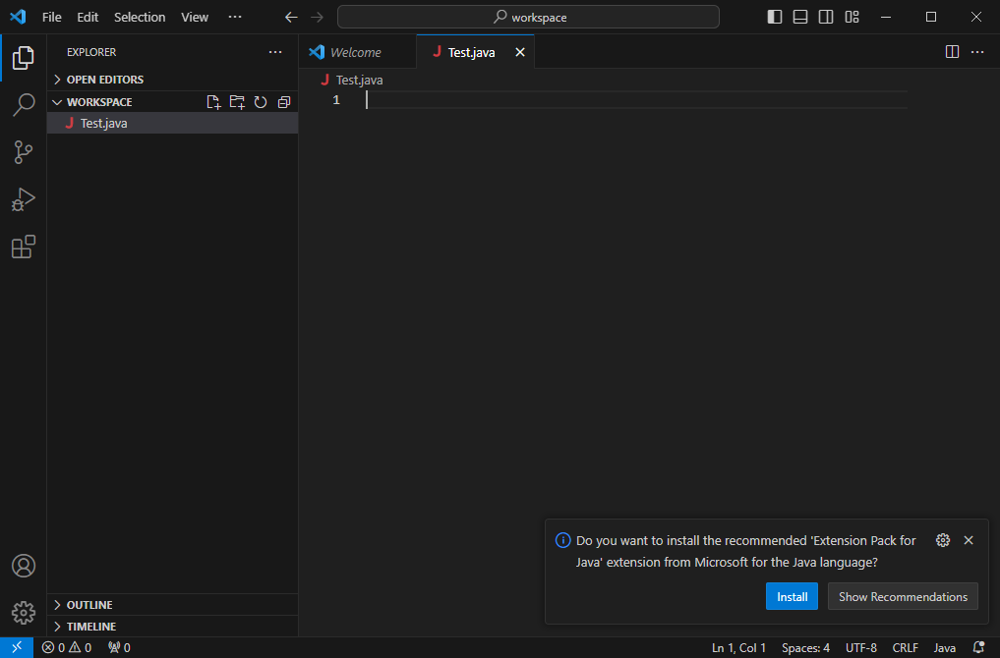
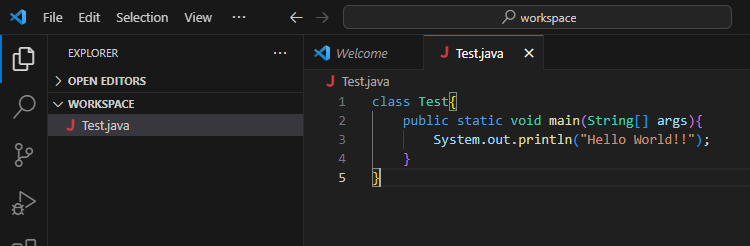
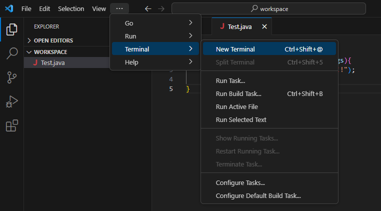
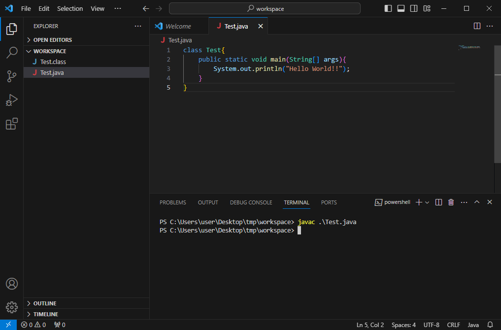
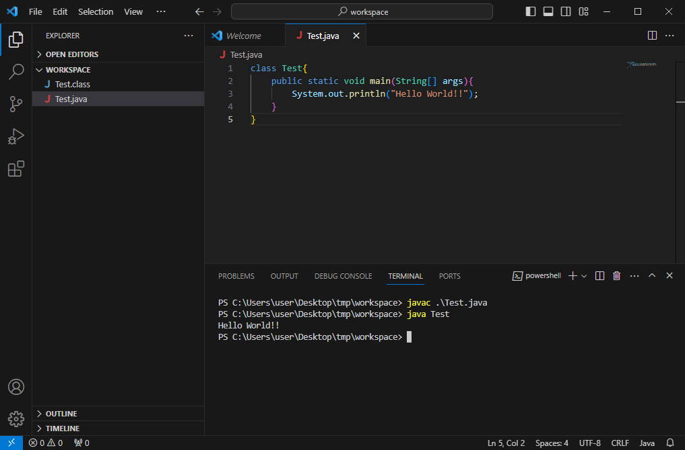

## ワークスペース作成

以下のように任意のパスに`workspace`フォルダを作成しましょう  



## VSCode起動

左上メニューの `File` > `Open Folder` をクリックし、  
先程作成した `workspace` フォルダを選択して下さい  


以下の画面が表示された場合は `Yes, I trust the authors` をクリックします  



左上にフォルダが表示されます(プロジェクトエクスプローラ)  
フォルダ名右の**ファイルアイコン**をクリックし、 `Test.java` というファイルを作成して下さい



以下の様に画面右側に先程作成した `Test.java` が表示されます  




下の画像の通りに `Test.java`の内容を編集し、上書き保存をしてください

```Java
Class Test{
    public static void main(String args[]){
        System.out.println("Hello World!!");
    }
}
```



上部メニューの **Terminal** > **New Terminal** をクリックし  
下部にターミナル(powershell)を表示します



## コンパイル

ターミナルに `javac ./Test.java` と入力し、エンターキーを押して下さい  
何も表示されずにコンパイル成功です



## 実行

同じくターミナルに `java Test` と入力し、エンターキーを押して下さい  
`Hello World!!` と表示されればプログラムは実行されています




:::tip

## 文字コードの違いによるコンパイルエラー

例えば以下の様に出力文字列部分を日本語のひらがなに変更してコンパイルする場合

```Java
Class Test{
    public static void main(String args[]){
        System.out.println("こんにちは!!");
    }
}
```

コンパイル時に以下のようなエラーが発生します  
`この文字は、エンコーディング~にマップできません`


これはjavaファイルが **UTF-8** という文字コードで保存されていることに起因します  
VSCode右下の **UTF-8** という表示がそれに当たります  

#### 対策1. コンパイル時にオプションを付与する

対策としては以下のようにコンパイル時にオプションをつけることで回避できます
```
javac -encoding UTF-8 ./Test.java
```

#### 対策2. ファイルの文字コードを変更する
上記のエラーはファイルの文字コードとwindowsデフォルトの文字コードの違いによって発生します  
windows標準文字コードは **Shift-JIS** です  
ということは現状 **UTF-8** で保存されているファイルを **Shift-JIS** として保存してあげれば同じ様にこのコンパイルエラーを回避することができます  


:::