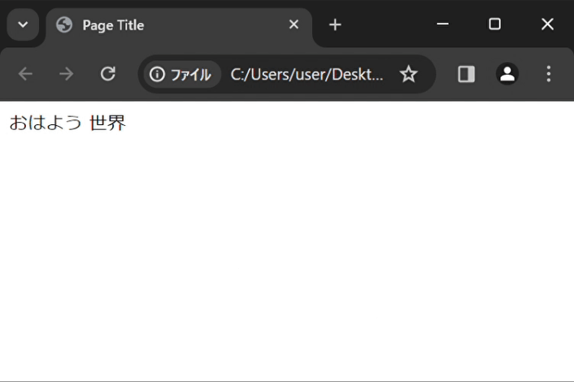
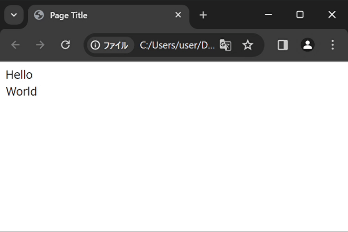
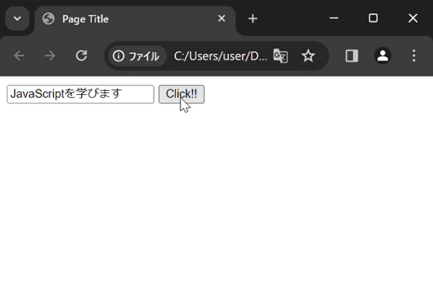

# JavaScriptとは  
JavaScriptとは、Webブラウザ上で動作するスクリプト言語です  

他のプログラミング言語と同様に演算やデータ処理を行うことができますが  
唯一無二の特徴として、HTMLやCSSで構成されたWebページに組み込むことで、本来静的であるWebページを動的に操作できます

## JavaScriptでできること
例えば、次のような処理を実行することができます  
- ページのコンテンツを書き換える  

- ページのスタイルを書き換える  

- ユーザーの操作に反応し、特定の処理を行う  

これらは基礎的な処理になりますが、組み合わせることで  

- ユーザーの操作に合わせた動的デザイン  
- アニメーション  
- サーバーや他クライアントとのリアルタイム通信  

といったものをWebページ上で表現することが可能です  
また、Webアプリやブラウザゲームといったものを制作することもできます。